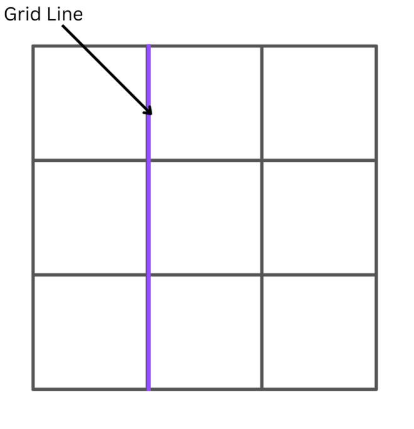
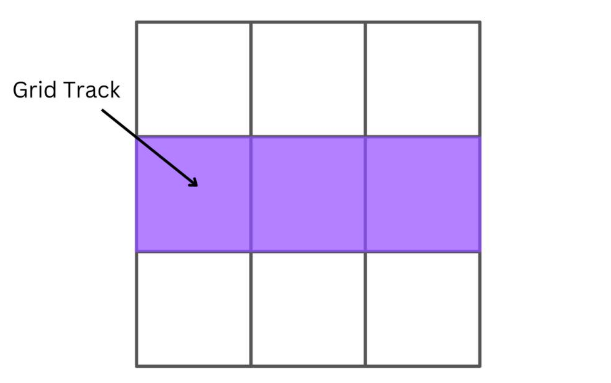
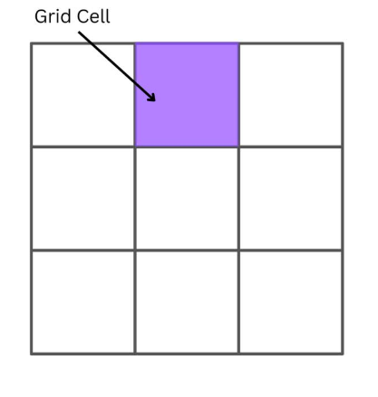
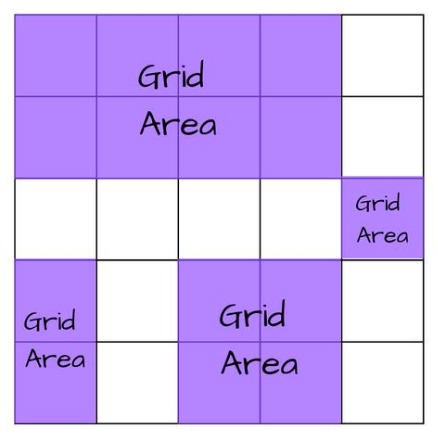
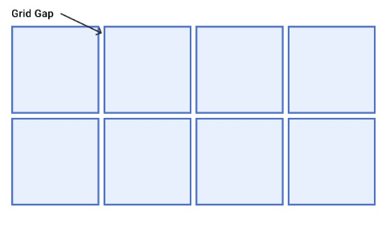

# grid基础


1. 网格容器(grid container)

    网格容器是所有网格项的父元素，网格容器会定义display:grid。下面例子中，类名为 container 的 div 元素就是网格容器：

    ```htm
    <div class="container">
        <div class="item">1</div>
        <div class="item">2</div>
        <div class="item">3</div>
        <div class="item">4</div>
    </div>
    <style>
        .container {
            display: grid;
        }
    </style>
    ```

2. 网格项(grid item)

    上例中`class=item`的`div`元素就是网格项。


3. 网格线(grid line)


    下图中的网格有 9 个网格项，有 4 条行网格线和 4 条列网格线：

    

4. 网格轨道(grid track)

    track 指两条 line 之间的空间。row track 就是 row line 间，column track 就是 column line 间的空间。

    

5. 网格单元(grid cell)

    单元格 cell 是最小单元，是row track和column track的交叉区域。

    
    
    
6. 网格区域(grid area)
    
    area 是一组 cell 在一起。
    
    


7. 网格间隙(grid gap)

    


## 参考
1. https://zhangqiang.work/lab/css_layout_grid/
2. https://www.toutiao.com/article/7173980850827117096/
3. https://www.zhangxinxu.com/wordpress/2018/11/display-grid-css-css3/