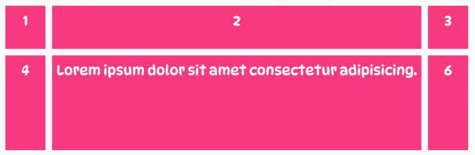
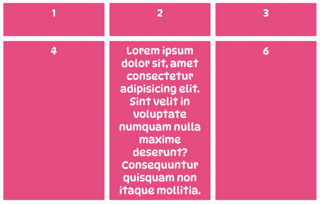

# 网格轨道(grid track)行列

## [网格轨道(grid track)](https://developer.mozilla.org/en-US/docs/Web/CSS/CSS_grid_layout/Basic_concepts_of_grid_layout#grid_tracks)

1. grid-template-rows: 创建行
2. grid-template-columns: 创建列(grid track)
    1. 200px 200px 200px: 3列, 每列宽200px
    2. 1fr 1fr 1fr: 3列, 每列宽等分
    3. 500px 1fr 2fr: 3列, 第一列宽500px, 剩余两列平分剩余宽度
    4. repeat(3, 1fr): 3列, 每列宽等分
    5. 500px repeat(2, 1fr): 3列, 第一列宽500px, 剩余两列平分剩余宽度
    6. repeat(2, 100px 2fr): 4列, 前两列宽100px, 后两列平分剩余宽度

3. grid-auto-rows: 当子项个数超过grid-template-columns设置的值时, 会自动增加行. 该值设置自动增加行的高度.
    1. 200px: 行高200px
    2. minmax(100px, auto): 行高最小100px, 最大自动设置

## grid-template-columns

该属性指定列数以及每列的宽度.

下例中, 容器是三列，每列宽 400px。由于网格容器有四个子元素，而我们只给网格指定了三列，所以当网格容器中的网格项数量超过三个时，CSS 会将其他网格项放到新行中以保持容器的布局。如：

```css
.container {
    display: grid;
    grid-template-columns: 400px 400px 400px;
}
```


## grid-template-rows

与 grid-template-columns 属性不同，grid-template-rows无法来控制网格的行数, 而只用来设置每行的高度。这是因为每当网格项换行时，网格容器都会隐式创建一个新行。

如下列, 网格容器的第一行高度为 100px，第二行高度为 200px。我们仅设置了网格容器中前两行的高度。如果向网格容器中添加更多的网格项，那么那些隐式创建的行的高度将不是由 grid-template-rows 属性决定，而由其内容的大小决定。

```css
.container {
    display: grid;
    grid-template-columns: 400px 400px 400px;
    grid-template-rows: 100px 200px;
}
```


## 测量单位

除了非负CSS 长度值（例如px、rem、vw和百分比 ( %) ）之外，我们还可以使用特殊的大小单位和关键字来控制网格中网格项的大小。

### fr 单位

fr单位是“fractional”的缩写，如下例, 创建一个由三列组成的网格布局，其中第一列占网格宽度的 1/6，第二列是第一列宽度的两倍，第三列是第一列宽度的三倍。如果没有fr 单位，我们就需要执行一些数学运算，先用网格的总宽度100%除以6，然后将结果乘以每列的跨度：

1. 第一列的宽度 = 100% / 6 * 1 —> 15%
1. 第二列的宽度 = 100% / 6 * 2 —> 30%
1. 第三列的宽度 = 100% / 6 * 3 —> 45%

计算相对麻烦。这时 fr 单位就派上用场了, 如下例将容器宽度的一部分分给第一列，第二列的宽度是第一列的两倍，第三列的宽度是第一列的三倍。：

```css
.container {
   display: grid;
   grid-template-columns: 1fr 2fr 3fr;
}

```


### min-content

min-content 是一个用于调整大小的关键字，它将网格轨迹的宽度设置为最小宽度，通常是网格项中最小内容或文本的大小。它的工作原理类似于CSS函数：min()，但被用作间距单位而不是函数。

下例中, 将第一列和第三列的宽度设置为网格容器的小部分，同时将第二列设置为 min-content，使其缩小到网格项中内容的大小。

```css
.container {
display: grid;
grid-template-columns: 1fr min-content 1fr;
}
```


### max-content

max-content关键字的效果与min-content相反，它类似于CSS函数：max()。当应用于列或行时，轨道将变得尽可能宽，以便网格项中的所有内容都显示在一条完整的长行中。

下例中, 定义了三列，并将第二列的宽度设置为max-content关键字。如果在第二列的网格项中添加大量内容，这些网格项中的文本将不会溢出。相反，第二列的宽度将增加，第一列和第三列将缩小以适应它。

```css
.container {
   display: grid;
   grid-template-columns: 1fr max-content 1fr;
}

```



## css函数

### repeat()

repeat() 函数表示轨道列表的重复片段，该函数有两个参数：

1. 第一个参数用来指定行或列的重复模式重复的次数，有三种取值方式：

    1. `<number>`：整数，确切的重复次数。
    2. `<auto-fill>`：以网格项为准自动填充。
    3. `<auto-fit>`：以网格容器为准自动填充。

2. 第二个参数用来指定行或列的重复模式重复的内容，有以下取值方式：

    1. `<length>`：非负长度。
    2. `<percentage>`：相对于列轨道中网格容器的内联大小的非负百分比，以及行轨道中网格容器的块长宽。
    3. `<flex>`：单位为fr的非负长度，指定轨道弹性布局的系数值。
    4. `max-content`：表示网格的轨道长度自适应内容最大的那个单元格。
    5. `min-content`：表示网格的轨道长度自适应内容最小的那个单元格。
    6. `auto`：作为最大值时，等价于max-content。作为最小值时，它表示轨道中单元格最小长宽(min-width/min-height)的最大值。

假设我们要创建一个具有六个相等列的网格。如果没有 repeat() 函数，我们必须使用 grid-template-columns 属性显式定义每个列。代码如下：

```css
.container {
     display: grid;
     grid-template-columns: 1fr 1fr 1fr 1fr 1fr 1fr;
}
```

然而，随着列数的增加，这种方法变得不可持续和冗长。我们可以使用repeat()函数将其重写为更紧凑的形式。代码如下：

```css
.container {
     display: grid;
     grid-template-columns: repeat(6, 1fr);
}
```


### minmax()

minmax() 函数允许我们指定网格轨道的最小和最大尺寸，它是一个长宽范围的闭区间。当网格在视口中调整大小时，网格轨道将在该范围内增长和缩小。在较小的屏幕上，它会缩小直到达到最小尺寸。在更大的屏幕上，它会拉伸直到达到最大尺寸。

minmax() 函数接受 CSS Grid 大小单位、关键字、长度和百分比值。其有两个参数：

1. min：轨道的最小尺寸。
2. max：轨道的最大尺寸。

下例中, 使用 minmax() 函数将网格容器中两行的最小高度设置为 100px，将最大高度设置 max-content。这样就可以确保每一行在超过 100px 时都能伸展并变得尽可能宽，以容纳其内容。

```css
.container {
  display: grid;
   grid-template-columns: repeat(3, 1fr);
   grid-template-rows: repeat(2, minmax(100px, max-content));
}
```



### fit-content()

fit-content() 函数的操作类似于 minmax() 函数。不同之处在于，使用 fit-content()时，最小值是网格项中内容的大小，最大值是我们传递给它的值。这样就可以将内容设置为最小值，并根据需要将其放大到某个值。

如果最小宽度的值超过了提供给函数的值，则网格轨道的大小将设置为传递给 fit-content() 函数的值，并且网格项的内容将换行。

下例中, 使用 fit-content() 函数分别创建了宽度为 200px、300px 和 400px 的三列。这意味着每列的大小将等于其网格项目中最小的内容或文本的大小，但如果这变得大于提供给 fit-content() 函数的值，则列将设置为传递给 fit-content() 函数的值。

```css
.container {
   display: grid;
   grid-template-columns: fit-content(200px) fit-content(300px) fit-content(400px);
}
```


## [沟槽(Gutters)](https://developer.mozilla.org/en-US/docs/Web/CSS/CSS_grid_layout/Basic_concepts_of_grid_layout#gutters)

行与行, 列与列之间的间距

gap: 20px 1em; 行间距20px, 列间距1em. 等价下面的详细写法:

1. row-gap: 20px; 行与行之间的间距
2. column-gap: 1em; 列与列之间的间距

### column-gap

使用 column-gap 属性来通过调整网格容器中垂直网格线的宽度来增加列之间的间距。

它接受一个非负 CSS 长度值，该值用来定义每列之间的网格线的宽度。

如下例: 将网格容器中每条垂直（列）网格线的宽度设置为了 28px。使得网格中每一列之间的距离增加了28px。

```css
.container { 
    display: grid; 
    column-gap: 28px;
}
```


### row-gap

使用 row-gap 属性来通过调整网格容器中所有水平网格线的高度来在网格容器中的行之间添加间距。

它接受一个非负 CSS 长度值，该值定义每行之间网格线的大小。

下例中, 将网格容器中每条水平（行）网格线的高度设置为 40px。使得网格中每一行之间的距离增加了40px。

```css
.container { 
    display: grid; 
    column-row: 40px;
}
```


## 参考

1. <https://zhangqiang.work/lab/css_layout_grid/>
2. <https://www.toutiao.com/article/7173980850827117096/>
3. <https://www.zhangxinxu.com/wordpress/2018/11/display-grid-css-css3/>
