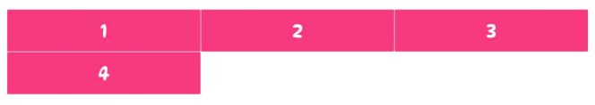
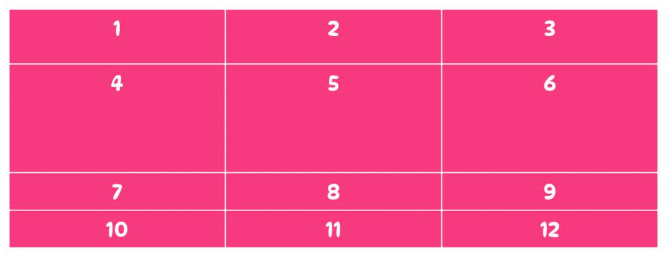

# grid行列设置

## grid-template-columns
指定列数以及每列的宽度. 

该属性接受一个或多个非负CSS长度值，这些值的个数就是网格容器的列数，每个值表示每列（即每个网格轨道）的宽度。

下例中, 容器是三列，每列宽 400px。由于网格容器有四个子元素，而我们只给网格指定了三列，所以当网格容器中的网格项数量超过三个时，CSS 会将其他网格项放到新行中以保持容器的布局。如：

```css
.container {
    display: grid;
    grid-template-columns: 400px 400px 400px;
}
```




## grid-template-rows


与 grid-template-columns 属性不同，grid-template-rows并没有指定网格容器的行数，而只用来设置每行的高度。这是因为每当网格项换行时，网格容器都会隐式创建一个新行。因此，我们无法使用 grid-template-rows 属性来控制网格的行数。

该属性接受一个或多个非负CSS 长度值，其中每个值表示网格容器中每一行的高度，从第一行到最后一行。


如下列, 网格容器的第一行高度为 100px，第二行高度为 200px。我们仅设置了网格容器中前两行的高度。如果向网格容器中添加更多的网格项，那么那些隐式创建的行的高度将不是由 grid-template-rows 属性决定，而由其内容的大小决定。

```css
.container {
    display: grid;
    grid-template-columns: 400px 400px 400px;
    grid-template-rows: 100px 200px;
}
```




## 网格线名称


grid-template-columns 和 grid-template-rows 属性还可以使用方括号来指定每一条网格线的名字，方便引用.


下例中, 定义了一个 3 行 4 列的网格，其中 one、two、three、four是列网格线的名称，five、six、seven、eight 是行网格线的名称。


```css
.container{
    grid-template-columns: [one] 40px [two] 50px [three] auto [four];
    grid-template-rows: [five] 25% [six] 100px [seven] auto [eight];
}
```


## 参考
1. https://zhangqiang.work/lab/css_layout_grid/
2. https://www.toutiao.com/article/7173980850827117096/
3. https://www.zhangxinxu.com/wordpress/2018/11/display-grid-css-css3/


