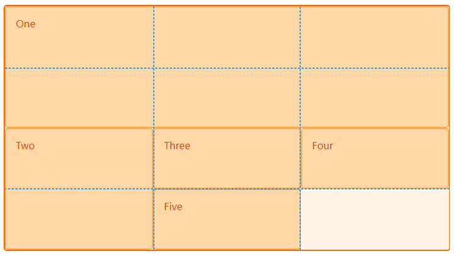

# [网格线(grid lines)](https://developer.mozilla.org/en-US/docs/Web/CSS/CSS_grid_layout/Basic_concepts_of_grid_layout#grid_lines)

我们使用网格轨道来定义grid, 而使用网格线来放置元素.


## 最佳实践

```htm

<div class="wrapper">
  <div class="box1">One</div>
  <div class="box2">Two</div>
  <div class="box3">Three</div>
  <div class="box4">Four</div>
  <div class="box5">Five</div>
</div>

```

```css
.wrapper {
  display: grid;
  grid-template-columns: repeat(3, 1fr);
  grid-auto-rows: 100px;
}

.box1 {
  grid-column-start: 1;
  grid-column-end: 4;
  grid-row-start: 1;
  grid-row-end: 3;
}

.box2 {
  grid-column-start: 1;
  grid-row-start: 3;
  grid-row-end: 5;
}
```



可以看到:

1. 元素One占据了第1列到第4列的纵向空间和第1行到第3行的横向空间, 既占据了3列2行.
2. 元素Two占据了第1列到第2列的纵向空间和第13行到第5行的横向空间, 既占据了1列2行.
3. 剩余的元素依次占据一个1行1列的空间.默认每个元素会占据一个[网格单元(Grid cells)](https://developer.mozilla.org/en-US/docs/Web/CSS/CSS_grid_layout/Basic_concepts_of_grid_layout#grid_cells)


## 网格线选择语法

1. grid-row: 1 / 3; 取行线1~行线3中的2行, 等价下面详细的写法
    1. grid-row-start: 1;元素开始行线
    2. grid-row-end: 3; 元素结束行线
2. grid-column: 1 / 4; 取列线1~列线4中的3列, 等价下面的详细写法
    1. grid-column-start: 1; 元素开始列线
    2. grid-column-end: 4; 元素结束列线
3. 单格选择:
    1. grid-column: 1; 取第一行, 默认跟了grid-column-end: 2, 等价下面的详细写法:
    2. grid-column-start: 1;


## 网格线名称

grid-template-columns 和 grid-template-rows 属性还可以使用方括号来指定每一条网格线的名字，方便引用.

下例中, 定义了一个 3 行 4 列的网格，其中 one、two、three、four是列网格线的名称，five、six、seven、eight 是行网格线的名称。

```css
.container{
    grid-template-columns: [one] 40px [two] 50px [three] auto [four];
    grid-template-rows: [five] 25% [six] 100px [seven] auto [eight];
}
```


## [网格区域(Grid areas)](https://developer.mozilla.org/en-US/docs/Web/CSS/CSS_grid_layout/Basic_concepts_of_grid_layout#grid_areas)


网格区域可以看成是网格线的简写形式.

1. [grid-area: 1 / 1 / 3 / 4](https://developer.mozilla.org/en-US/docs/Web/CSS/CSS_grid_layout/Grid_layout_using_line-based_placement)
    1. grid-row-start: 1
    2. grid-column-start: 1
    3. grid-row-end: 3
    4. grid-column-end: 4

2. [给区域命名](https://developer.mozilla.org/en-US/docs/Web/CSS/CSS_grid_layout/Grid_template_areas)

    在规划网格时, 每个网格都用区域名称填充, 子元素就可以使用class来直接引用网格名

    ```html
    .wrapper {
        display: grid;
        grid-template-columns: repeat(9, 1fr);
        grid-auto-rows: minmax(100px, auto);
        grid-template-areas:
            "hd hd hd hd   hd   hd   hd   hd   hd"
            "sd sd sd main main main main main main"
            ".  .  .  ft   ft   ft   ft   ft   ft";
    }

    <div class="wrapper">
        <div class="header">Header</div>
        <div class="sidebar">Sidebar</div>
        <div class="content">Content</div>
        <div class="footer">Footer</div>
    </div>
    ```


## 参考:
1. https://zhangqiang.work/lab/css_layout_grid/
2. https://www.toutiao.com/article/7173980850827117096/
3. https://www.zhangxinxu.com/wordpress/2018/11/display-grid-css-css3/


