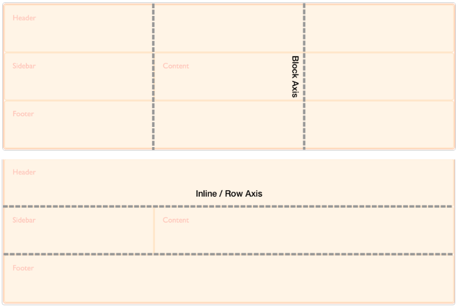

# 网格内容对齐(Box alignment)

网格有两个轴: 纵轴(block/column axis)和横轴(inline/row axis)

## 当内容填满网格空间时

### [纵轴对齐](https://developer.mozilla.org/en-US/docs/Web/CSS/CSS_grid_layout/Box_alignment_in_grid_layout#aligning_items_on_the_block_axis)

纵轴对齐是指在纵轴上移动, 也就是上对齐, 下对齐, 垂直居中.

1. [align-items](https://developer.mozilla.org/en-US/docs/Web/CSS/align-items): 容器设置, 对所有子项生效. 常用选项有:
2. [align-self](https://developer.mozilla.org/en-US/docs/Web/CSS/align-self): 子项设置, 仅对该子项生效

他们共有的属性:

1. stretch: 盒子填满网格, div的内容垂直居中
2. center: 盒子最小(盒子的大小是被内容撑起来的), 且垂直居中(等价div的内容居中)
3. start: 盒子最小(盒子的大小是被内容撑起来的), 上对齐
4. end: 盒子最小(盒子的大小是被内容撑起来的), 下对齐

### [横轴对齐](https://developer.mozilla.org/en-US/docs/Web/CSS/CSS_grid_layout/Box_alignment_in_grid_layout#justifying_items_on_the_inline_axis)

横轴对齐是指在横轴上移动, 也就是左对齐, 右对齐, 水平居中.

1. [justify-items](https://developer.mozilla.org/en-US/docs/Web/CSS/justify-items): 容器设置, 对所有子项生效
2. [justify-self](https://developer.mozilla.org/en-US/docs/Web/CSS/justify-self): 子项设置, 对该子项生效

他们共有的属性:

1. stretch: 盒子填满网格, div的内容水平居中
2. center: 盒子最小(盒子的大小是被内容撑起来的), 且水平居中(等价div的内容居中)
3. start: 盒子最小(盒子的大小是被内容撑起来的), 左对齐
4. end: 盒子最小(盒子的大小是被内容撑起来的), 右对齐

### 快捷设置

1. place-items: align-items justify-items;
2. place-self: align-self justify-self;

## 当内容未填满网格空间时

如果容器分配的网格, 没有占据所有容器空间, 则可是使用

1. [align-content](https://developer.mozilla.org/en-US/docs/Web/CSS/align-content)在纵轴上对齐
2. [justify-content](https://developer.mozilla.org/en-US/docs/Web/CSS/justify-content)在横轴上对齐
3. [place-content](https://developer.mozilla.org/en-US/docs/Web/CSS/place-content)同时在纵轴或横轴上对齐
