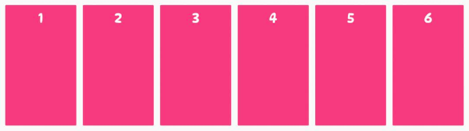

# css函数

## repeat()

repeat() 函数表示轨道列表的重复片段，该函数有两个参数：

1. 第一个参数用来指定行或列的重复模式重复的次数，有三种取值方式：

    1. `<number>`：整数，确切的重复次数。
    2. `<auto-fill>`：以网格项为准自动填充。
    3. `<auto-fit>`：以网格容器为准自动填充。

2. 第二个参数用来指定行或列的重复模式重复的内容，有以下取值方式：

    1. `<length>`：非负长度。
    2. `<percentage>`：相对于列轨道中网格容器的内联大小的非负百分比，以及行轨道中网格容器的块长宽。
    3. `<flex>`：单位为fr的非负长度，指定轨道弹性布局的系数值。
    4. `max-content`：表示网格的轨道长度自适应内容最大的那个单元格。
    5. `min-content`：表示网格的轨道长度自适应内容最小的那个单元格。
    6. `auto`：作为最大值时，等价于max-content。作为最小值时，它表示轨道中单元格最小长宽(min-width/min-height)的最大值。


假设我们要创建一个具有六个相等列的网格。如果没有 repeat() 函数，我们必须使用 grid-template-columns 属性显式定义每个列。代码如下：

```css
.container {
     display: grid;
     grid-template-columns: 1fr 1fr 1fr 1fr 1fr 1fr;
}
```

然而，随着列数的增加，这种方法变得不可持续和冗长。我们可以使用repeat()函数将其重写为更紧凑的形式。代码如下：

```css
.container {
     display: grid;
     grid-template-columns: repeat(6, 1fr);
}
```



## minmax()

minmax() 函数允许我们指定网格轨道的最小和最大尺寸，它是一个长宽范围的闭区间。当网格在视口中调整大小时，网格轨道将在该范围内增长和缩小。在较小的屏幕上，它会缩小直到达到最小尺寸。在更大的屏幕上，它会拉伸直到达到最大尺寸。

minmax() 函数接受 CSS Grid 大小单位、关键字、长度和百分比值。其有两个参数：

1. min：轨道的最小尺寸。
2. max：轨道的最大尺寸。

下例中, 使用 minmax() 函数将网格容器中两行的最小高度设置为 100px，将最大高度设置 max-content。这样就可以确保每一行在超过 100px 时都能伸展并变得尽可能宽，以容纳其内容。

```css
.container {
  display: grid;
   grid-template-columns: repeat(3, 1fr);
   grid-template-rows: repeat(2, minmax(100px, max-content));
}
```


## fit-content()

fit-content() 函数的操作类似于 minmax() 函数。不同之处在于，使用 fit-content()时，最小值是网格项中内容的大小，最大值是我们传递给它的值。这样就可以将内容设置为最小值，并根据需要将其放大到某个值。

如果最小宽度的值超过了提供给函数的值，则网格轨道的大小将设置为传递给 fit-content() 函数的值，并且网格项的内容将换行。

下例中, 使用 fit-content() 函数分别创建了宽度为 200px、300px 和 400px 的三列。这意味着每列的大小将等于其网格项目中最小的内容或文本的大小，但如果这变得大于提供给 fit-content() 函数的值，则列将设置为传递给 fit-content() 函数的值。

```css
.container {
   display: grid;
   grid-template-columns: fit-content(200px) fit-content(300px) fit-content(400px);
}
```


## 参考
1. https://zhangqiang.work/lab/css_layout_grid/
2. https://www.toutiao.com/article/7173980850827117096/
3. https://www.zhangxinxu.com/wordpress/2018/11/display-grid-css-css3/


