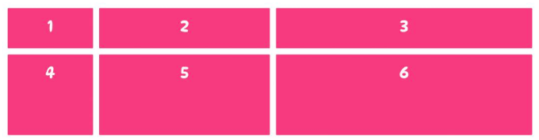
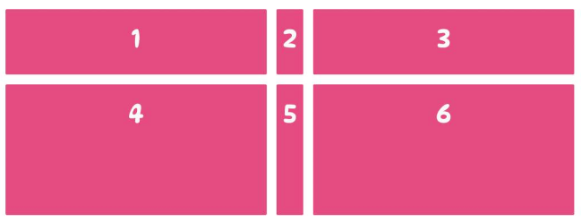
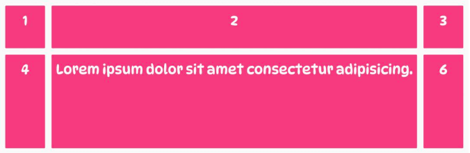

# 测量单位

除了非负CSS 长度值（例如px、rem、vw和百分比 ( %) ）之外，我们还可以使用特殊的大小单位和关键字来控制网格中网格项的大小。


## fr 单位

fr单位是“fractional”的缩写，如下例, 创建一个由三列组成的网格布局，其中第一列占网格宽度的 1/6，第二列是第一列宽度的两倍，第三列是第一列宽度的三倍。如果没有fr 单位，我们就需要执行一些数学运算，先用网格的总宽度100%除以6，然后将结果乘以每列的跨度：

1. 第一列的宽度 = 100% / 6 * 1 —> 15%
1. 第二列的宽度 = 100% / 6 * 2 —> 30%
1. 第三列的宽度 = 100% / 6 * 3 —> 45%

计算相对麻烦。这时 fr 单位就派上用场了, 如下例将容器宽度的一部分分给第一列，第二列的宽度是第一列的两倍，第三列的宽度是第一列的三倍。：


```css
.container {
   display: grid;
   grid-template-columns: 1fr 2fr 3fr;
}

```




## min-content

min-content 是一个用于调整大小的关键字，它将网格轨迹的宽度设置为最小宽度，通常是网格项中最小内容或文本的大小。它的工作原理类似于CSS函数：min()，但被用作间距单位而不是函数。

下例中, 将第一列和第三列的宽度设置为网格容器的小部分，同时将第二列设置为 min-content，使其缩小到网格项中内容的大小。


```css
.container {
display: grid;
grid-template-columns: 1fr min-content 1fr;
}
```




## max-content


max-content关键字的效果与min-content相反，它类似于CSS函数：max()。当应用于列或行时，轨道将变得尽可能宽，以便网格项中的所有内容都显示在一条完整的长行中。


下例中, 定义了三列，并将第二列的宽度设置为max-content关键字。如果在第二列的网格项中添加大量内容，这些网格项中的文本将不会溢出。相反，第二列的宽度将增加，第一列和第三列将缩小以适应它。
```css
.container {
   display: grid;
   grid-template-columns: 1fr max-content 1fr;
}

```




## 参考
1. https://zhangqiang.work/lab/css_layout_grid/
2. https://www.toutiao.com/article/7173980850827117096/
3. https://www.zhangxinxu.com/wordpress/2018/11/display-grid-css-css3/


