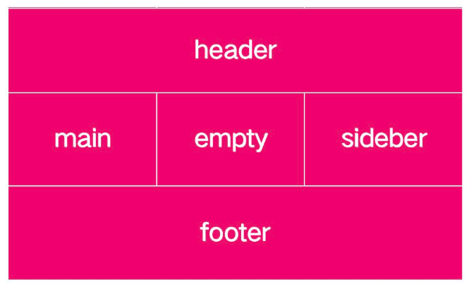

# 网格区域
使用grid-template-areas属性来定义网格区域。该属性有以下三个属性值：


1. `grid-area-name`：使用grid-area属性设置的网格区域的名称
2. `.` ：空网格单元
3. `none`：没有定义网格区域


下例: 
```css
.container{
    grid-template-areas: "header header header header"
                         "main main . sidebar"
                         "footer footer footer footer";
}

```




## 参考
1. https://zhangqiang.work/lab/css_layout_grid/
2. https://www.toutiao.com/article/7173980850827117096/
3. https://www.zhangxinxu.com/wordpress/2018/11/display-grid-css-css3/

