# 5网格容器对齐


## 水平对齐

使用justify-content属性来设置网格在网格容器内沿着水平方向的对齐方式。它接受七个可能的值。


1. start：将网格与网格容器的左边对齐

    ```css
    .container {
    justify-content: start;
    }
    ```

    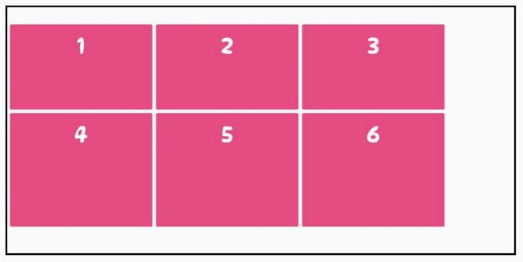

2. end：将网格与网格容器的右边对齐

    ```css
    .container {
    justify-content: end;
    }
    ```

    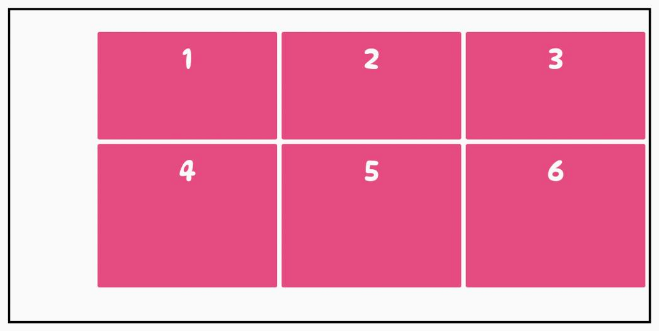

3. center：将整个网格水平放置在网格容器的中心


    ```css
    .container {
    justify-content: center;
    }
    ```

    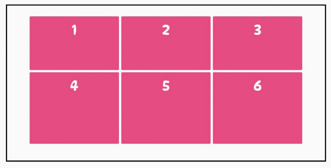

4. stretch：调整网格项大小，让宽度填充整个网格容器（默认值）

    ```css
    .container {
    justify-content: stretch;
    }
    ```

    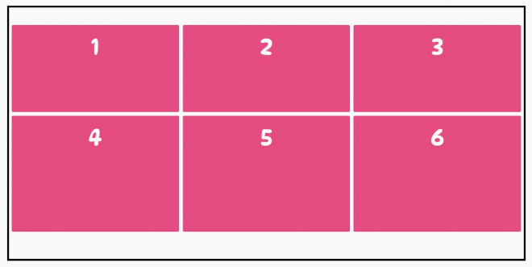

5. space-around：在网格项之间设置均等宽度的空白间隙，其外边缘间隙大小为中间空白间隙宽度的一半

    ```css
    .container {
    justify-content: space-around;
    }
    ```

    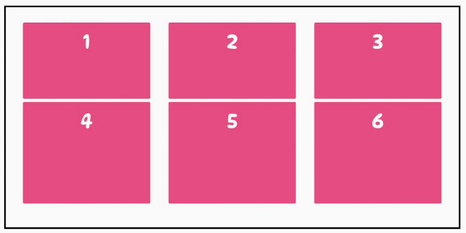

6. space-between：在网格项之间设置均等宽度空白间隙，其外边缘无间隙


    ```css
    .container {
    justify-content: space-between;
    }
    ```

    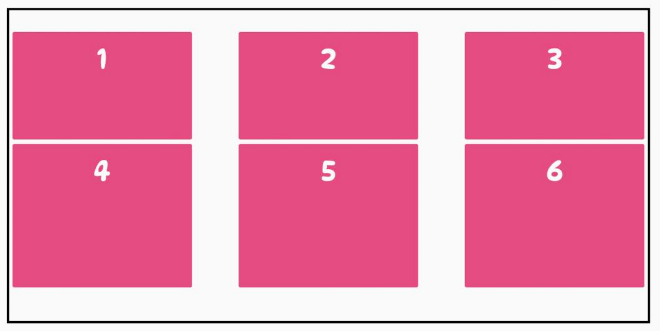

7. space-evenly：在每个网格项之间设置均等宽度的空白间隙，包括外边缘

    ```css
    .container {
    justify-content: space-evenly;
    }
    ```

    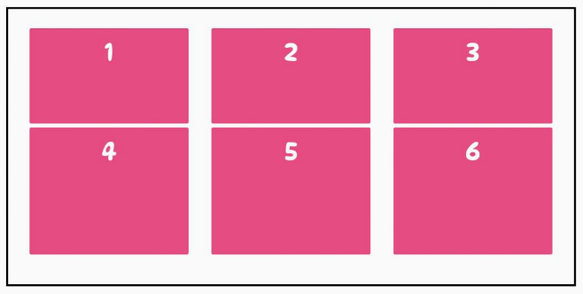


## 垂直对齐


align-content属性来设置网格在网格容器内沿着垂直方向的对齐方式。它接受七个可能的值。

1. start：将整个网格对齐到网格容器的顶部

    ```css
    .container {
    align-content: start;
    }
    ```

    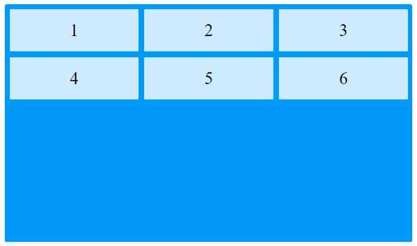

2. end：将整个网格与网格容器的底部对齐

    ```css
    .container {
    align-content: end;
    }
    ```

    

3. center：将整个网格垂直放置在网格容器的中心

    ```css
    .container {
    align-content: center;
    }
    ```

    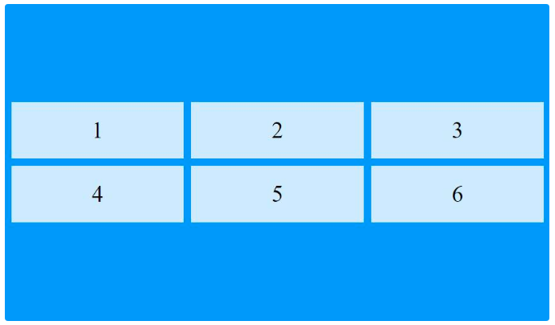

4. stretch：网格项目拉伸以填充容器网格的整个高度（默认值）

    ```css
    .container {
    align-content: stretch;
    }
    ```

    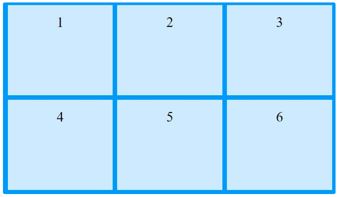

5. space-around：在网格项之间设置均等宽度的空白间隙，其外边缘间隙大小为中间空白间隙宽度的一半

    ```css
    .container {
    align-content: space-around;
    }
    ```
    
    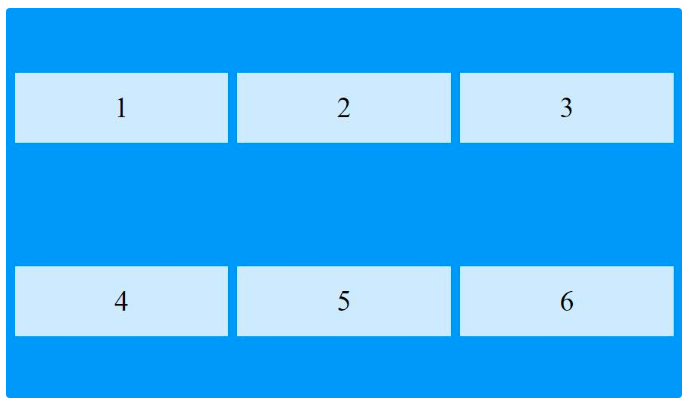

6. space-between：在网格项之间设置均等宽度空白间隙，其外边缘无间隙

    ```css
    .container {
    align-content: space-between;
    }
    ```
    
    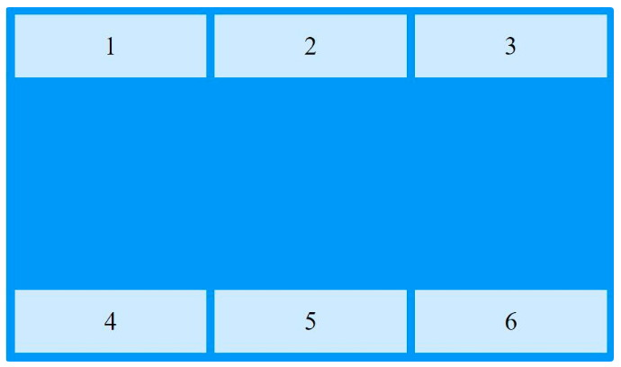

7. space-evenly：在每个网格项之间设置均等宽度的空白间隙，包括外边缘

    ```css
    .container {
    align-content: space-evenly;
    }
    ```
    
    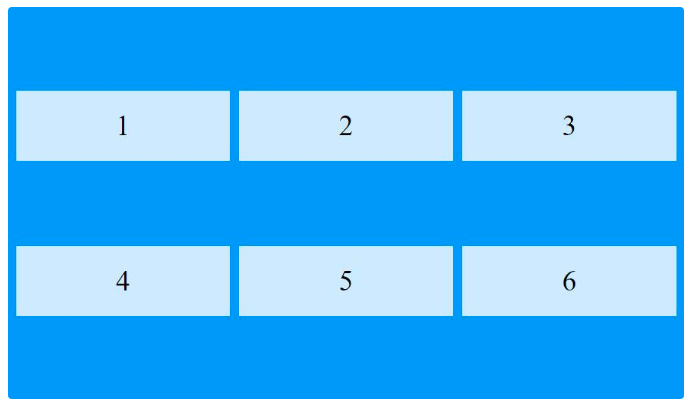


## 参考
1. https://zhangqiang.work/lab/css_layout_grid/
2. https://www.toutiao.com/article/7173980850827117096/
3. https://www.zhangxinxu.com/wordpress/2018/11/display-grid-css-css3/