# 网格项对齐


## 水平对齐网格项

Grid布局提供了六个属性来控制网格项沿网格容器的行或列的对齐方式。


### justify-items


justify-items 属性来控制所有网格项沿水平方向的对齐方式。它接受四个可能的值：


1. start：将网格项对齐到所有列的开头，即其单元格的左边缘。


    ```css
    .container {
    justify-items: start;
    }
    ```

    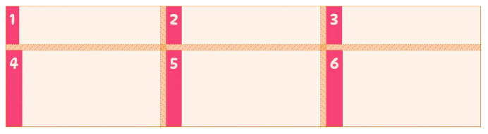


2. end：将网格项对齐到所有列的末尾，即其单元格的右边缘

    ```css
    .container {
    justify-items: end;
    }
    ```

    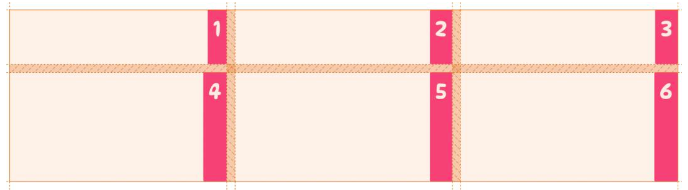

3. center：将所有网格项目放在其单元格的中心

    ```css
    .container {
    justify-items: center;
    }
    ```

    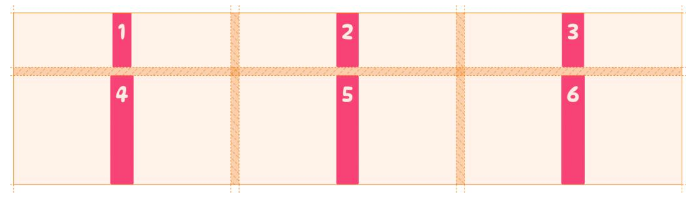

4. stretch：将拉伸网格项目以填充其单元格的整个宽度（默认值）

    ```css
    .container {
    justify-items: stretch;
    }
    ```

    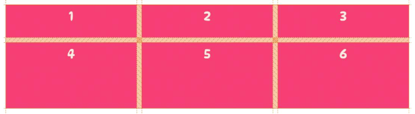


### justify-self

justify-self 属性来设置单元格内容的水平位置，此属性定义在`网格项上`，它接受四个可能得值。


## 垂直对齐网格项


### align-items
align-items 属性来控制所有网格项沿垂直方向的对齐方式。

它被传递给网格容器，其值适用于网格中的所有网格项。接受四个可能的值：


1. start：将所有网格项放在所有行的顶部

    ```css
    .container {
    align-items: start;
    }
    ```

    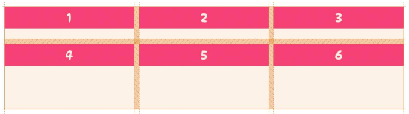

2. end：将所有网格项放在所有行的底部。

    ```css
    .container {
    align-items: end;
    }
    ```
    
    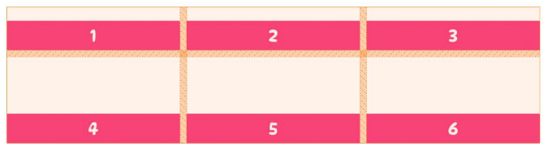

3. center：将所有网格项目放在其单元格的中心

    ```css
    .container {
    align-items: center;
    }
    ```

    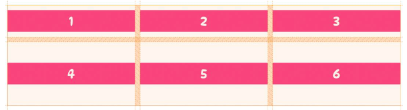

4. stretch：将拉伸所有网格项目以填充其单元格的整个高度（默认值）

    ```css
    .container {
    align-items: stretch;
    }

    ```

    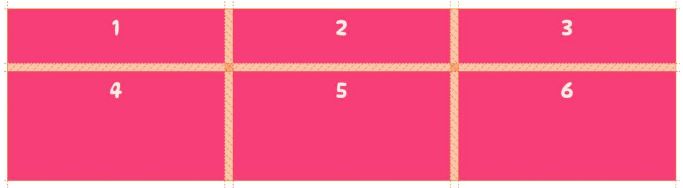


### align-self

使用 align-self 属性来设置单元格内容的垂直位置，此属性定义在网格项上，它接受四个可能得值。

1. start：在其单元格的顶部放置一个网格项

    ```css
    .box-4 {
    align-self: start;
    }
    ```
    
    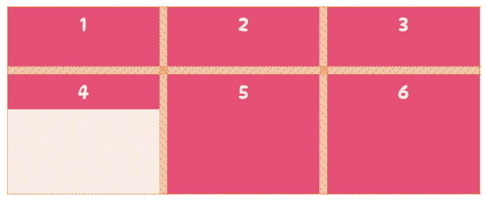

2. end：在其单元格的底部放置一个网格项

    ```css
    .box-5 {
    align-self: end;
    }
    ```

    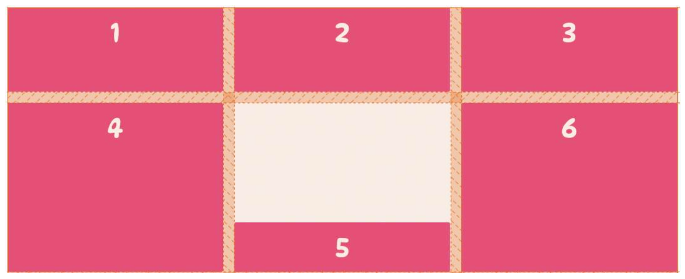


3. center：将一个网格项放置在其单元格的中心


    ```css
    .box-6 {
    align-self: center;
    }
    ```

    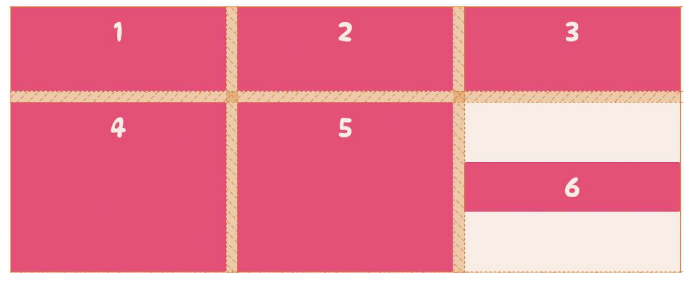

4. stretch：将拉伸网格项目以填充其单元格的整个高度（默认值）

    ```css
    .box-1 {
    align-self: stretch;
    }
    ```

    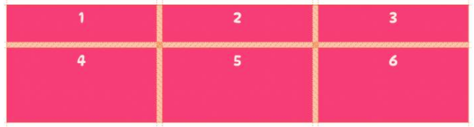


## 参考
1. https://zhangqiang.work/lab/css_layout_grid/
2. https://www.toutiao.com/article/7173980850827117096/
3. https://www.zhangxinxu.com/wordpress/2018/11/display-grid-css-css3/


