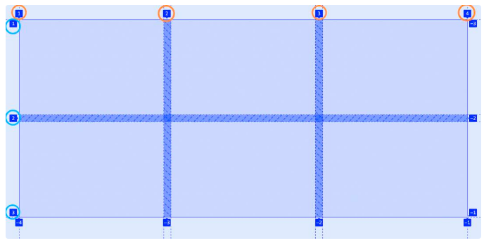
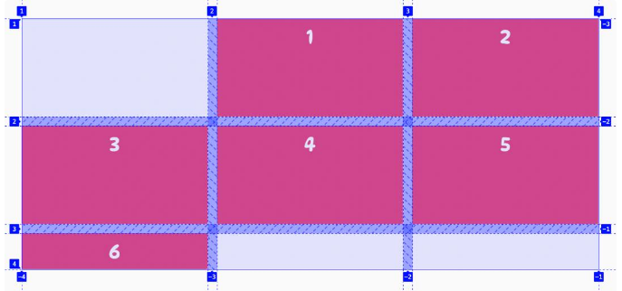
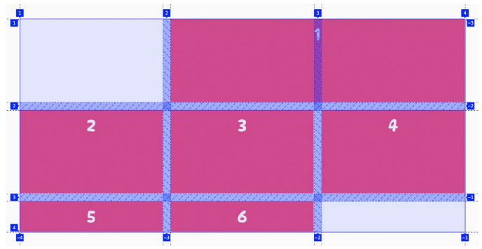
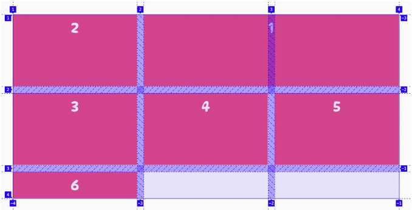
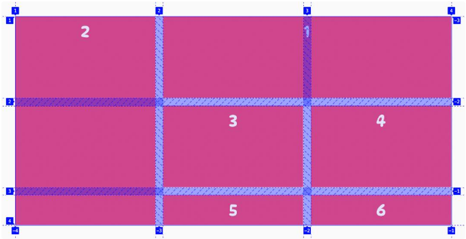

# 网格项布局


在网格容器中，每条网格线都根据其在网格上的位置给出一个编号。第一条网格线（行或列）的编号为 1，第二条为 2，依此类推。

例如，下图在一个三列两行的网格容器上存在的网格线的数量，其中列线是橙色圆圈内从 1 到 4 的数字，而行线是蓝色圆圈内的数字从 1 到 3 圈。




CSS Grid 提供了一些属性来控制网格项目沿这些网格线的位置，以及它们在水平和垂直方向上跨越的宽度。

1. grid-column-start
2. grid-column-end
3. grid-row-start
4. grid-row-end

## grid-column-start

可以使用 grid-column-start 属性来指定网格项沿网格容器内的列网格线的水平起始位置。这个开始位置定义了网格项目左边缘的开始。

如下例, 第一个网格项现在从第 2 列开始，而其他网格项被移动，换行到了新行或在网格上创建了空白空间。
```css
.container div:nth-of-type(1) {
  grid-column-start: 2;
}

```




## grid-column-end

使用 grid-column-end属性设置网格项的结束位置。

下例中, 使得第一个网格项从第 2 列开始，跨越两条网格线，并在第 4 行结束。使用 grid-column-start 和 grid-column-end 属性，可以有效地控制网格的水平起始位置以及它跨越网格的宽度。

```css
.container div:nth-of-type(1) {
    grid-column-start: 2;
    grid-column-end: 4;
}
```




## grid-row-start

grid-row-start 属性来指定网格项沿网格容器内水平（行）网格线的垂直起始位置。它用于设置网格项开始的行。

下例中, 使用 grid-row-start属性将第二个 div 元素的垂直起始位置设置为第 1 行。

```css
.container div:nth-of-type(2) {
    grid-row-start: 1;
}
```




## grid-row-end

可以使用 grid-row-end 属性来指定网格项沿网格容器内水平（行）网格线的垂直结束位置。

下例中, 第二个网格项从第一行开始，跨越三个网格线，在第 4 行结束。使用 grid-row-start和 grid-row-end 属性，可以有效地控制网格项的垂直起始位置及其在网格中的高度。
```css
.container div:nth-of-type(2) {
   grid-row-start: 1;
   grid-row-start: 4;
}

```


## 参考
1. https://zhangqiang.work/lab/css_layout_grid/
2. https://www.toutiao.com/article/7173980850827117096/
3. https://www.zhangxinxu.com/wordpress/2018/11/display-grid-css-css3/
