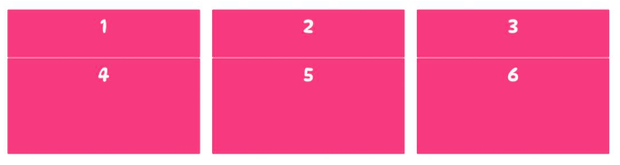
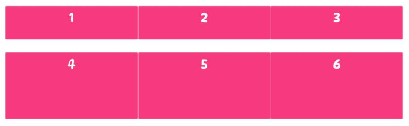

# 行列间隙


## column-gap


使用 column-gap 属性来通过调整网格容器中垂直网格线的宽度来增加列之间的间距。


它接受一个非负 CSS 长度值，该值用来定义每列之间的网格线的宽度。


如下例: 将网格容器中每条垂直（列）网格线的宽度设置为了 28px。使得网格中每一列之间的距离增加了28px。


```css
.container { 
    display: grid; 
    column-gap: 28px;
}
```



## row-gap


使用 row-gap 属性来通过调整网格容器中所有水平网格线的高度来在网格容器中的行之间添加间距。

它接受一个非负 CSS 长度值，该值定义每行之间网格线的大小。


下例中, 将网格容器中每条水平（行）网格线的高度设置为 40px。使得网格中每一行之间的距离增加了40px。

```css
.container { 
    display: grid; 
    column-row: 40px;
}
```


## 参考
1. https://zhangqiang.work/lab/css_layout_grid/
2. https://www.toutiao.com/article/7173980850827117096/
3. https://www.zhangxinxu.com/wordpress/2018/11/display-grid-css-css3/

