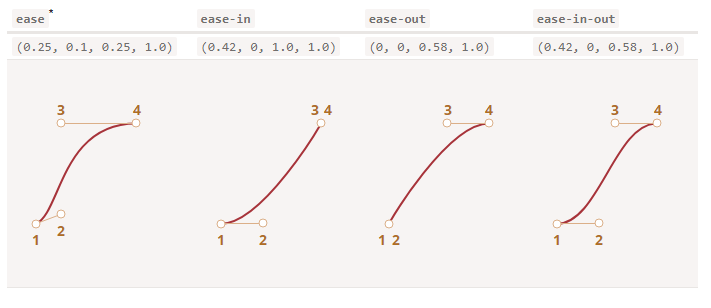

# 时间函数(timing-function)

时间函数描述了动画进程在时间上的分布。它是先慢后快还是先快后慢？
这个属性接受两种值：一个贝塞尔曲线（Bezier curve）或者阶跃函数（steps）。我们先从贝塞尔曲线开始，这也是较为常用的。


## 贝塞尔曲线（Bezier curve）

时间函数可以用贝塞尔曲线描述，通过设置四个满足以下条件的控制点：

1. 第一个应为：(0,0)。
1. 最后一个应为：(1,1)。
1. 对于中间值，x 必须位于 0..1 之间，y 可以为任意值。


CSS 中设置一贝塞尔曲线的语法为：cubic-bezier(x2, y2, x3, y3)。这里我们只需要设置第二个和第三个值，因为第一个点固定为 (0,0)，第四个点固定为 (1,1)。

时间函数描述了动画进行的快慢。

1. x 轴表示时间：0 —— 开始时刻，1 —— transition-duration的结束时刻。
2. y 轴表示过程的完成度：0 —— 属性的起始值，1 —— 属性的最终值。


1. 直线运输行驶

    最简单的一种情况就是动画匀速进行，可以通过设置曲线为 cubic-bezier(0, 0, 1, 1) 来实现。

    如下图, 直线函数, 这就是条直线。随着时间 x 推移，完成度 y 稳步从 0 增长到 1。
    
    
    <svg xmlns="http://www.w3.org/2000/svg" width="144" height="150" viewBox="0 0 144 150"><g id="animation" fill="none" fill-rule="evenodd" stroke="none" stroke-width="1"><g id="Group" transform="translate(12 13)"><path id="Shape" stroke="#A7333A" stroke-width="2" d="M4.17 103.348L104.314 3.505"/><circle id="Oval" cx="4" cy="104" r="4" fill="#FFF" stroke="#DBAF88"/><text id="1" fill="#AF6E24" fill-rule="nonzero" font-family="OpenSans-Bold, Open Sans" font-size="10.28" font-weight="bold"><tspan x="0" y="125">1</tspan></text><circle id="Oval" cx="104" cy="4" r="4" fill="#FFF" stroke="#DBAF88"/><text id="2" fill="#AF6E24" fill-rule="nonzero" font-family="OpenSans-Bold, Open Sans" font-size="10.28" font-weight="bold"><tspan x="100.101" y="25">2</tspan></text></g></g></svg>

    css样式的写法为:
    ```css
    .train {
    left: 0;
    transition: left 5s cubic-bezier(0, 0, 1, 1);
    /* JavaScript sets left to 450px */
    }
    ```


2. 起始阶段快, 结束阶段慢. 贝塞尔曲线为cubic-bezier(0.0, 0.5, 0.5 ,1.0), 图像如下:

    <svg xmlns="http://www.w3.org/2000/svg" width="149" height="187" viewBox="0 0 149 187"><g id="animation" fill="none" fill-rule="evenodd" stroke="none" stroke-width="1"><g id="train-curve.svg"><path id="Path-13" stroke="#A7333A" stroke-width="2" d="M26.137 142.908c0-49.408 50.364-99.664 100.358-99.664"/><path id="Line" stroke="#DBAF88" stroke-linecap="square" d="M25.5 143.5V93.34"/><circle id="Oval-4" cx="26" cy="144" r="4" fill="#FFF" stroke="#DBAF88"/><text id="-2" fill="#AF6E24" font-family="OpenSans-Bold, Open Sans" font-size="14" font-weight="bold"><tspan x="22" y="165">1</tspan></text><circle id="Oval-6" cx="26" cy="94" r="4" fill="#FFF" stroke="#DBAF88"/><text id="2" fill="#AF6E24" font-family="OpenSans-Bold, Open Sans" font-size="14" font-weight="bold"><tspan x="22" y="87">2</tspan></text><path id="Line" stroke="#DBAF88" stroke-linecap="square" d="M75.5 43.5h50.636"/><circle id="Oval-5" cx="126" cy="44" r="4" fill="#FFF" stroke="#DBAF88"/><text id="4" fill="#AF6E24" font-family="OpenSans-Bold, Open Sans" font-size="14" font-weight="bold"><tspan x="122" y="36">4</tspan></text><circle id="Oval-7" cx="76" cy="44" r="4" fill="#FFF" stroke="#DBAF88"/><text id="3" fill="#AF6E24" font-family="OpenSans-Bold, Open Sans" font-size="14" font-weight="bold"><tspan x="72" y="36">3</tspan></text></g></g></svg>


CSS 提供几条内建的曲线：linear、ease、ease-in、ease-out 和 ease-in-out。

linear 其实就是 cubic-bezier(0, 0, 1, 1) 的简写, 其它的名称是以下贝塞尔曲线的简写：





## 阶跃函数（Steps）

时间函数 steps(number of steps[, start/end]) 允许你让动画分段进行，number of steps 表示需要拆分为多少段。

下例把动画拆分为 9 段：

```css
#stripe.animate  {
  transform: translate(-90%);
  transition: transform 9s steps(9, start);
}
```

1. steps 的第一个参数表示段数。这个过渡动画将会被拆分为 9 个部分（每个占 10%）。时间间隔也会以同样的方式被拆分：9 秒会被分割为多个时长 1 秒的间隔。
2. 第二个参数可以取 start 或 end 两者其一。
    1. start 表示在动画开始时，我们需要立即开始第一段的动画。流程如下:

        1. 0s —— -10%（在第一秒开始的时候立即变化）
        2. 1s —— -20%
        3. …
        4. 8s – -80%
        5. （最后一秒，显示最终值）

    2. end表示：改变不应该在最开始的时候发生，而是发生在每一段的最后时刻。流程如下:


        1. 0s —— 0
        2. 1s —— -10%（在第一秒结束时第一次变化）
        3. 2s —— -20%
        4. …
        5. 9s —— -90%


## 参考
1. https://zh.javascript.info/css-animations