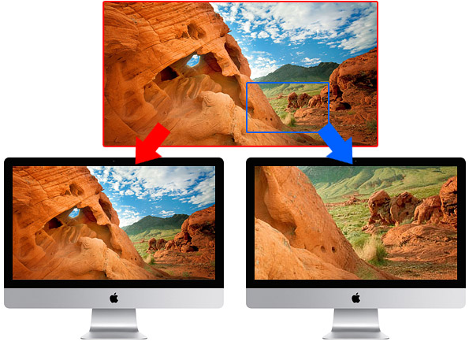
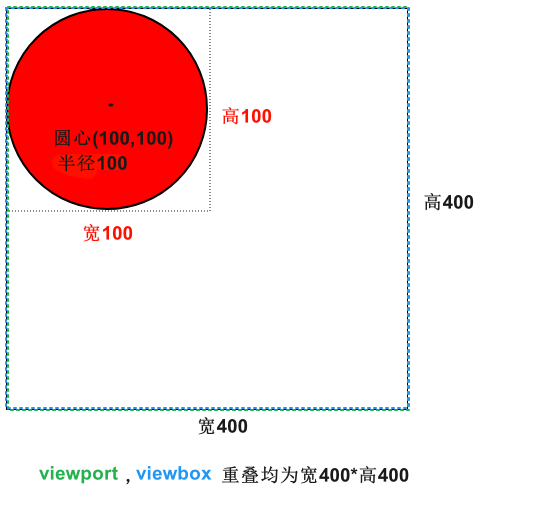
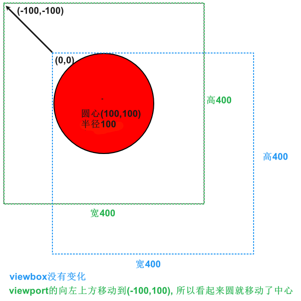
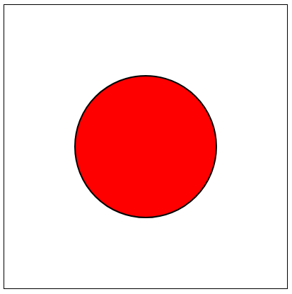
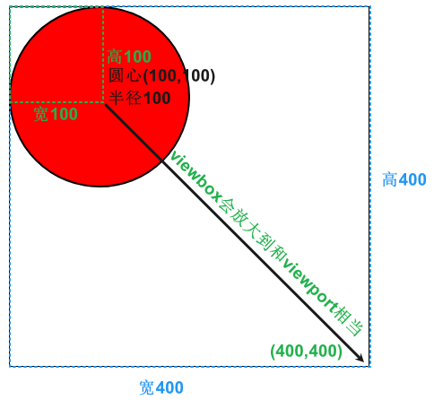
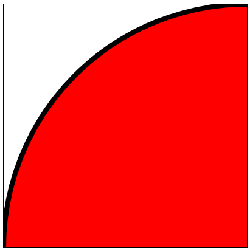

# viewbox和viewport


## [viewbox和viewport概念](https://www.oxxostudio.tw/articles/201409/svg-23-viewpoint-viewBox.html)

1. 视口(viewport): (width, height)就是画布的大小, 左上角坐标是(0,0), 右下角坐标是(width, height)✨与 HTML 和 CSS 比较不同的地方，SVG 本身定义这些属性是没有单位的
2. 视盒(viewbox): (min-x, min-y, width, height)当我们不设定 viewbox 的时候，viewbox 就是整个 viewport 的大小，当我们设定了 viewbox，等于就是告诉 SVG 说：「只有这个区域是我要表现的」，SVG 便会把这个区域放大到 viewport 的大小，如果还是很难理解，可以想像一下我们家的电视机，电视机就是那么大，就是 viewport，而电视机里的画面，可以特写，可以全景，这就是 viewbox。





## viewbox和viewport重叠

默认情况下viwbox和viewport重叠的


```htm
<svg width="400" height="400" style="border:1px solid black;" xmlns="https://www.w3.org/2000/svg" version="1.1">
   <circle cx="100" cy="100" r="100" stroke="black" stroke-width="2" fill="red" />
</svg> 

```





## viewbox平移

```htm
<svg width="400" height="400" viewbox="-100, -100, 400, 400"style="border:1px solid black;" xmlns="https://www.w3.org/2000/svg" version="1.1">
   <circle cx="100" cy="100" r="100" stroke="black" stroke-width="2" fill="red" />
</svg> 

```








## viewbox缩放


```htm
<svg width="400" height="400" viewbox="0, 0, 100, 100"style="border:1px solid black;" xmlns="https://www.w3.org/2000/svg" version="1.1">
   <circle cx="100" cy="100" r="100" stroke="black" stroke-width="2" fill="red" />
</svg> 

```






## 参考
1. https://developer.mozilla.org/zh-CN/docs/Web/SVG/Tutorial/Positions


