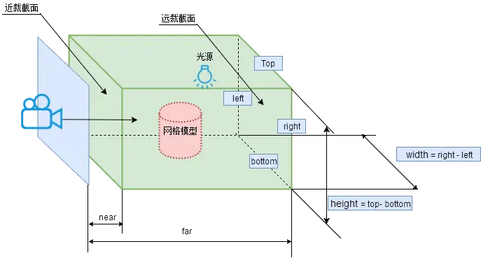

# 相机


## 创建相机

1. 实例化(正投影或者透视投影)
2. 设置相机位置
3. 设置相机拍摄方向

```ts
// 实例化一个透视投影相机对象
const camera = new THREE.PerspectiveCamera();
camera.position.set(200, 200, 200); 
camera.lookAt(0, 0, 0); //坐标原点
```

## 相机类型

### 透视相机

透视相机的四个参数`fov`, `aspect`, `near`, `far`构成一个四棱台3D空间，被称为视锥体，只有视锥体之内的物体，才会渲染出来. 如下图, 只有锥形的近截面和远截面中间的物体才会被渲染出来.


1. 方法: `new THREE.PerspectiveCamera( fov, aspect, near, far )`
2. 参数: 
    1. fov: 相机视锥体竖直方向视野角度	50
    2. aspect: 相机视锥体水平方向和竖直方向长度比，一般设置为Canvas画布宽高比, width / height	1
    3. near: 相机视锥体近裁截面相对相机距离	0.1
    4. far: 相机视锥体远裁截面相对相机距离，far-near构成了视锥体高度方向	2000


    <iframe src="https://threejs.org/manual/examples/cameras-perspective.html" width="100%" height="500"></iframe>


### 正交相机(OrthographicCamera)

物体的大小不受距离的影响。适合渲染2D场景或者UI元素.



1. 方法`new THREE.OrthographicCamera(left, right, top, bottom, near, far);`
2. 参数:
    1. left渲染空间的左边界
    2. right渲染空间的右边界
    3. top渲染空间的上边界
    4. bottom渲染空间的下边界
    5. near属性表示的是从距离相机多远的位置开始渲染，一般情况会设置一个很小的值。 默认值0.1
    6. far属性表示的是距离相机多远的位置截止渲染，如果设置的值偏小小，会有部分场景看不到。 默认值2000


## 相机动画

### 相机位置变化

连续改变相机的位置.position，就可以获得一个动画效果。

如下代码, 相机沿着z轴负方向移动

```ts

function render() {
    camera.position.z -= 0.3;//相机直线运动动画
    renderer.render(scene, camera);
    requestAnimationFrame(render);
}
render();
```

如下代码, 相机在XOZ平面上绕着y轴圆周运动

```ts
// 渲染循环
let angle = 0; //用于圆周运动计算的角度值
const R = 100; //相机圆周运动的半径
function render() {
    angle += 0.01;
    // 相机y坐标不变，在XOZ平面上做圆周运动
    camera.position.x = R * Math.cos(angle);
    camera.position.z = R * Math.sin(angle);
    renderer.render(scene, camera);
    requestAnimationFrame(render);
}
render();
```


### 相机视角变化

改变.position属性后，如果不执行.lookAt()方法，相机的观察方向默认不变。

如果你希望相机圆周运动的同时，改变相机视线方向，保持相机镜头始终指向坐标原点或其它位置，需要每次改变.position属性后，重新执行一遍.lookAt()方法

```ts
function render() {
    angle += 0.01;
    camera.position.x = R * Math.cos(angle);
    camera.position.z = R * Math.sin(angle);
    // .position改变，重新执行lookAt(0,0,0)计算相机视线方向
    camera.lookAt(0,0,0);
    requestAnimationFrame(render);
}
render();
```


## 参考
1. [透视投影相机](http://www.webgl3d.cn/pages/c0b143/)
1. [透视投影照相机](https://www.cnblogs.com/xulei1992/p/5709677.html)
2. [正交相机](https://threejs.org/docs/index.html?q=Camera#api/zh/cameras/OrthographicCamera)
3. [Three.js相机Camera](https://juejin.cn/post/7231089453695238204)