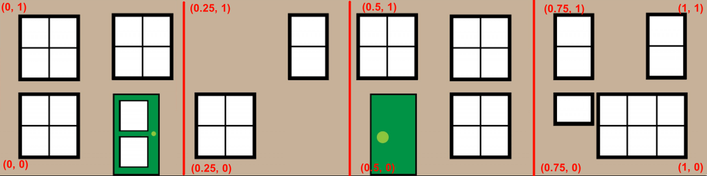

## mesh大小设置

以下三种方法效果相同:

1. 创建时指定

    `const box = BABYLON.MeshBuilder.CreateBox("box", {width: 2, height: 1.5, depth: 3})`

2. 创建后, 使用scaling指定

    1. 直接设置xyz
        ```js
        const box = BABYLON.MeshBuilder.CreateBox("box", {}); //unit cube
        box.scaling.x = 2;
        box.scaling.y = 1.5;
        box.scaling.z = 3;
        ```

    2. 使用Vector3
        ```js
        const box = BABYLON.MeshBuilder.CreateBox("box", {}); //unit cube
        box.scaling = new BABYLON.Vector3(2, 1.5, 3);
        ```

## mesh位置设定
   
1. 直接设置xyz

    ```js
    box.position.x = -2;
    box.position.y = 4.2;
    box.position.z = 0.1;
    ```

2. 使用Vector3

    ```js
    box.position = new BABYLON.Vector3(-2, 4.2, 0.1);
    ```

## mesh角度设定

    ```js
    box.rotation.y = Math.PI / 4;
    box.rotation.y = BABYLON.Tools.ToRadians(45);
    ```


## 合并网格体

```js
const house = BABYLON.Mesh.MergeMeshes([box, roof], true, false, null, false, true);

```


## 复制网格体
1. clone: 深拷贝
2. createInstance: 软拷贝

```js
clonedHouse = house.clone("clonedHouse")
instanceHouse = house.createInstance("instanceHouse")
```
## 通用参数


### Updatable(可更新)

Babylon中的物体都是由一组顶点数据经过彼此之间的连接构成，如果一个物体Option中的updatable参数设置为true，那么这个物体的顶点数据就能够被修改，这意味着物体能够改变形状。

### SideOrientation

3D世界的计算比较耗费资源，一般相机移动到物体的背面，为了节省资源就默认不显示这个物体了，所以在创建物体时SideOrientation都为正面。如果选择反面，那么当相机位于物体的正面时，物体就被隐藏了。如果选择了双面，无论相机如果移动，那么物体都会被显示出来，这也是最耗费电脑资源的方式。

SideOrientation有4个可能的选项：

1. BABYLON.Mesh.FRONTSIDE，表示正面。
2. BABYLON.Mesh.BACKSIDE，表示反面。
3. BABYLON.Mesh.DOUBLESIDE，表示双面。
4. BABYLON.Mesh.DEFAULT，目前这个值和FRONTSIDE相等

。BABYLON.Mesh.FRONTSIDE的值是0，BACKSIDE是1，DOUBLESIDE是2，DEFAULT也是1。


### [faceUV](https://doc.babylonjs.com/features/introductionToFeatures/chap2/face_material/)

类似于CSS中的精灵图(spirit), 将图片的某一部分贴在网格体上. 图片的行为使用数学坐标系, 左下角坐标为(0, 0), 右上角坐标为(1, 1).

正方体有6个面, 编号分别为后面0, 前面1, 右面2, 左面3, 上面4, 下面5.

🌰将下图贴在正方形的前后左右4面上:


```js
const faceUV = [];
faceUV[1] = new BABYLON.Vector4(0.0, 0.0, 0.25, 1.0); //front face
faceUV[2] = new BABYLON.Vector4(0.25, 0, 0.5, 1.0); //right side
faceUV[0] = new BABYLON.Vector4(0.5, 0.0, 0.75, 1.0); //back face
faceUV[3] = new BABYLON.Vector4(0.75, 0, 1.0, 1.0); //left side
const box = BABYLON.MeshBuilder.CreateBox("box", {faceUV: faceUV, wrap: true});
```
<iframe src="https://playground.babylonjs.com/#KBS9I5#72" width="100%" height="500"></iframe>


### [faceColors]

Color4表示rgba，只是Babylon中的Color值都是用0至1表示的，例如Color3(0.5,0.5,0.5)，就相当于rgb(128,128,128)。

```js
var rgba = new BABYLON.Color3(0.5, 0.5, 0.5, 1);//透明度颜色
```


## 参考

1. https://doc.babylonjs.com/features/introductionToFeatures/chap2/placement/