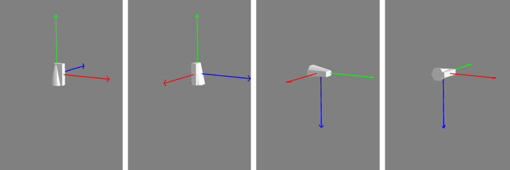

# [网格体位置旋转和缩放](https://doc.cnbabylon.com/6-0-position-and-rotation/)


## 坐标参照系

Babylon.js坐标的轴线都有标准的颜色标识，X轴为红色R，Y轴为绿色G，Z轴为蓝色B。

Babylon.js使用了两种坐标参照系 ，即全局(world)坐标系和局部(local)坐标系.

1. 全局坐标系的原点位置任何时候都是(0, 0, 0)不会被改变
2. 局部坐标系的原点始终在会处于物体的中心, 会随着物体位置、旋转、缩放的改变而改变。

🌰在创建一个物体后，默认旋转角度为0，缩放比例为1，所以实验体的位置也显示在世界坐标的原点(0, 0, 0)，而且世界坐标轴和局部坐标轴此时是重合在一起的。，它世界坐标系和局部坐标系就都是(0, 0, 0)，当这个物体移动到位置(0, 10, 0)的时候，也就是向上移动了10的距离，这个时候它世界坐标系还是(0, 0, 0)和局部坐标系是(0, 10, 0)。

物体旋转和缩放需要一个支点，一般来说都是位于其局部坐标的原点，简单来说也就是该物体的中心，所以我们看到的效果就是中心缩放和中心旋转。如果想改变支点怎么办？比如地球绕着太阳旋转，支点就肯定不能是自身中心，强大的Babylon肯定是有办法的，那就是通过使用变换节点TransformNode或矩阵Matrix来为物体设置新的支点。

## 位置(Position)


```js
//常规设置
pilot.position = new BABYLON.Vector3(2, 3, 4);

//或者，独立设置
pilot.position.x  =  2;
pilot.position.y  =  3;
pilot.position.z  =  4;
```

## 旋转(Rotation)

3D空间旋转要考虑两个因素:
1. 多次旋转操作，而应用这些旋转操作的先后顺序可能会导致物体有着完全不同的方向
2. 使用的是世界坐标还是局部坐标

```js
//常规设置
 pilot.rotation = new BABYLON.Vector3(alpha, beta, gamma);

//或者，独立设置
pilot.rotation.x  =  alpha; //围绕X轴旋转
pilot.rotation.y  =  beta;  //围绕Y轴旋转
pilot.rotation.z  =  gamma; //围绕Z轴旋转
```

以上代码中的alpha, beta, and gamma是以`弧度`作为单位的，也就是说与我们平时所说的角度不一样，例如360°，有一个换算公式：`1° = π /180 弧度`

可能的疑问：上面代码中分别设置了alpha, beta, gamma，针对了X、Y、Z三个轴，那它们三个分别使用了世界坐标系还是局部坐标系？应用的顺序如何？”其实对于Babylon.js中旋转，以下两个准则得出的结果都是一样的：



## 缩放(Scaling)


```js
//常规设置
mesh.scaling = new BABYLON.Vector3(scale_x, scale_y, scale_z);

//或者，独立设置
mesh.scaling.x = 5;
mesh.scaling.y = 5;
mesh.scaling.z = 5;
```


