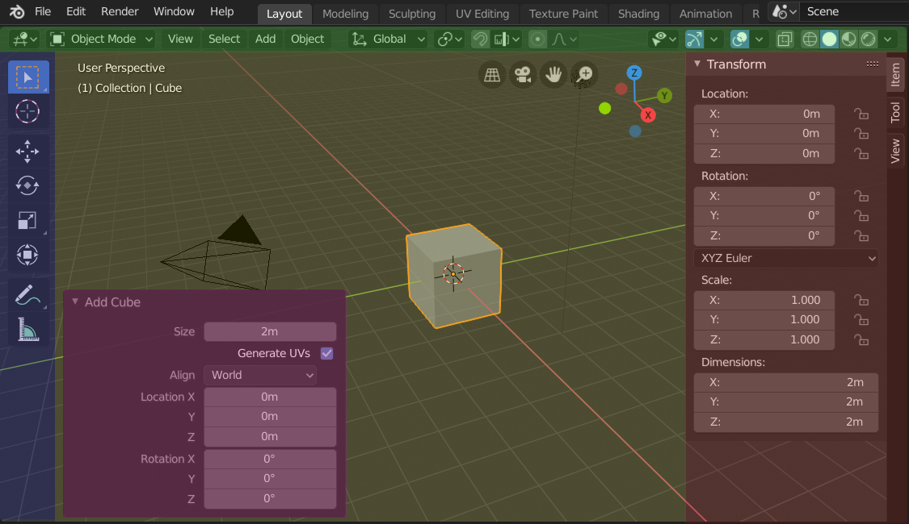

# 区域和区块

## 区域(Areas)

Blender 窗口被划分为若干矩形，称为区域。一个区域对应一个编辑器，例如 3D 视图或大纲。

1. 改变大小(Resizing): 移动鼠标光标到两个区域之间的边界，直到它变成一个双向箭头，然后按下并拖动。✨按住 Ctrl 键可将区域的大小调整为易用的尺寸。
2. 对接(Docking): 将鼠标光标放在一个区域的角上，光标将变为十字 (+)。
    1. 合并: 从一个区域的角落拖动到另一个区域的空间，将 合并 两个区域。
    2. 拆分: 从区域的角落向左/右拖动将垂直分割区域，向上/向下拖动则水平分割区域。
3. 区域选项(Area Options): 在区域边界按 鼠标右键 打开 区域选项。
    1. 垂直/水平分割(Vertical/Horizontal Split): 
    2. 向上/下/左/右合并(Join Up/Down/Left/Right):
    3. 互换区域(Swap Areas, ): 初始区域的一个角上按下 Ctrl-鼠标左键 来交换两个区域的内容，向目标区域拖动，并在那里释放鼠标
4. 将区域复制到新窗口(Duplicate Area into new Window, Shift-LMB): 视图 ‣ 区域 ‣ 将区域复制到新窗口 创建一个新的包含该区域的浮动窗口
5. 区域最大化(Toggle Maximize Area, Ctrl-Spacebar): 视图 ‣ 区域 ‣ 切换区域最大化
6. 区域全屏(Toggle Fullscreen Area, Ctrl-Alt-Spacebar): 视图 ‣ 区域 ‣ 切换区域全屏

## 区块(Regions)

### 区块分类
区域(Area)由多个区块(Region)构成，如选项卡和面板，其中包含标题栏（绿色），主区块（黄色），工具栏（蓝色），侧栏（红色）和调整上一步操作面板（粉色）。

1. 主区块(Main Region): 每个编辑器的主区块和附加区块的功能都是不一样的
2. 标题栏(Header): 菜单和按钮将随编辑器类型和所选物体和模式而改变
    3. 上下文菜单(Context Menu): 在标题栏上 鼠标右键 单击
4. 工具栏(Toolbar): 编辑器区域的左侧, 包含一组交互式工具。T 切换工具条的可见性。
    1. 工具设置(Tool Settings): 编辑器顶部或底部的一个水平条（类似于标题栏），包含了当前所选工具的设置。
5. 侧栏(Sidebar): 编辑器区域右侧，包含编辑器中物体与编辑器自身的设置面板。N 用于切换侧栏的可见性。
6. 底栏(Footer): 编辑器显示一个栏（在编辑器区域的顶部/底部），显示例如活动工具或操作符的信息。

### 分割排布
1. 滚动
2. 改变尺寸与隐藏
3. 缩放

### 资产架
1. 搜索
2. 选项卡

