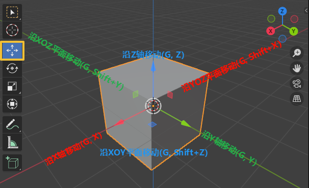
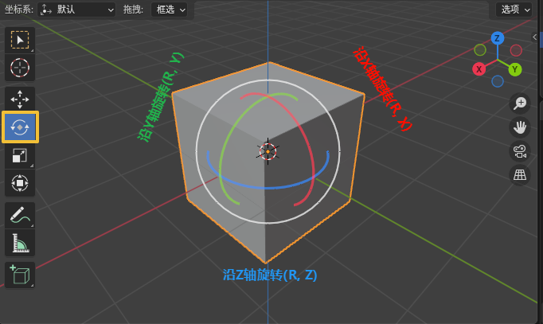
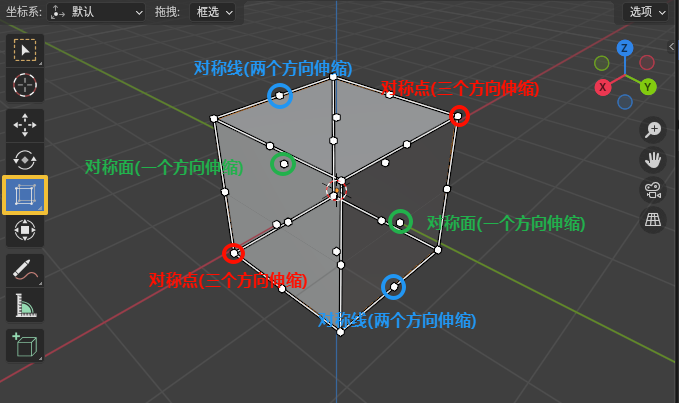
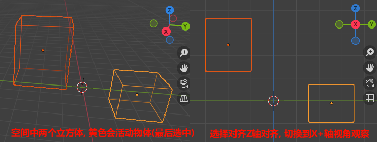
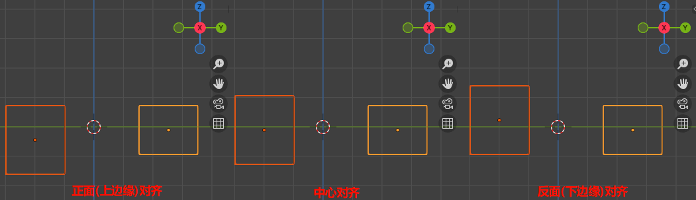

# 移动旋转缩放

## 移动旋转缩放

1. 移动(G)

    1. 基础移动: 点击G, 鼠标移动, 左键确认, 右键取消
    2. 沿X轴移动: 点击红色箭头, 拖动(G, X)
    3. 沿YOZ平面移动: 点击红色方块, 拖动(G, Shift+X)
    4. 沿Y轴移动: 点击绿色箭头, 拖动(G, Y)
    5. 沿XOZ平面移动: 点击绿色方块, 拖动(G, Shift+Y)
    6. 沿Z轴移动: 点击蓝色箭头, 拖动(G, Z)
    7. 沿XOY平面移动: 点击蓝色方块, 拖动(G, Shift+Z)

    

2. 旋转(R)
    1. 基础旋转: 点击R(或RR), 鼠标移动, 左键确认, 右键取消
    2. 沿X轴旋转: 点击红色线, 拖动(R, X)
    3. 沿Y轴旋转: 点击绿色线, 拖动(R, Y)
    4. 沿Z轴旋转: 点击蓝色线, 拖动(R, Z)

    

3. 缩放(S)
    1. 中心缩放
        1. 基础缩放: 点击S, 鼠标移动, 左键确认, 右键取消
        2. 沿X轴缩放: 点击红色箭头, 拖动(S, X)
        3. 沿YOZ平面缩放: 点击红色方块, 拖动(S, Shift+X)
        4. 沿Y轴缩放: 点击绿色箭头, 拖动(S, Y)
        5. 沿XOZ平面缩放: 点击绿色方块, 拖动(S, Shift+Y)
        6. 沿Z轴缩放: 点击蓝色箭头, 拖动(S, Z)
        7. 沿XOY平面缩放: 点击蓝色方块, 拖动(S, Shift+Z)

        

        ✨多个顶点可以利用缩放在某一个轴上对齐

    2. 罩体缩放

        

    3. 多选缩放

        多个物体时, 是以多个物体的中心进行缩放. 将两个平面向中线拉伸.

4. 变换: 综合移动, 旋转, 缩放.

## [对齐](https://docs.blender.org/manual/zh-hans/2.91/scene_layout/object/editing/transform/align_objects.html)

指令: 物体->变换->对齐物体

参数:

1. 高品质: 对齐精度
2. 相对于: 选择参考物体
    1. 活动项: 最后选择物体, 要依次选择对齐的物体, 和被对齐物体.
    2. 选中项:
    3. 3D游标:
    4. 场景原点:
3. 对齐: 选择沿哪个方向对齐, Shift可多选

Mesh Align Plus插件

