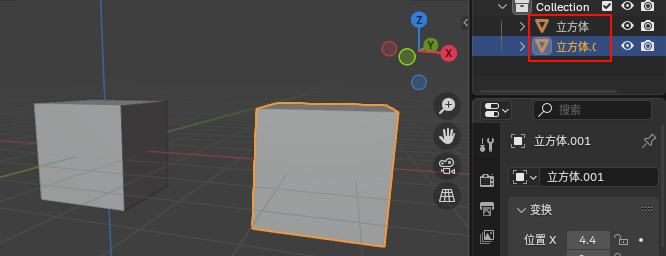
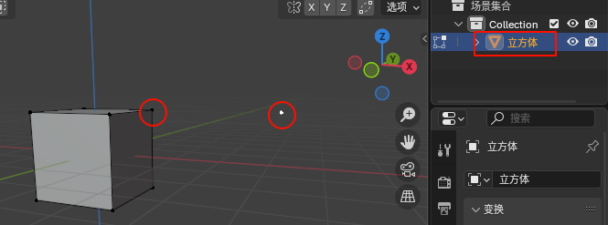
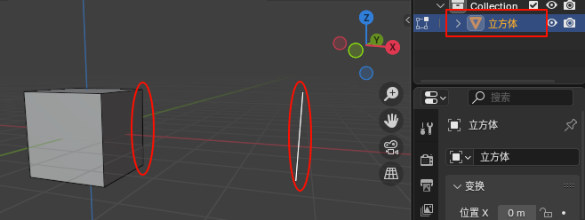
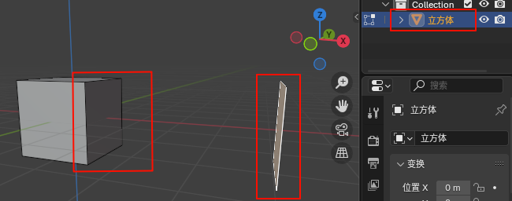

# 增加

## 创建物体

创建物体(Shift+A)后可以调节参数. 参数调节有且只有一次结汇, 在进入下一次操作前可以使用F9进行调节

在编辑模式下, 创建网格或者点线面都是属于同一对象.

## 复制

Shift+D

1. 物体模式: 生成一个独立物体, 可以合并成一个物体, 比如桥接时需要

    

2. 编辑模式: 点线面均属于原物体, 可以进行分离(P)
    1. 点

        

    2. 线

        

    3. 面

        

## 交互添加

自动贴合物体的平面, 然后在该平面上创建.

