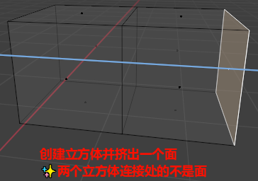

# 点线面的删除

## 删除(X)

1. 点只有点删除，同时会删掉与点接触到的更高的线和面
2. 边的边删除，会同时删掉与边接触到的更高维的面

    1. 边的点删除，等同于删除边上两边的端点，也就是两个点的点删除
    2. 仅边和面删除 时，只有边删除会生效 （附，点线面不能选择更高维的删除）

3. 面的面删除，因为面已经最高维了，所以只会删除面 
    1. 面的点删除，和边的点删除一样，就相当于所有端点一起点删除（如正方形面有四个端点） 
    2. 面的边删除，就相当于面的所有边一起边删除，注意因为是边删除，只会在删掉边后再顺带删掉更高维度的面，所以面的端点还在

✨口诀, 删自身, 删高维: 之所以点没有线面删除，边没有面删除，是因为它们不能删除比自己高维的东西

## [融并(Ctrl+X)](docs.blender.org/manual/zh-hans/4.2/modeling/meshes/editing/mesh/delete.html)

融并是将多个面合并成一个面:
1. 选择2个面融并, 会删除公共的线
2. 选择1个线融并, 会删除自身, 等价与选择2个相邻的面
3. 选择1个点融并, 会删除自身, 等价于选择4个相邻的面

✨多个面可以在同一个平面, 也可以不再同一个平面, 不在同一平面的2个面, 融合后是一个弯折的面.

创建实验的长方体:

✨两个正方体连接的地方不是一个面

### 融并面

1. 同一平面相邻面融并

    

2. 不同平面相邻面融并

    

### 融并线

### 融并点

### 添加额外面的影响

