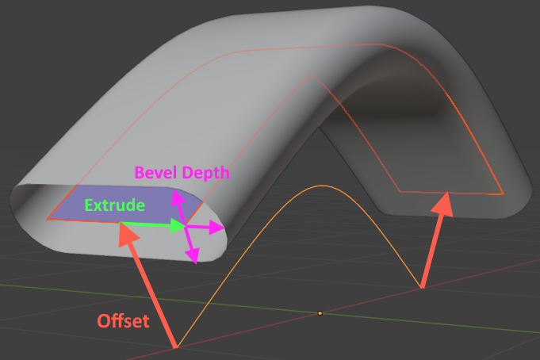

# 曲线

## 曲线操作

1. E挤出点
2. Ctrl+鼠标右键点击，可不断的增加线段
3. 选择两个点, Shift+F闭合曲线
4. 选择任何点, Alt+C闭合, 按第二次alt+c可取消环闭合曲线
5. 选择点, Alt+S调整局部粗细
✨删除段数断开, 删除点不会断开

## [曲线属性](https://docs.blender.org/manual/zh-hans/latest/modeling/curves/properties/geometry.html)

### 形状

1. 维度: 默认3D，2D将控制点约束在XY轴上。
2. 预览/渲染分辨率 U: 控制点之间计算的点的数量。通过大分辨率，更平滑。
3. 扭曲方法: 更改曲线的扭曲度的计算方式
4. 平滑: 如果曲线因过度扭曲而出现明显的 "扭结"，则此功能非常有用
5. 填充模式: 曲线在倒角时的显示方式, 当设置为 一半 时，曲线会显示为半个圆柱体。
6. 填充形变: 在应用所有可能使曲线变形的修改（例如形态键和修改器）后，填充曲线。
7. 曲线形变:
    1. 半径: 使形变物体按设定的曲线半径缩放。
    2. 拉伸: 允许网格物体拉伸或挤压整个曲线。
    3. 边界钳制: 启用此选项时，物体和网格沿形变轴的偏移量将被忽略。

### 几何数据

将1维的线转化为2维的面或3维的管道.

1. 偏移: 根据法线移动
2. 挤出: 垂直于法线的面挤出
3. 锥化物体:
4. 锥化半径:
5. 映射锥化:
6. 倒角: 将1维的线或二维挤出的面转化为3维的管道
    1. 圆: 
        1. 深度: 粗细
        2. 分辨率: 表面顶点个数
        3. 填充封盖: 开口还是闭口
    2. 物体: 使用曲线物体代替默认的圆形横切面
    3. 轮廓: 自定义横切面的样子
        1. 预设
        2. 反向路径
        3. 切换轮廓钳制
        4. 采样直边
        5. 采样均一长度
7. 开始结束映射: 
    1. 系数 起始/结束
    2. 映射 起始/结束
        1. 分辨率:
        2. 分段:
        3. 样条线:

## 最佳实践

管子制作: 曲线属性->倒角->深度

## 蒙皮修改器

