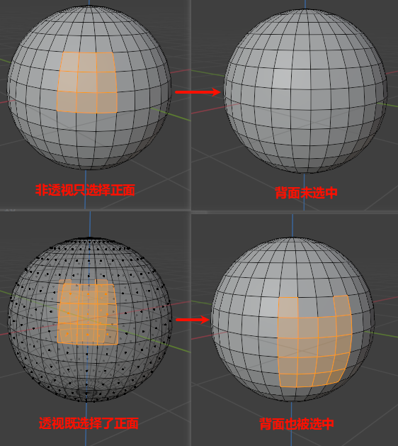
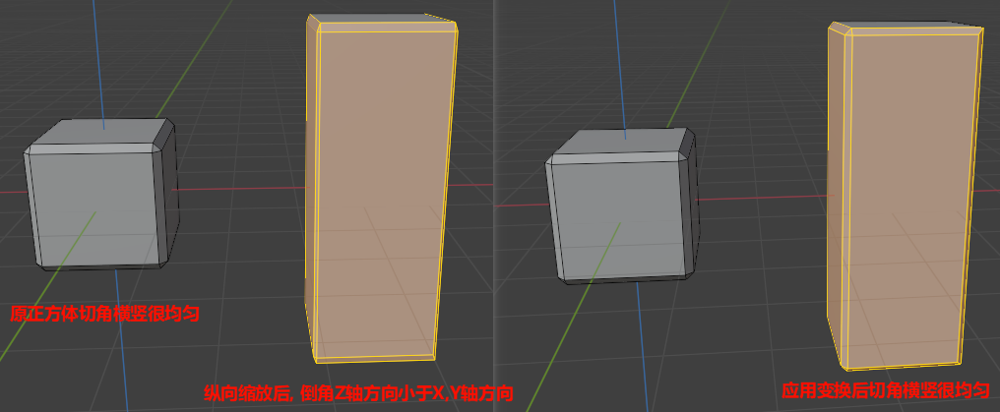

# 辅助操作

## 窗口类

ctrl-alt-q: 四视图

创建新界面:

1. 在区域边缘左键拖动
2. 在区域边缘右键边缘水平垂直分割

## 吸附

Shift+Tab

1. 增量
2. 栅格
3. 顶点

## 测量

测量的方法有三种:

1. 工具栏-测量工具(物体模式, 编辑模式)
2. 叠加层-测量(编辑模式)
3. MeasureIt插件

前2个内置的测能量工具没有MeasureIt好用.

安装后, 在侧栏-视图-MeasureIt Tools中使用.

## 视图控制

## 轮盘操作

快捷键: `, 移动鼠标选择

## 快捷键

1. 旋转(鼠标中键)
2. 缩放(ctrl+鼠标中键, 滚动鼠标中键)
3. 平移(shift+鼠标中键)
4. 显示所有物体: Home
5. 正视面 小键盘 1
6. 侧视图 小键盘 3
7. 顶视图 小键盘 7
8. 底视图 小键盘 9
9. 透视正交切换  5
10. 角度切换 2 4 6 8

## 点击图标

1. 旋转：坐标旋转(上下左右)
2. 缩放：放大镜, 推拉放大
3. 平移：放手掌上平移(上下左右)

## 预览模式

打开预览模式选择版: Z

1. 线框预览(Shift+Z)
    1. 可以透选, 即选择

2. 实体预览(Shift+Z)
3. 材质预览
4. 渲染预览

✨切换到线框模式可以选择背面的

## 叠加藏

开启关闭叠加层信息: Shfit+Alt+Z

## 显示隐藏

编辑模式: 网格 -> 显示/隐藏

1. 隐藏选中: H
2. 显示隐藏: Alt+H
3. 隐藏未选中: Shift+H

    能达到独立观察(/)的小姑

## 重复之前的操作

Shift+L

## 应用

位置, 旋转, 缩放等操作应用到物体上. 选中物体执行指令(物体模式-物体-应用(Ctrl+A)).

位置, 旋转, 缩放是类似于Buffer应用到原物体上, 再未应用前, 倒角之类的操作, 还是以原物体为准. 可以通过侧边栏查看, 应用前这些变换有值, 应用后就没值了.

## 坐标系和轴心点

1. 坐标系: `<`
2. 轴心点: `>`

## 游标

1. 游标移动: Shift+右键
2. 游标回到原点: Shift+C
3. 相对移动: Shift+S

## 工具栏

工具栏两个快捷键:

1. T: 显示隐藏工具栏
2. Shift+空格: 鼠标旁显示工具栏

工具栏工具有两种方式

1. 直接点击工具栏工具
2. 不点击, 直接使用快捷键, 如移动(G)

## 细分

Ctrl+2

## 平滑着色

## 锁定摄像头

渲染预览模式, N面板, 锁定摄像机

## Machin3tools

Machin3tools是Blender的一个小功能集合插件，包括各种点线面处理快捷方法、对齐、镜像、打组、细分、着色器、变形等

[M3工具（Part 1）智能点、线、面+模型清理+强化游标原点工具](https://www.bilibili.com/opus/663393811006750725)
[M3工具（Part 2）对齐+镜像+各种饼菜单](https://www.bilibili.com/opus/664501835243978802)
[M3工具（Part 3）组管理+螺纹+旋绕](https://www.bilibili.com/opus/664505047890001956)

## [透视/正交](https://docs.blender.org/manual/zh-hans/dev/editors/3dview/navigate/projections.html)

视图->正交/透视

我们的眼睛习惯于透视远处物体看起来更小的地方。正交投影起初通常看起来有点奇怪，因为无论物体的距离如何，它们的大小都保持不变。这就像从无限远的点观看场景一样。尽管如此，正交查看可能非常有用，因为它提供了对场景的更 “技术性” 的眼光，使其更容易建模和判断比例。

