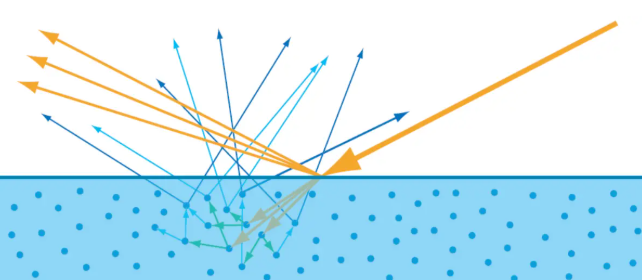
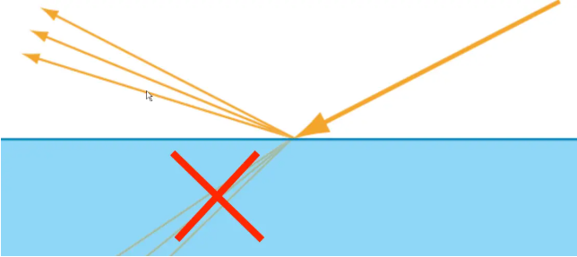
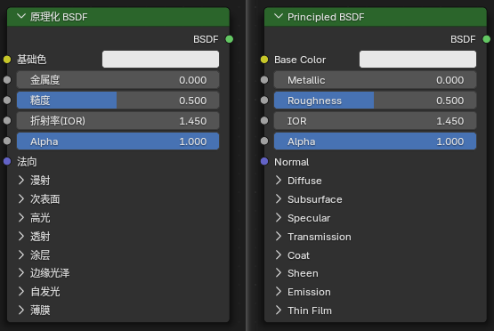

2. 属性面板
1. Shift+Q
2. Alt+M(插件)

Blender有两种控制材质的方式:
1. 属性面板的材质栏: 使用预定义的属性和参数进行调整
2. 材质（着色）节点（Shader Node）编辑器: 将不同的节点连接在一起，来进行材质的调整

## 节点介绍

### [原理化BSDF](https://docs.blender.org/manual/zh-hans/latest/render/shader_nodes/shader/principled.html)

原理化BSDF(Principled BSDF)节点: 和右侧材质面板调节的属性是一个作用。可以调整这里的基础色或者金属度，物体材质也会随之改变。

将多个层组合成一个易于使用的节点。

1. 双向反射(Bidirectional reflectance distribution function, BRDF)
2. 双向散射(Bidirectional scattering distribution function, BSDF)

不同物体会有不同的反射和散射:

1. 非金属会同时表现出反射和散射。

    

2. 金属只会有反射

    

### 输入

1. 基础色(Base Color): 材质的整体颜色，用于漫反射、次表面散射、金属和透射成分。
2. 粗糙度(Roughness): 指定表面的微观粗糙度，该参数控制镜面反射与透射。数值为 0.0 时会产生完全清晰的反射，而 1.0 时则会呈现漫反射效果。
3. 金属度(Metallic): 控制类塑料与类金属材质模型之间的混合过渡。当数值为 0.0 时，材质由具有漫反射或透射特性的基层构成，并在其上方叠加镜面反射层；当数值为 1.0 时，材质将呈现完全由基色着色的镜面反射效果，不含漫反射或透射成分。
4. IOR(折射率): 用于镜面反射(specular reflection)和透射(transmission)的折射率（IOR）。
5. Alpha(透明度): 控制表面的透明度，数值设定为 1.0 时，表面完全不透明。通常连接到图像纹理着色器节点的 Alpha 输出接口。
6. 法向(Normal): 控制基础图层的法线方向。
7. 漫反射(Diffuse): 仅限 Cycles, 通过粗糙来控制
8. 次表面(Subsurface): 次表面散射用于渲染诸如皮肤、牛奶和蜡等材质。光线在表面之下散射，从而营造出柔和的外观。
9. 高光(Specular): 用于漫反射和次表面之上的金属成分和镜面反射层的控制
10. 透射(Transmission): 透射用于渲染诸如玻璃和液体之类的材质，在这些材质中，表面既反射光线，又将光线透射到物体内部。
11. 图层(Coat): 在材料表面涂上涂层，以模拟诸如清漆、亮漆或汽车漆等。
12. 边缘光泽(Sheen): 光泽度模拟物体表面非常细小的纤维。对于布料来说，这会在边缘附近产生类似柔软天鹅绒的反射效果。它也可用于模拟任意材质上的灰尘。
13. 自发光(Emission): 从表面发出的光
14. 薄膜(Thin Film): 薄膜模拟了位于材料顶部的薄膜中的干涉效应。这使得镜面反射呈现出一种颜色，这种颜色在很大程度上取决于视角、薄膜厚度以及薄膜和材料本身的折射率（IOR）。这种效应常见于例如油膜、肥皂泡或玻璃涂层上。虽然它在镜面高光中的影响更为明显，但它也会影响透光率。

### 输出

1. 标准着色器输出

噪波纹理节点(纹理-噪波纹理): 

## 其他

材质如果没有使用, 则不会保存. 可以点击材质的盾牌图标来保留.

一个可以有多个材质, 第一个材质是基础材质覆盖所有表面, 其他的材质可以局部更改.

## 参考

1. https://zhuanlan.zhihu.com/p/713128109
2. https://docs.blender.org/manual/zh-hans/latest/render/materials/assignment.html
