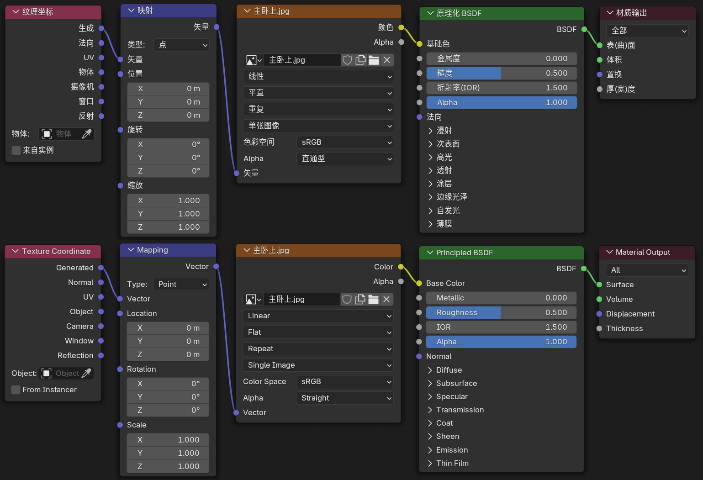
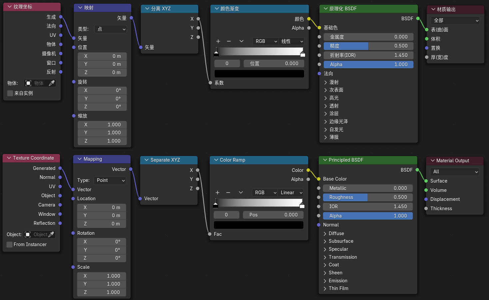
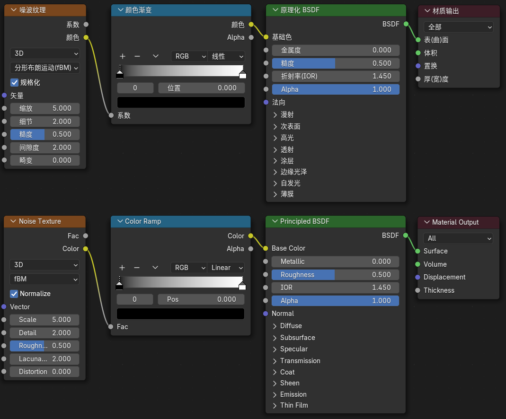

# 纹理图片映射

## 纹理图片映射

总共需要操作5个节点:
1. 纹理坐标: 用什么坐标系来映射
2. 映射: 调整位置, 旋转和缩放
3. 图像纹理: 载入图像, 调整在面上的映射方式
4. 原理化BSDF: 着色器调材质
5. 材质输出: 改变物体哪个部分

### 纹理坐标节点

1. 生成: 
    
    使用全局坐标, 以世界坐标的中心作为坐标0

    纹理坐标节点选择UV, 节点选择映射的面
    
    1. 方框: 图片分别映射到六个平面
    2. 平展: 图片分别映射到上和下2个平面
    3. 管型: 图片分别映射到前后左右4个面管子壁上, 和平展互为补充
    4. 球体: 类似地图映射

2. 法向: 做投影灯
3. UV: 把立方体展开成二维平面, 然后将图片映射上去, 默认UV. 通过UV编辑器->选中模型->编辑模式.
4. 物体:

    使用局部坐标, 以物体本身的原点作为坐标0, 也可以指定另外一个物体作为坐标0

5. 摄像机: 以摄像机的视角
6. 窗口: 转动模型不影响
7. 反射: 将纹理放在四周, 像镜面一样反射

### 映射节点

类型:

1. 点: 移动的是坐标轴, 所以是反方向
2. 纹理: 移动的是纹理, 所以是同方向

## 纹理渐变映射

## 程序化纹理映射

还有波浪纹理

