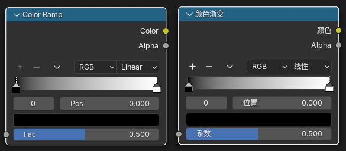

### [颜色渐变节点](https://docs.blender.org/manual/zh-hans/dev/render/shader_nodes/converter/color_ramp.html)

颜色渐变节点用于使用渐变将数值映射为颜色。

2. 属性
    1. 颜色渐变(Color Ramp): 
1. 输入
    1. 系数(Factor): 要映射的值。0.0 表示最左边的颜色，1.0 表示最右边的颜色。
3. 输出
    1. 图像/颜色(Image/Color): 标准颜色输出。
    2. Alpha: 遮罩的透明度

