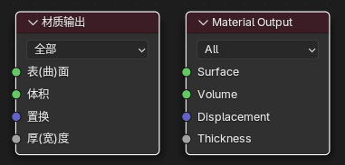

## 节点

### 材质输出节点

1. 属性
    1. 目标(Target): 渲染引擎是输入着色器所用于的对象。默认情况下，着色器在 Cycles 和 EEVEE 之间共享，通过多个输出节点，可以为每个渲染引擎创建专门的着色器设置。

2. 输入
    1. 曲面(Surface): 对象 表面 的着色。
    2. 体积(Volume): 对象内部 体积 的着色。
    3. 置换(Displacement): 用于创建凹凸映射或实际细分的位移。
    4. 厚度(Thickness): 用于在无需大量计算的情况下近似物体的内部几何结构。目前，这用于次表面散射、半透明双向散射分布函数（BSDF）、折射双向散射分布函数（BSDF）以及包含这些效果的节点。如果没有值连接到输出节点，将基于物体最小维度使用默认厚度。如果连接了一个值，它将被用作物体空间厚度（即通过物体变换进行缩放）。值为零将禁用厚度近似，并将物体视为只有一个界面。此输出仅由 EEVEE 渲染引擎使用。
3. 输出
    1. 没有输出