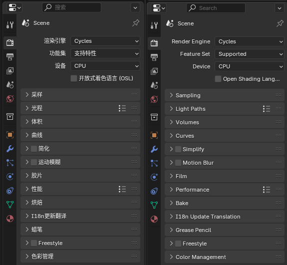

三维数据转为二维数据

1. 实时渲染(游戏, VR)
2. CG渲染(电影, 广告)

## [EEVEE渲染设置](https://docs.blender.org/manual/en/4.4/render/eevee/render_settings/index.html#)

- 采样(Sampling)
- 钳制(Clamping)
- 光线追踪(Raytracing)
- 体积(卷标)(Volumes)
- 曲线(Curves)
- 景深(Depth of Field)
- 运动模糊(Motion Blur)
- 胶片(Film)
- 性能(Performance)
- 蜡笔(Grease Pencil)

## [Cycles渲染设置](https://docs.blender.org/manual/en/4.4/render/cycles/render_settings/index.html)

1. 采样(Sampling):
    1. 采样(Sampling): 采样是指从摄像机发出射线，追踪它们在场景中的反射等行为，直到射线终结在灯光、自发光物体、或者世界背景的过程。

    2. 降噪(Denoising): 去噪使用一种专门的算法，在无需更多样本的情况下获得噪点更少的图像。

    3. 路径引导(Path guiding): 路径引导有助于在一些场景中减少噪声，在这些场景里，对于常规路径追踪而言，找到一条通向光源的路径很困难，比如当一个房间是通过一扇小门的开口采光时。随着时间推移，重要的光线方向会被学习到，并且随着获取的样本增多而不断改善。

    4. 灯光(Lights): 

    5. 高级(Advanced): 

2. 光程(Light Paths)

    光线类型可分为四类：

    1. 相机：光线直接从相机发出。
    2. 反射：由表面反射而产生的光线。
    3. 透射：由穿透表面而产生的光线。
    4. 阴影：光线用于（透明）阴影。

    反射和透射光线还具有以下特性：

    1. 漫射(Diffuse)：光线由漫反射或透射（半透明）产生。
    1. 光泽(Glossy)：光线是由光泽高光反射或透射产生的。
    1. 单一(Singular)：光线是由一个完美的反射或透射产生的。

    光程节点可用于找出正在为其计算着色的光线类型。

    1. 反弹控制(Bounce Control): 光线反弹的最大次数可以手动控制。尽管这一数值理论上没有限制，然而在实际中，一个较小的数值即可满足需要，或者屏蔽某些光线交互来加快收敛控制。
    2. 透明(Transparency): 透明双向散射分布函数（BSDF）着色器会得到特殊处理。光线直接穿过它，方向和类型都不会改变，就好像根本不存在几何体一样。对于透明 BSDF，透明度通道输出也有所不同。其他传输型 BSDF 被视为不透明，因为它们会改变光线方向。因此，它们不能用于 Alpha 叠加合成，而透明 BSDF 则可以
    3. 设置(Settings): 
        1. 最多反弹次数(Max Bounces):
            1. 总数(Total):
            2. 漫反射(Diffuse):
            3. 光泽(Glossy):
            4. 透射(Transmission):
            5. 体积(Volume):
            6. 透明(Transparent):
        2. 钳制(Clamping):
            1. 直接光(Direct Light): 限制样本来自尚未反弹的能对像素造成影响的光线的最大强度。它降低了噪点，但精度更低。将此选项设置为 0.0 将完全禁用钳制。越低，对生成的图像的影响（调暗样本）比值较高。
            2. 间接光(Indirect Light): 适用于多次反弹的光线。
        3. 焦散(Caustics):
        4. 快速GI近似(Fast GI Approximation): 近似漫射间接光与背景着色环境光遮蔽。这为全全局照明（GI）提供了快速的替代方法，用于交互式视口渲染或质量较低的最终渲染。
3. 体积(Volumes): 体积 步长 大小是体积着色器样本之间的距离。Cycles会根据体积对象中的体素大小和烟雾模拟自动估算此距离。增大步长可以减少渲染时间，但代价是可能会丢失一些体积细节。对于添加细节的程序化体积着色器，可以针对每个对象，材质或世界增加步长。
4. 曲线(Curves): 用于粒子毛发系统的所有实例的全局设置。链的分辨率由粒子设置中的步长值控制。每个毛发系统都使用粒子设置中标识的材质。
5. 简化(Simplify):
6. 运动模糊(Motion Blur): 默认渲染为 完全静止 的图像序列。尽管这对定格和延时动画很棒，但这不够真实，因为高速移动的物体在运动方向看起来是模糊的，不管是在影片单帧或现实世界的摄影中。
7. 胶片(Film): 
8. 性能(Performance): 影响渲染速度或内存消耗的属性。

