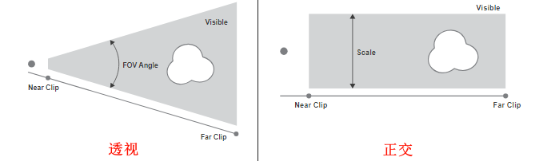

# 摄像机

属性 ‣ 摄像机属性

## 镜头

1. 类型: 控制三维物体在二维图像中的表示方式。
    1. 透视: 与人眼在现实世界中查看事物的方式相匹配。距离中的物体看起来比前景中的物体小，并且平行线（例如铁路上的铁轨）看起来会随着它们越来越远而收敛。
    2. 正交: 对于 正交透视 物体，无论距离如何，始终以实际尺寸显示。这意味着平行线看起来是平行的，并且不会产生像透视那样的效果。 
    3. 全景: 全景相机只能在Cycles中工作。
2. 焦距: (透视参数)较长的焦距会导致较小的 FOV（更多的缩放），而较短的焦距可让您一次看到更多的场景（较大的 FOV，变焦较小）。
3. 镜头单位: (透视参数)焦距可以以毫米为单位设置，也可以以实际 视野 角度设置。
4. 正交比例: (正交参数)控制投影在图像上的物体的外观尺寸。由于平行线不会在正交模式下收敛（没有消失点），因此镜头移位设置相当于在3D视图中平移相机。
5. 移位: 允许调整消失点。消失点指的是平行线会聚的位置。
6. 裁剪起始和结束: 物体直接可见的间隔，此范围之外的任何物体仍会间接影响图像，因为不会剪切进一步的光反弹。

## 景深

真实世界的相机通过镜头传输光线，镜头将光束弯曲并聚焦到传感器上。因此，距离一定距离的物体会聚焦，但前后的物体会模糊不清。

1. 焦点物体: 选择用于计算焦点的物体。链接物体后会使焦点距离失效。
2. 焦距: 当未指定焦点物体时，此设置用于设定到焦点的距离。
3. 光圈
    1. 光圈: 光圈数值比率定义模糊量。较低的值会产生强烈的景深效果。
    2. 叶片: 用于改变渲染中模糊物体形状的多边形刀片总数，以及渲染预览。
    3. 旋转: 沿着面对轴旋转多边形刀片，并以顺时针和逆时针方式旋转。
    4. 比率: 更改失真量以模拟变形散景效果。设置为1.0表示没有失真，低于1.0的数字将导致水平失真，数字越大则导致垂直失真。

## 摄像机

可以选择几个 预设 来匹配真实世界的相机。

1. 传感器适配
    1. 自动:根据 分辨率 尺寸中较大的尺寸计算一个方形传感器的尺寸。
    2. 水平:手动调整传感器的 宽度，高度 是根据输出的 分辨率 的宽高比计算的。
    3. 垂直:手动调整传感器的 高度，宽度 是根据输出的 分辨率 的宽高比计算的。
2. 尺寸: 相对于修改焦距，这个设置是控制视场的另一种方法。

## 安全区

不同的屏幕有不同数量的过扫描（特别是较旧的电视机）。这意味着并非所有内容都对所有查看者都可见，因为边缘周围的图像部分不会显示。为了解决这个问题，电视制作人定义了两个保证内容显示的区域：动作安全和标题安全。

## 背景图

添加背景

## 视图显示

1. 尺寸: 3D视图中摄像机可视化的大小。此设置对相机的渲染输出 没有 影响。
2. 显示
    1. 限制: 显示一条橙色线条，指示裁切起始和结束值，同时还会显示一个黄色十字，指示焦点距离。
    2. 雾场: 打开或关闭雾限值的查看。极限显示为摄像机视线上的两个相连的白点。
    3. 传感器: 在摄像机视图中显示虚线框。
    4. 名称: 在摄像机视图中打开和关闭名称显示。

## 构图辅助线

构图辅助线 可以叠加到摄像机显示屏上，在构图时提供帮助。

1. 九宫分割: 添加垂直和水平分隔三分之一帧的线条。
2. 中心:
    1. 中心: 添加将框架垂直和水平分成两半的线条。
    2. 斜向: 添加连接对角的线条。
3. 黄金分割
    1. 比率: 将宽度和高度分成黄金比例（框架四周大小约为0.618）。
    2. 三角形A: 显示从左下角到右上角的对角线，然后添加穿过左上角和右下角的垂直线。
    3. 三角形B: 与A相同，但有相反的角落。
4. 均衡
    1. 三角形A: 显示从左下角到右上角的对角线，然后是从左上角和右下角的线到0.618相对侧的长度。
    2. 三角形B: 与A相同，但有相反的角落。
5. 外边框: 这个选项使摄像机视场外的区域变暗。遮挡的不透明度可以用数值滑块来调整。
