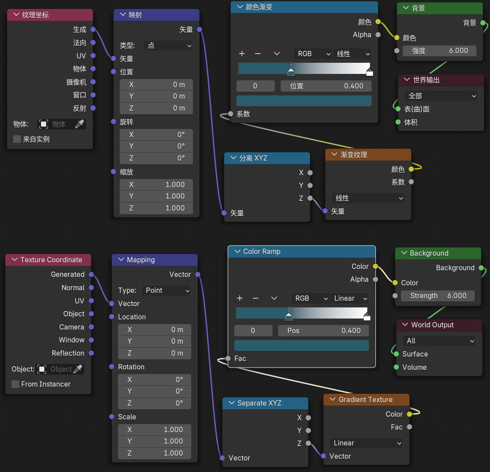
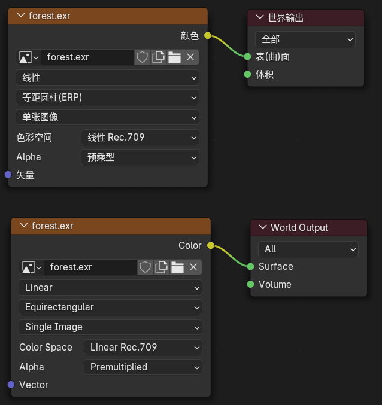

## 光的分类

### 世界光

影响到场景里的所有物体, 奠定主基调. 通过着色编辑器->物体->世界环境进入调整.

1. 背景光

    等价于属性面板->世界环境直接修改

    

2. 天空纹理节点

    

3. 渐变纹理

    

4. 渐变纹理(环境纹理): 高动态范围填图(High Dynamic Range Image, HDRI)

    可以隐藏环境背景的图片: 渲染属性->胶片->透明

    

    在渲染预览, 取消场景世界, 就是开启了HDRI贴图. 但该调整仅仅是预览渲染有效, 真实渲染无效.

## 场景光

创建灯光后, 在属性面板->灯光属性, 可以更改4中光源:

1. 点光: 非平行光, 位置和角度都影响影子
2. 日光: 平行光, 位置不影响影子, 角度影响
3. 聚光:
4. 面光: 介于点光和日光的中间

## 三点布光

1. 主光: 打在需要突出的物体上
2. 辅光: 
3. 轮廓光: 背后, 高亮对象的

## 其他

F12渲染

0切换到渲染预览模式, 勾选锁定摄像机

