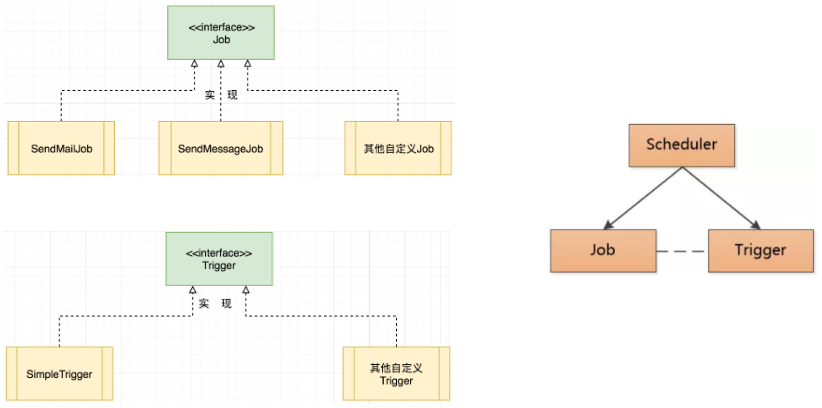

# quartz基本概念

[Quartz](http://www.quartz-scheduler.org/)是OpenSymphony开源组织在Job scheduling领域的一个开源项目，由Java开发，可以用来执行定时任务，类似于java.util.Timer。Quartz是功能强大的开源作业调度库，几乎可以集成到任何Java应用程序中。Quartz包含许多企业级功能，例如对JTA事务和集群的支持。Quartz作为定时任务组件，既可以单独使用，也可以整合Spring使用。

- Scheduler：任务调度器，使任务和触发器关联，统一进行任务的调度
- StdSchedulerFactory:任务调度器工厂，可以创建Scheduler对象
- JobDetail：任务对象
- JobBuilder：任务构建器，用于创建JobDetail对象
- Trigger：触发器对象
- TriggerBuilder：触发器构建器，用于创建Trigger对象
- JobExecutionContext：任务执行的上下文对象，通过此对象可以获取当前执行任务的相关信息，例如JobDetail、Trigger对象都可以获取到
- JobDataMap：保存任务实例的状态信息
- RAMJobStore：此类实现了一个利用RAM作为其存储设备的JobStore，访问速度极快，但是数据却易失，如果需要在程序关闭之前保持真正的持久性，则不应使用此JobStore
- JobStoreTX：通过JDBC将所有数据保存在数据库中

