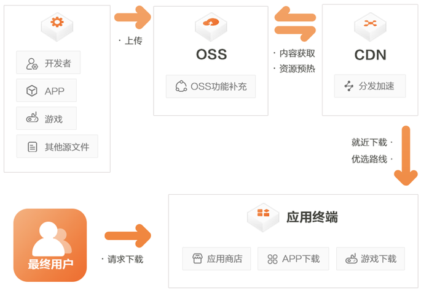

1、对象存储OSS（Object Storage Service）是阿里云提供的海量、安全、低成本、高持久的云存储服务。
2、阿里云内容分发网络（Content Delivery Network，简称CDN）是建立并覆盖在承载网之上，由分布在不同区域的边缘节点服务器群组成的分布式网络。

首先OSS只是阿里云的对象存储英文简称，相对应的腾讯云对象存储简称是COS,华为云对象存储是OBS。以下内容用oss简称。

对象存储最基础的功能就是可以存储海量资源了，只要你愿意就可以无限扩展，当然资费比直接扩容服务器硬盘便宜多了，更适合做大型网站还有图片分享，音视频等等需要大量存储空间的网站，另外oss还支持对图片，音频等资源的自动压缩等节省请求流量的功能。

再者就是oss解决了服务器的性能瓶颈问题，试想一下，如果你的网站哪天开始出名了，请求服务器的人数突然增多，此时选择升级服务器的带宽显然不现实（贵的要命），而使用对象存储，就没有带宽的限制了，其实还是有限制，不过峰值很高，对于大多数站点来说相当于没有限制。按下行流量大小收费（一般都有优惠包可以买。ps:下行流量是指用户在一段时间内请求服务器所接收到的所有流量，上行流量自然是你在一段时间内上传到网络上的所有数据流量）。

然而oss没有缓存机制，同一个文件在没有本地缓存的情况下，比如有100个人同时请求这个文件那么就要花费100倍的流量，就算买了流量包，用户量一大，一下就给你刷刷没了，况且似乎oss不能手动限制带宽，这样一旦有人攻击网站，短时间内就会产生高额的oss流量费用。

此时，cdn就派上用场了，cdn通过将静态内容分发到边缘节点（离请求地最近的节点），因为oss是有地域限制的，虽然带宽上限很高，但是如果存储地点离请求地点远的话，传输起来速度还是会慢的。用cdn的话可以给你将资源分发到最近的节点，并且可以将数据缓存起来，提升同一个文件被同一地区客户大量重复并发下载的体验，此时无论同一个地区的用户怎么大量请求，都有cdn的缓存给予资源反馈。大量的节省了oss流量费用。当资源有发生变化时，或者缓存到期，才会去动用oss的流量包。此时oss产生的流量就很低了。所以，这样使用cdn的原因就是有缓存，流量计费比oss低，并且带宽上限更高，还能手动设置带宽，可以有效防止无带宽限制下短时间使用掉大量流量。

那么，我只用cdn不行吗？是可以的，但是如果你的服务器不够强大，当某个地区首次请求资源时，或者文件内容发生改变，相当于没有缓存资源了，cdn还是要请求服务器才能获取缓存资源，此时依然受到服务器带宽的限制，如果你的服务器带宽很大，财大气粗，那么当我没说。。

所以，将oss和cdn搭配起来是一种比较好的加速站点方式

## 参考

- <https://www.cnblogs.com/jsfh/p/14076992.html>
