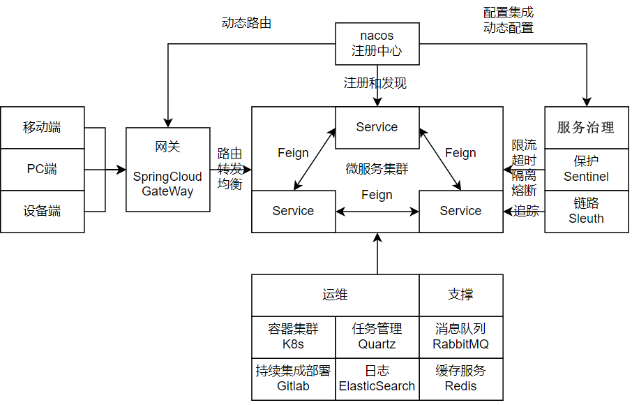

# 微服务技术SpringCloud

## 最佳实践

## 考察问

### 考察问

- 💛微服务架构图
    - 注册发现和配置管理：`()`
        - `()`
        - `()`
        - `()`
    - 远程调用：`()`
    - 链路监控：`()`
    - 服务保护：`()`
        - `()`
        - `()`
        - `()`
        - `()`, 使用`()`:
            - `()`
            - `()`
            - `()`
    - 统一网关路由：`()`
        - `()`, `()`, `()`
        - `()`

    

### 考察点

- 微服务架构图
    - 注册发现和配置管理：`Nacos`
        - `动态网关`
        - `服务注册和发现`
        - `配置整合与热更新`
    - 远程调用：`OpenFeign`
    - 链路监控：`Sleuth`
    - 服务保护：`Sentinel`
        - `服务限流`
        - `超时处理`
        - `线程隔离`
        - `熔断降级`, 使用`断路器`:
            - `关闭`
            - `打开`
            - `半开`
    - 统一网关路由：`SpringCloudGateWay`
        - `转发`, `路由`, `负载均衡`
        - `统一身份校验`

    

## 微服务技术SpringCloud

SpringCloud集成了各种微服务功能组件，并基于SpringBoot实现了这些组件的自动装配，从而提供了良好的开箱即用体验：

- 服务注册发现：Eureka、Nacos、Consul
- 服务远程调用：OpenFeign、Dubbo
- 服务链路监控：Zipkin、Sleuth
- 统一配置管理：SpringCloudConfig、Nacos
- 统一网关路由：SpringCloudGateway、Zuul
- 流控、降级、保护：Hystrix、Sentinel
  