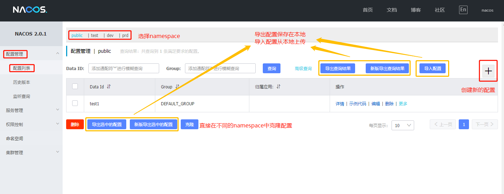
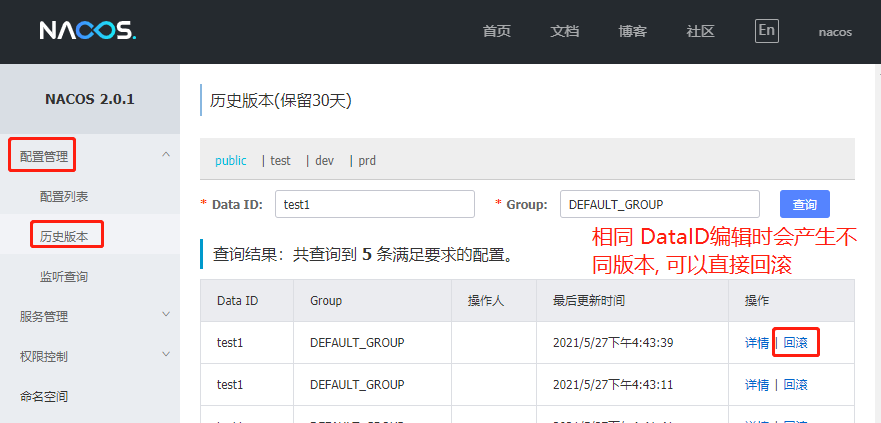
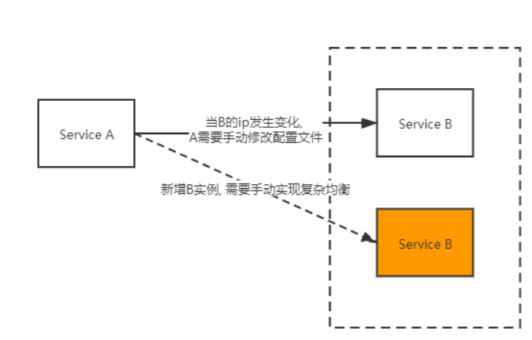
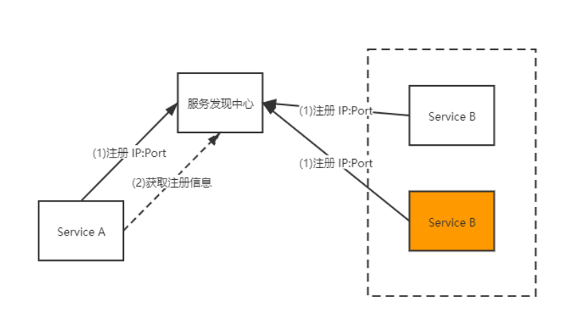

# patch


Nacos
统一管理各个系统的配置文件.
[官网](https://github.com/alibaba/nacos)
<!--more-->

### 安装
1. 官网下载, 解压, 运行脚本
2. http://127.0.0.1:8848/nacos 用户名和密码都是nacos


### 基本概念
- 配置集(Data ID)
一个配置文件通常就是一个配置集, 例如，一个配置集可能包含了数据源、线程池、日志级别等配置项。
通常采用类Java包（如 com.taobao.level）的命名规则保证全局唯一性

- 配置分组(Group)
配置分组是对配置集进行分组, 默认配置分组的名称是 DEFAULT_GROUP.
不同的配置分组下可以有相同的配置集（Data ID）

- 命名空间(Namespace)
常用场景之一是不同环境的配置的区分隔离，例如开发测试环境和生产环境的资源（如配置、服务）隔离等。
不同的命名空间下，可以存在相同名称的配置分组(Group) 或 配置集。
Nacos第一次登陆时只有public空间, 可以在`命名空间`选项中自行添加, 一般添加`dev`, `test`, `prd`三个环境

实践中, 使用方法是:
Namespace：代表不同环境，如开发、测试、生产环境。
Group：代表某项目，如XX医疗项目、XX电商项目
DataId：每个项目下往往有若干个工程，每个配置集(DataId)是一个工程的主配置文件


### 配置管理

#### 编写配置
一般通过网页直接操作(常用), 也提供了Restful接口编写(少用)和通过客户端API编写(少用).


对同一个`DataID`配置文件进行编写时, 会生成历史版本, 方便回滚.



#### 获取配置
- 通过客户端API编写(常用),也提供了Restful接口编写(少用)
```java
    Properties properties =new Properties();
    properties.put("serverAddr","127.0.0.1:8848");
    properties.put("namespace","110d0329-95b6-43a7-9401-0fc6405a960e");
    ConfigService configService = NacosFactory.createConfigService(properties);

    // 根据group 和 dataId 定位到具体的配置文件
    String dataId = "newconfig";
    String group = "DEFAULT_GROUP";
    String config = configService.getConfig(dataId, group, 5000);
    System.out.println(config);
```
详细代码参考 learnTools/nacos

#### 监听配置
```java
    // 根据serverAddr和namespace定位到configService
    Properties properties =new Properties();
    properties.put("serverAddr","127.0.0.1:8848");
    properties.put("namespace","110d0329-95b6-43a7-9401-0fc6405a960e");
    ConfigService configService = NacosFactory.createConfigService(properties);

    //监听, 当配置文件发生变化时, 回调
    String dataId = "newconfig";
    String group = "DEFAULT_GROUP";
    configService.addListener(dataId, group, new Listener() {
        public Executor getExecutor() {
            return null;
        }
        //当配置有变化 时候获取通知
        public void receiveConfigInfo(String s) {
            System.out.println(s);
        }
    });

    while (true){
        try {
            Thread.sleep(2000);
        } catch (InterruptedException e) {
            e.printStackTrace();
        }
    }
```
详细代码参考 learnTools/nacos


### 服务发现

- 微服务实例的网络位置或许是动态分配的。
- 每一个服务一般会有多个实例来做负载均衡，由于宕机或升级，服务实例网络地址会经常动态改变。
- 每一个服务也可能应对临时访问压力增加新的服务节点



通过注册中心来解决:
服务实例本身并不记录服务生产方的网络地址，所有服务实例内部都会包含服务发现客户端。
1. 在每个服务启动时会向服务发现中心上报自己的网络位置。
2. 当需要对某服务进行请求时，服务实例通过该注册中心，定位目标服务网络地址。若目标服务存在多个网络地
址，则使用负载均衡算法从多个服务实例中选择出一个。



详细代码见 learnTools/nacos


只修改端口号, 多开程序

ctrl+alt+v


[java SDK](https://nacos.io/zh-cn/docs/sdk.html)