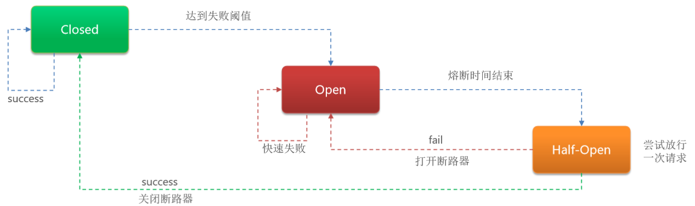

# 熔断降级

## 最佳实践

### 考察点

- 熔断触发条件

    - `慢调用`比例：
        - 设置允许的慢调用RT即最大的响应时间），请求的响应时间大于该值则统计为慢调用。
        - 当单位统计时长（statIntervalMs）内请求数目大于设置的最小请求数目，
        - 慢调用的比例大于阈值

    - `异常`比例：
        - 当单位统计时长内请求数目大于设置的最小请求数目，
        - 异常的比例大于阈值
    - `异常`数：
        当单位统计时长内的异常数目超过阈值之后会自动进行熔断。

- 熔断后的处理

    - 熔断器: 进入`熔断状态`(OPEN)状态
    - 一段时间后熔断器进入`探测恢复状态`（HALF-OPEN状态）
    - 若接下来的一个请求正常则`结束熔断`(CLOSE)，若大于设置的慢调用RT则会再次被熔断。

## 熔断降级

除了流量控制以外，对调用链路中不稳定的资源进行熔断降级也是保障高可用的重要措施之一。一个服务常常会调用别的模块，可能是另外的一个远程服务、数据库，或者第三方 API 等。例如，支付的时候，可能需要远程调用银联提供的 API；查询某个商品的价格，可能需要进行数据库查询。然而，这个被依赖服务的稳定性是不能保证的。如果依赖的服务出现了不稳定的情况，请求的响应时间变长，那么调用服务的方法的响应时间也会变长，线程会产生堆积，最终可能耗尽业务自身的线程池，服务本身也变得不可用。

现代微服务架构都是分布式的，由非常多的服务组成。不同服务之间相互调用，组成复杂的调用链路。以上的问题在链路调用中会产生放大的效果。复杂链路上的某一环不稳定，就可能会层层级联，最终导致整个链路都不可用。因此我们需要对不稳定的弱依赖服务调用进行熔断降级，暂时切断不稳定调用，避免局部不稳定因素导致整体的雪崩。

## 熔断策略

Sentinel 提供以下几种熔断策略：

- 慢调用比例 (SLOW_REQUEST_RATIO)：选择以慢调用比例作为阈值，需要设置允许的慢调用 RT（即最大的响应时间），请求的响应时间大于该值则统计为慢调用。当单位统计时长（statIntervalMs）内请求数目大于设置的最小请求数目，并且慢调用的比例大于阈值，则接下来的熔断时长内请求会自动被熔断。经过熔断时长后熔断器会进入探测恢复状态（HALF-OPEN 状态），若接下来的一个请求响应时间小于设置的慢调用 RT 则结束熔断，若大于设置的慢调用 RT 则会再次被熔断。

- 异常比例 (ERROR_RATIO)：当单位统计时长（statIntervalMs）内请求数目大于设置的最小请求数目，并且异常的比例大于阈值，则接下来的熔断时长内请求会自动被熔断。经过熔断时长后熔断器会进入探测恢复状态（HALF-OPEN 状态），若接下来的一个请求成功完成（没有错误）则结束熔断，否则会再次被熔断。异常比率的阈值范围是 [0.0, 1.0]，代表 0% - 100%。

- 异常数 (ERROR_COUNT)：当单位统计时长内的异常数目超过阈值之后会自动进行熔断。经过熔断时长后熔断器会进入探测恢复状态（HALF-OPEN 状态），若接下来的一个请求成功完成（没有错误）则结束熔断，否则会再次被熔断。

✨可以直接抛出错误或者走fallback逻辑

## 熔断器的三个状态

- closed：关闭状态，断路器放行所有请求，并开始统计异常比例、慢请求比例。超过阈值则切换到open状态
- open：打开状态，服务调用被熔断，访问被熔断服务的请求会被拒绝，快速失败，直接走降级逻辑。Open状态5秒后会进入half-open状态
- half-open：半开状态，放行一次请求，根据执行结果来判断接下来的操作。
    - 请求成功：则切换到closed状态
    - 请求失败：则切换到open状态

