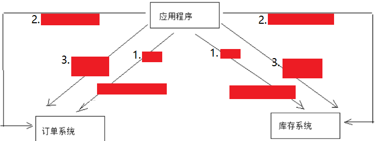
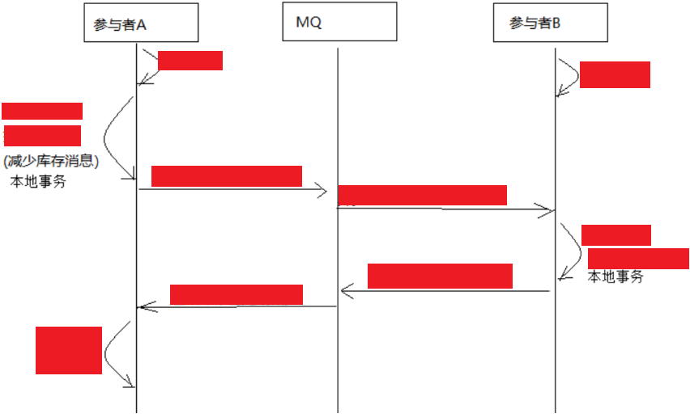
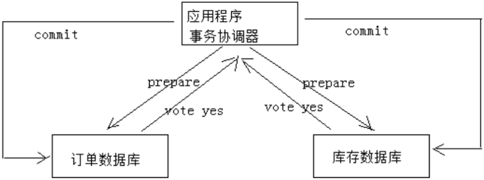
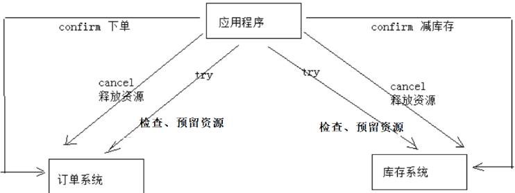
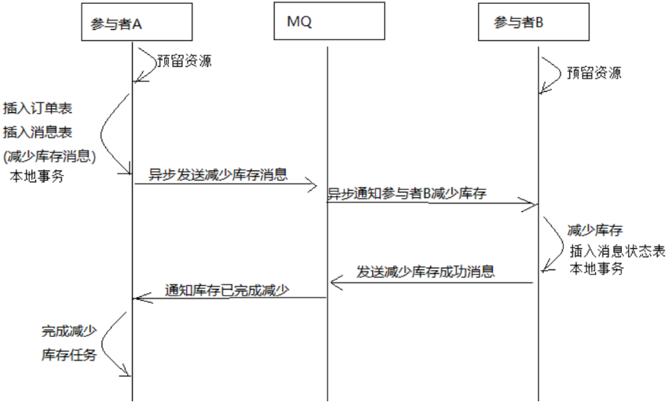
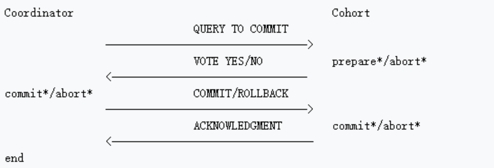

# 一致性问题解决方案

## 最佳实践

### 考察问

- 💛一致性问题解决方案:
    - `()`
    - `()`
    - `()`

- 💛两阶段提交协议

    - 第一阶段：`()`阶段协调者通知参与者`()`, 但`()`，参与者`()`后向协调者回应Yes(成功)或No(失败), 既`()`。

    - 第二阶段：`()`阶段协调者根据参与者的投票结果发起最终的`()`事务或`()`事务的指令。

    

    优缺点:

    - 优点：`()`一致性
    - 缺点：性能`()`, 灵活性`()`

- 💛事务补偿(TCC)

    1. Try: `()`并`()`好资源。
    2. Confirm: `()`预留的资源。
    3. Cancel: 如果任一执行出现问题则全部`()`并`()`资源。

    

    - 优点：性能`()`, 灵活性`()`
    - 缺点：`()`一致性, 要`()`

- 💛消息队列实现最终一致性

    1. 订单服务和库存服务完成`()`和`()`资源
    2. 订单服务在本地事务中完成
        1. `()`
        2. `()`
    3. 由`()`根据`()`的记录发送给MQ通知`()`执行减库存操作
    4. 库存服务在本地事务中完成
        1. `()`，
        2. 并且`()`（为避免重复执行消息，在执行减库存之前查询是否执行过此消息）
    5. 库存服务向MQ发送`()`
    6. 订单服务接收到完成库存减少的消息后`()`

    

    优缺点:
    - 优点：`()`，性能`()`。开发成本比TCC`()`。
    - 缺点：浪费`()`资源，另外对于高并发操作不是最佳方案。

- 💛幂等性: 是指对同一个`()`, 无论`()`多少次，其结果都`()`。实现方式有：

    - 在数据库表中加一个状态字段（未处理，已处理），数据操作时判断`()`时再处理。
    - 操作之前在业务方法进行判断如果执行过了就`()`执行。
    - 缓存所有请求和处理的结果，已经处理的请求则`()`结果。

### 考察点

- 一致性问题解决方案:
    - `两阶段提交协议`
    - `事务补偿TCC`
    - `消息队列`

- 两阶段提交协议

    - 第一阶段：`准备`阶段协调者通知参与者`执行本地事务`, 但`不提交`，参与者`完成本地事务`后向协调者回应Yes(成功)或No(失败), 既`Vote(投票)`。

    - 第二阶段：`提交(commit)/回滚(rollback)`阶段协调者根据参与者的投票结果发起最终的`提交`事务或`回滚`事务的指令。

    

    优缺点:

    - 优点：`强`一致性
    - 缺点：性能`低`, 灵活性`差`

- 事务补偿(TCC)

    1. Try: `检查`并`预留`好资源。
    2. Confirm: `执行`预留的资源。
    3. Cancel: 如果任一执行出现问题则全部`回滚`并`释放`资源。

    

    - 优点：性能`高`, 灵活性`好`
    - 缺点：`最终`一致性, 要`幂等性`

- 消息队列实现最终一致性

    1. 订单服务和库存服务完成`检查`和`预留`资源
    2. 订单服务在本地事务中完成
        1. `添加订单表记录`
        2. `添加消息表记录:减少库存任务消息`
    3. 由`定时任务`根据`消息表`的记录发送给MQ通知`库存服务`执行减库存操作
    4. 库存服务在本地事务中完成
        1. `执行减少库存`，
        2. 并且`记录执行消息状态`（为避免重复执行消息，在执行减库存之前查询是否执行过此消息）
    5. 库存服务向MQ发送`完成减少库存的消息`
    6. 订单服务接收到完成库存减少的消息后`删除原来添加的“减少库存任务消息”`

    

    优缺点:
    - 优点：`异步解耦`，性能`高`。开发成本比TCC`低`。
    - 缺点：浪费`数据库`资源，另外对于高并发操作不是最佳方案。

- 幂等性: 是指对同一个`操作`, 无论`请求`多少次，其结果都`相同`。实现方式有：

    - 在数据库表中加一个状态字段（未处理，已处理），数据操作时判断`未处理`时再处理。
    - 操作之前在业务方法进行判断如果执行过了就`不再`执行。
    - 缓存所有请求和处理的结果，已经处理的请求则`直接返回`结果。

## 两阶段提交协议(2PC)

为解决分布式系统的数据一致性问题出现了两阶段提交协议（2 Phase Commitment Protocol），两阶段提交由协调者和参与者组成，共经过两个阶段和三个操作，部分关系数据库如Oracle、MySQL支持两阶段提交协议，本节讲解关系数据库两阶段提交协议。

2PC协议流程图：

第一阶段：`准备`阶段(prepare)协调者`通知`参与者`执行本地事务, 但不提交`，参与者`完成本地事务`后向协调者回应Yes(成功)或No(失败), 既`Vote(投票)`。

第二阶段：`提交(commit)/回滚(rollback)`阶段协调者根据参与者的投票结果发起最终的提交指令, `提交事务`或`回滚`。

下图是一个下单减库存的例子：

1. 应用程序连接两个数据源。

2. 应用程序通过事务协调器向两个库发起`prepare`，两个数据数据库收到消息分别执行`本地事务`（记录日志），但不提交，如果执行成功则回复`yes`，否则回复`no`。

3. 事务协调器收到回复
    - 只要有`一`方回复no则分别向参与者发起`回滚`事务，参与者开始回滚事务。
    - `全部`回复yes，此时向参与者发起提交事务。如果参与者有一方提交事务失败则由事务协调器发起回滚事务。

该方案的优缺点:

- 优点：实现`强一致`性，部分关系数据库支持（Oracle、MySQL等）。
- 缺点：整个事务的执行需要由协调者在多个节点之间去协调，`性能`低下。

## 事务补偿(TCC)

TCC事务补偿是基于2PC实现的业务层事务控制方案，它是Try、Confirm和Cancel三个单词的首字母，含义如下：

1. Try: 完成提交事务前的`检查`，并`预留`好资源。
2. Confirm: 对try阶段预留的资源正式`执行`。
3. Cancel: `回滚`, 对try阶段预留的资源`释放`。

下面用一个下单减库存的业务为例来说明：

1. Try下单业务由订单服务和库存服务协同完成，在try阶段订单服务和库存服务完成检查和预留资源。 订单服务检查当前是否满足提交订单的条件（比如：当前存在未完成订单的不允许提交新订单）。 库存服务检查当前是否有充足的库存，并锁定资源。

2. Confirm订单服务和库存服务成功完成Try后开始正式执行资源操作。 订单服务向订单写一条订单信息。 库存服务减去库存。

3. Cancel如果订单服务和库存服务有一方出现失败则全部取消操作。 订单服务需要删除新增的订单信息。 库存服务将减去的库存再还原。

优缺点:

- 优点：在业务层实现事务控制，`灵活性好`。
- 缺点：仅保证`最终一致性`, `开发成本高`，每个事务操作每个参与者都需要实现try/confirm/cancel三个接口。

✨TCC的try/confirm/cancel接口都要实现幂等性，因为在try、confirm、cancel失败后要不断重试。

幂等性是指对同一个`操作`, 无论`请求`多少次，其结果都`相同`。实现方式有：

- 操作之前在业务方法进行判断如果执行过了就`不再`执行。
- 缓存所有请求和处理的结果，已经处理的请求则`直接返回`结果。
- 在数据库表中加一个状态字段（未处理，已处理），数据操作时判断`未处理`时再处理。

## 消息队列实现最终一致性

本方案是将分布式事务拆分成多个本地事务来完成，并且由消息队列异步协调完成。下边以下单减少库存为例来说明：

1. 订单服务和库存服务完成`检查`和`预留`资源
2. 订单服务在本地事务中完成`添加订单表记录`和`添加消息表记录, 减少库存任务消息`
3. 由`定时任务`根据`消息表`的记录发送给MQ通知`库存服务`执行减库存操作
4. 库存服务`执行减少库存`，并且`记录执行消息状态`（为避免重复执行消息，在执行减库存之前查询是否执行过此消息）
5. 库存服务向MQ发送`完成减少库存的消息`
6. 订单服务接收到完成库存减少的消息后`删除原来添加的“减少库存任务消息”`

实现最终事务一致性要求：预留资源成功理论上要求正式执行成功，如果执行失败会进行重试，要求业务执行方法实现幂等。

- 优点：由MQ按异步的方式协调完成事务，`性能`较高。不用实现try/confirm/cancel接口，`开发成本`比TCC低。
- 缺点：此种方式基于关系数据库本地事务来实现，会出现频繁读写数据库记录，`浪费数据库资源`，另外对于高并发操作不是最佳方案。
