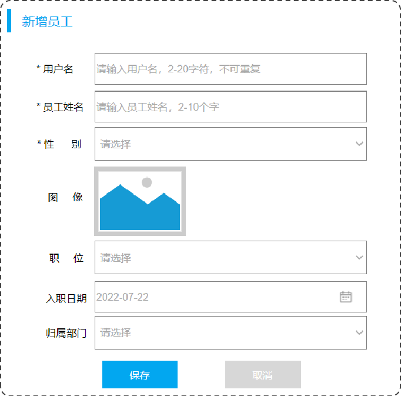
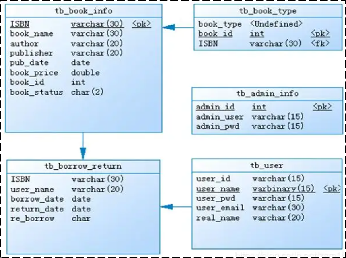
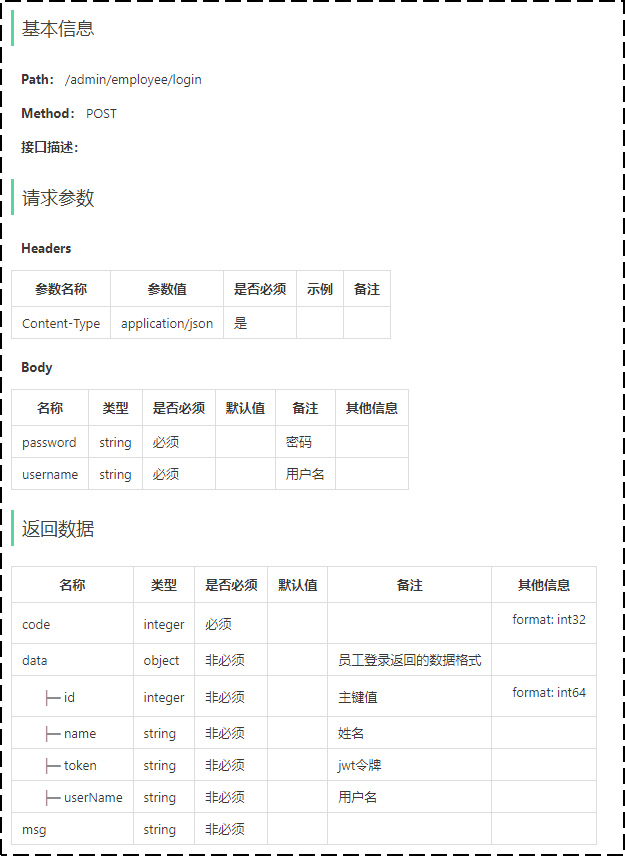
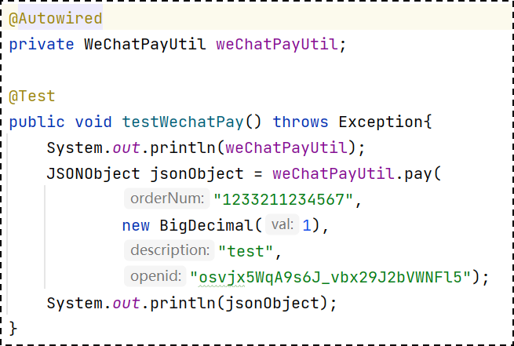

# 软件开发流程

1. 需求
2. 设计
3. 编码
4. 测试
5. 运维

## 第1阶段: 需求

完成需求规格说明书、产品原型编写。  

### 需求规格说明书

需求规格说明书， 一般来说就是使用 Word 文档来描述当前项目的各个组成部分，如：系统定义、应用环境、功能规格、性能需求等，都会在文档中描述。例如：

- 1 导言
    - 1.1 目的
    - 1.2 范围
    - 1.3 缩写说明
    - 1.4 术语定义
    - 1.5 引用标准
    - 1.6 参考资料
    - 1.7 版本更新信息
- 2 系统定义
    - 2.1 项目来源及背景
    - 2.2 项目要达到的目标
    - 2.3 系统整体结构
- 3 应用环境
    - 3.1 系统运行网络环境
    - 3.2 系统运行硬件环境
    - 3.3 系统运行软件环境
- 4 功能需求
    - 4.1 角色（Actor）定义
        - 4.1.1 应聘者
        - 4.1.2 管理用户
        - 4.1.3 数据库
    - 4.2 系统上 Use Case 图
    - 4.3 客户端子系统
        - 4.3.1 职位选择
        - 4.3.2 简历输入
    - 4.4 管理端子系统
        - 4.4.1 登录管理
        - 4.4.2 题库管理
- 5 性能需求
    - 5.1 响应时间需求
    - 5.2 可靠性需求

### 产品原型编

产品原型，一般是通过网页(html)的形式展示当前的页面展示什么样的数据, 页面的布局是什么样子的，点击某个菜单，打开什么页面，点击某个按钮，出现什么效果，都可以通过产品原型看到。例如：

## 第2阶段: 设计

### 按角色或流程分

软件研发是一个团队性工作，各个角色协同工作，共同把项目完成。每个阶段和角色的产出，又是下一阶段和角色的输入。比如作为架构师，会根据产品经理编写的功能需求说明书，进行整体系统架构设计，而开发人员，也会根据产品经理的需求说明书和架构师的概要设计，做详细的设计和开发。

### 按设计内容分

设计的内容包含 UI设计、数据库设计、接口设计。

1. UI设计：用户界面的设计，主要设计项目的页面效果，小到一个按钮，大到一个页面布局，还有人机交互逻辑的体现。例如：

    

2. 数据库设计：需要设计当前项目中涉及到哪些数据库，每一个数据库里面包含哪些表，这些表结构之间的关系是什么样的，表结构中包含哪些字段。例如：

    

3. 接口设计：通过分析原型图，首先，粗粒度地分析每个页面有多少接口，然后，再细粒度地分析每个接口的传入参数，返回值参数，同时明确接口路径及请求方式。例如：

    

### 第3阶段: 开发

编写项目代码、并完成单元测试。

1. 项目代码编写：作为软件开发工程师，我们需要对项目的模块功能分析后，进行编码实现。
2. 单元测试：编码实现完毕后，进行单元测试，单元测试通过后再进入到下一阶段。例如：

    

### 第4阶段: 测试

在该阶段中主要由测试人员, 对部署在测试环境的项目进行功能测试, 并出具测试报告。

### 第5阶段: 运维

在项目上线之前， 会由运维人员准备服务器上的软件环境安装、配置， 配置完毕后， 再将我们开发好的项目，部署在服务器上运行。
