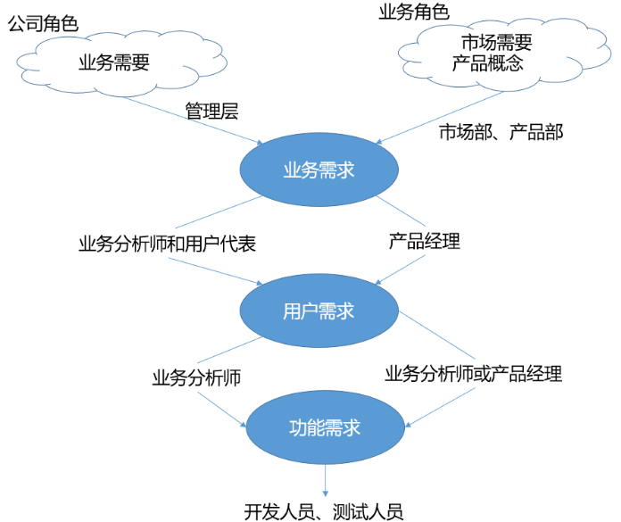

## 6.2. 需求理解不一致


项目最重要的阶段是进行需求分析，明白真正的需求。项目需求指的是用户真正需要什么，而不是供应商假设用户需要什么和供应商能够供应什么。需求的准确定位就是要按用户要求，对目标系统提出完整、准确、清晰、具体要求。这对一个项目的成功来说非常重要，需求分析做得不好，就会造成需求不断变更，从而影响进度、费用，甚至会导致项目失败。


- 客户：我家有三个小孩，我须要一个能三个人用的秋千。它是由一绳子吊在我园子里的树上。
- 项目经理：秋千这东西太简单了，就是一块板子，两边用绳子吊起来，挂在树上的两个枝子上。
- 设计师：这个无知的项目经理，两个树枝上挂上秋千哪还能荡漾起来吗？除非是把树从中截断再支起来，这样就满足要求了。


# 7. 需求获取

## 7.1 需求来源

**干系人**

干系人（Stake holder）：对于系统有利益关系的个人，团队、组织和其他系统。

项目干系人包括但不限于：

- 投资方：系统的投资方
- 主管方：批准/管理系统的
- 最终用户：用户/系统受益方
- 操作方：操作/维护系统的
- 监管方：认证系统的
- 测试方：负责系统验收

示例：XX信贷管理系统

```
投资方：     资金部
主管方：  	 信息化部
用户代表：   市场部
最终用户：   营业员
监管方：     审计部
测试方：     信息化部
操作方：     信息化部
```
## 7.2 需求分类

软件需求的三个层次：




**1. 业务需求**

描述组织或客户的高层次目标，通常问题定义本身就是业务需求。业务需求就是系统目标，它必须是业务导向、可度量、合理、可行的。这类需求通常来自于高层，例如项目投资人、实际用户的管理者、市场营销部门或产品策划部门。

业务需求从总体上描述了为什么要开发系统（why），希望达到什么目标。比如“希望实施CRM后公司的客户满意度达到80％以上”。

业务需求对之后的用户需求和功能需求起了限定作用，任何用户和功能需求都必须符合业务需求。

**2. 用户需求**

用户需求是指描述用户使用产品必须要完成什么任务，怎么完成需求，通常是进行用户访谈、调查，对用户使用的场景进行整理，从而建立从用户角度的需求。

用户需求必须能够体现软件系统将给用户带来的业务价值 ，也就是说用户需求描述了用户能使用系统来做些什么（what），这个层次的需求是非常重要的。

用户需求可细分为：

- **基本型需求：**产品功能必须满足的用户需求。例如社交产品的加友功能；音乐产品的听歌功能。
- **期望型需求：**用户满意度随着此类需求的满足程度而线性提升或下降。当此类型需求越得到满足则用户满意度越高，反之则用户满意度越低。例如，音乐类产品的歌曲越多越好。
- **兴奋型需求：**是一种完全出乎用户意料的属性或功能。例如微信的摇一摇。
- **无差异型需求：**这类需求无论满足与否，用户满意度都不会受其影响，用户对此因素并不在意。例如产品的简介。
- **反向型需求：**用户没有此需求，提供后满意度适得其反。例如产品付费功能。


**3. 功能需求**

功能需求描述的是开发人员需要实现什么，是需求的主体，它描述的是开发人员如何设计具体的解决方案来实现这些需求（**how**），其数量往往比用户需求高一个数量级。 

这些需求记录在软件**需求规格说明（Software Requirments Specification）**中。 SRS完整地描述了软件系统的预期特性。开发、测试、质量保证、项目管理和其他相关的项目功能都要用到 SRS。


