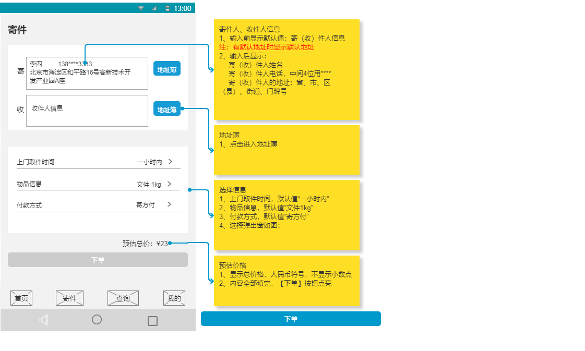

## 货物类型管理

货物类型是TMS的基础数据，表示物流货物的类别，例如：服饰、食品、数码产品等类型，可以进行增删改查的操作。

产品原型如下：

## 地址簿管理

地址簿是TMS的C端用户来负责维护的基础数据，用户可以在寄件时从地址簿中选择寄件人和收件人。

## 用户信息管理

此处的用户是指TMS的C端用户，用户在进行验证码登录时会自动完成注册。

## 订单中心服务开发

订单中心微服务提供TMS中订单的维护功能。

### 货物信息

货物信息是指用户所寄物品相关信息，包括货物名称、货物单位、货物重量、所属订单id、所属运单id、货物数量等。

产品原型如下：

### 订单

订单是指客户下达运输业务的单个委托单证。用户可以通过手机端品达速运App在寄件页输入相关信息，点击“下单”按钮即可提交订单。

产品原型如下：

## 作业中心服务开发

### 快递员取件、派件任务管理

用户通过手机App寄件，产生订单(pd_order),根据订单计算，产生快递员取件任务(pd_task_pickup_dispatch)。 货物到达收件人网点后，计算产生快递员派件任务(pd_task_pickup_dispatch)。

任务类型：1为取件任务，2为派件任务

任务状态：1为待执行（对应 待上门和须交接）、2为进行中（该状态暂不使用，属于保留状态）、3为待确认（对应 待妥投和须交件）、4为已完成、5为已取消

签收状态：1为已签收，2为拒收

任务分配状态：1为未分配，2为已分配，3为待人工分配

产品原型如下：

### 运单管理

运单是指承运人与托运人之间关于货物运输事宜的“一次性’’书面契约。是货物运输及运输代理的合同凭证，也是运输经营者接受货物并在运输期间负责保管和据以交付的凭据。整个运输过程中，运单是进行各项运输作业和处理有关事项(如货运事故或运费计收等)的基本依据。

运单状态：1.新建 2.已装车 3.到达 4.到达终端网点 5.已签收 6.拒收

调度状态：1.待调度 2.未匹配线路 3.已调度

### 运输任务管理

根据订单和运单计算，产生运输任务(pd_task_transport)。一个运单可能关联多个运输任务。

任务状态：1为待执行（对应 未发车）、2为进行中（对应在途）、3为待确认（保留状态）、4为已完成（对应 已交付）、5为已取消。

任务分配状态：1未分配、2已分配、3待人工分配。

产品原型如下：

### 司机作业单管理

调度过程中会根据运输任务计算产生司机作业单，司机根据作业单进行运输作业。

作业状态：1为待执行（对应 待提货）、2为进行中（对应在途）、3为改派（对应 已交付）、4为已完成（对应 已交付）、5为已作废。

产品原型如下：

## 智能调度服务

智能调度服务，主要功能就是针对物流公司的网点和转运中心的订单进行处理，最终生成司机的运输作业，司机根据运输作业进行货物的运输操作。

具体处理流程如下

流程为：开始 → 订单分类 → 路线规划 → 创建运输任务 → 规划车次车辆 → 创建司机运输作业 → 结束

注意：智能调度是针对某一个网点或者转运中心的，即每个网点或转运中心都需要根据当前自己机构的订单进行智能调度处理。

- 订单分类：就是根据订单的收件人地址所属网点将订单进行分类，收件网点相同的订单分为一类
- 路线规划：根据当前网点和目的地网点查询符合条件的线路(包括直达线路和中转线路)，确定订单分类和线路的对应关系
- 创建运输任务：根据前面路线规划的结果，创建运输任务，同时更新订单状态并且让运输任务关联运单
- 规划车次车辆：根据前面路线规划的结果，查询符合条件的车次、车辆、司机
- 创建司机运输作业：根据前面路线规划和车次车辆规划的结果，创建司机的运输作业，同时更新运输任务信息
