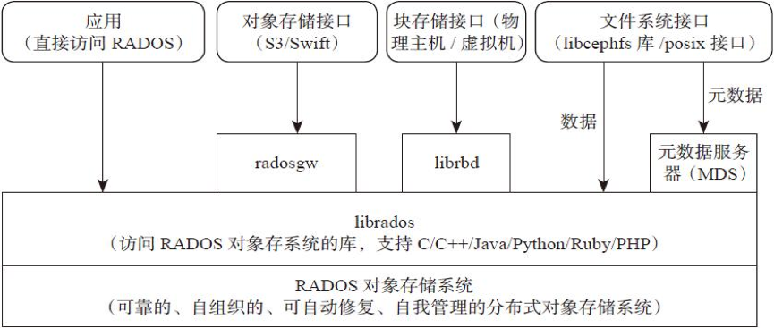
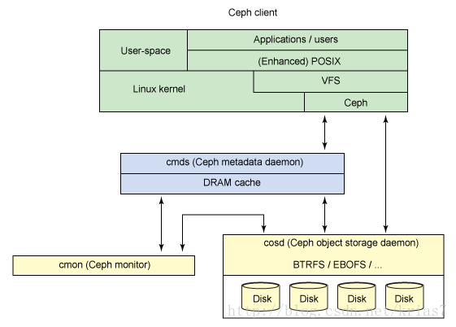
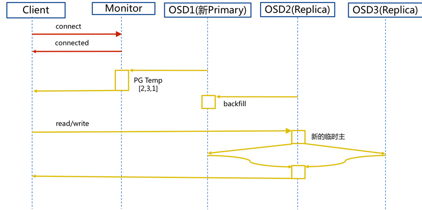
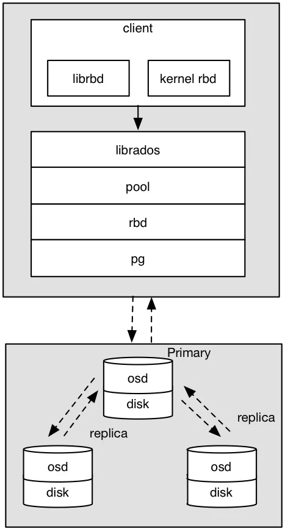
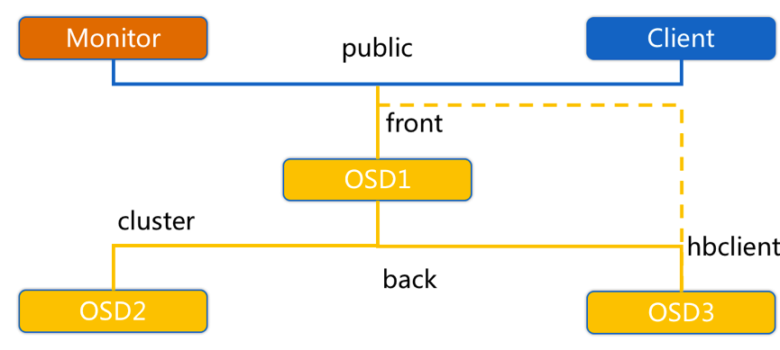
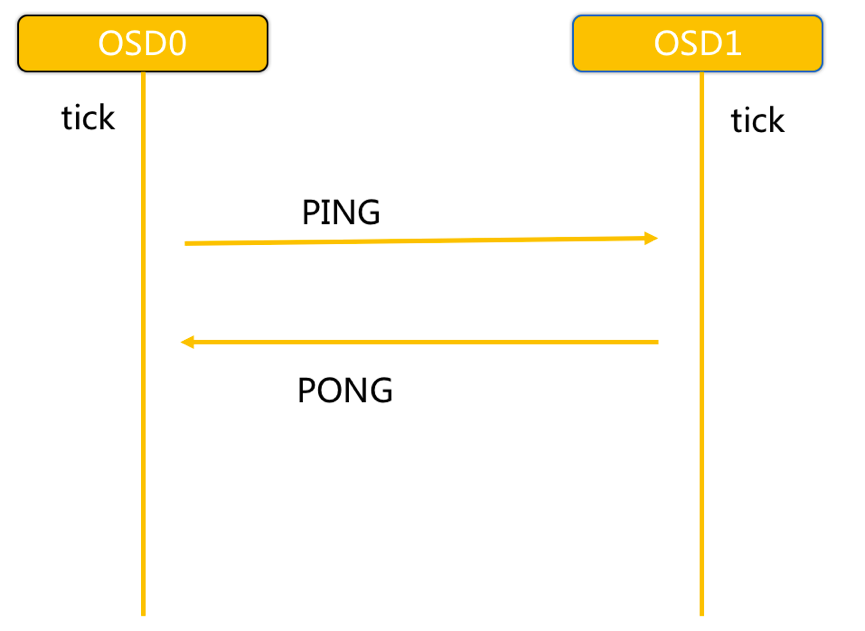
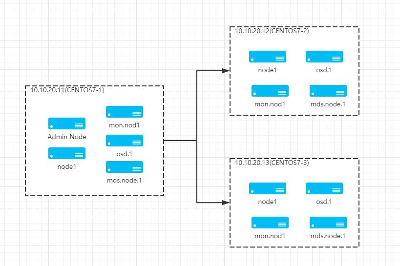

# Ceph

### 3. 讲解

#### 3.1  背景

Ceph是一个去中心化的分布式存储系统， 提供较好的性能、可靠性和可扩展性。Ceph项目最早起源于Sage就读博士期间的工作（最早的成果于2004年发表），并随后贡献给开源社区。在经过了数年的发展之后，目前已得到众多云计算厂商的支持并被广泛应用。

#### 3.2  特点

Ceph适合跨集群的小文件存储， 拥有以下特点：

+ **高性能**

  采用CRUSH算法，数据分布均衡，并行度高，支持上千个存储节点， 支持TB及PB级数据。

+ **高可用性**

  支持故障域分隔，数据强一致性； 没有单点故障，自动管理。

+ **高扩展性**

  去中心化、灵活、随节点增加线性增长。

+ **场景丰富**

  支持三种存储接口类型: 块存储、文件存储、对象存储。 同时支持自定义接口，C++为底层实现， 兼容多种语言。

    + **块存储**： 将磁盘空间映射给主机使用， 适用 docker容器、虚拟机磁盘存储分配；日志存储， 文件存储。

    + **文件存储**： 解决块存储无法共享问题， 在服务器架设FTP和NFS服务器，适用目录结构的存储、日志存储等。

    + **对象存储**： 大容量硬盘， 安装存储管理软件， 对外提供读写访问能力， 具备块存储的高速读写能力， 也具备文件存储共享的特性； 适用图片存储或视频存储。

#### 3.3  存储系统横纵对比

| 对比说明 | TFS  | FASTDFS | MooseFS | GlusterFS | CEPH |
| -------- | ---- | ------- | ------- | --------- | ---- |
| 开发语言 | C++  | C       | C       | C         | C++  |
|数据存储方式| 块| 文件/Trunk| 块 |文件/块| 对象/文件/块|
|在线扩容|支持| 支持| 支持| 支持| 支持|
|冗余备份|支持| 支持| 支持| 支持| 支持|
|单点故障| 存在| 不存在| 存在| 不存在| 不存在 |
|易用性 | 安装复杂，官方文档少| 安装简单，社区相对活跃| 安装简单，官方文档多| 安装简单，官方文档专业化| 安装简单，官方文档专业化|
|适用场景|跨集群的小文件|单集群的中小文件|单集群的大中文件|跨集群云存储| 单集群的大中小文件|

#### 3.4  Ceph整体设计

+ 基础存储系统RADOS（Reliable, Autonomic,Distributed Object Store，即可靠的、自动化的、分布式的对象存储）

  这就是一个完整的对象存储系统，所有存储在Ceph系统中的用户数据事实上最终都是由这一层来存储的。而Ceph的高可靠、高可扩展、高性能、高自动化等等特性本质上也是由这一层所提供的。因此，理解RADOS是理解Ceph的基础与关键。物理上，RADOS由大量的存储设备节点组层，每个节点拥有自己的硬件资源（CPU、内存、硬盘、网络），并运行着操作系统和文件系统。

+ 基础库librados

  这层的功能是对RADOS进行抽象和封装，并向上层提供API，以便直接基于RADOS（而不是整个Ceph）进行应用开发。特别要注意的是，RADOS是一个对象存储系统，因此，librados实现的API也只是针对对象存储功能的。RADOS采用C++开发，所提供的原生librados API包括C和C++两种。物理上，librados和基于其上开发的应用位于同一台机器，因而也被称为本地API。应用调用本机上的librados API，再由后者通过socket与RADOS集群中的节点通信并完成各种操作。

+ 高层应用接口

  这层包括了三个部分：RADOS GW（RADOS Gateway）、 RBD（Reliable Block Device）和Ceph FS（Ceph File System），其作用是在librados库的基础上提供抽象层次更高、更便于应用或客户端使用的上层接口。其中，RADOS GW是一个提供与Amazon S3和Swift兼容的RESTful API的gateway，以供相应的对象存储应用开发使用。RADOS GW提供的API抽象层次更高，但功能则不如librados强大。因此，开发者应针对自己的需求选择使用。RBD则提供了一个标准的块设备接口，常用于在虚拟化的场景下为虚拟机创建volume。目前，Red Hat已经将RBD驱动集成在KVM/QEMU中，以提高虚拟机访问性能。Ceph FS是一个POSIX兼容的分布式文件系统( POSIX表示可移植操作系统接口, 定义了操作系统与应用程序交互的接口标准, linux和windows都要实现基本的posix标准, 程序在源代码级别就能实现可移植性)。由于还处在开发状态，因而Ceph官网并不推荐将其用于生产环境中。

+ 应用层

  这层是不同场景下对于Ceph各个应用接口的各种应用方式，例如基于librados直接开发的对象存储应用，基于RADOS GW开发的对象存储应用，基于RBD实现的云硬盘等等。在上文的介绍中，有一个地方可能容易引起困惑：RADOS自身既然已经是一个对象存储系统，并且也可以提供librados API，为何还要再单独开发一个RADOS GW？

  理解这个问题，事实上有助于理解RADOS的本质，因此有必要在此加以分析。粗看起来，librados和RADOS GW的区别在于，librados提供的是本地API，而RADOS GW提供的则是RESTfulAPI，二者的编程模型和实际性能不同。而更进一步说，则和这两个不同抽象层次的目标应用场景差异有关。换言之，虽然RADOS和S3、Swift同属分布式对象存储系统，但RADOS提供的功能更为基础和底层、操作接口也更为丰富。这一点可以通过对比看出。

  由于Swift和S3支持的API功能近似，这里以Swift举例说明。Swift提供的API功能主要包括：

    + 用户管理操作：用户认证、获取账户信息、列出容器列表等；

    + 容器管理操作：创建/删除容器、读取容器信息、列出容器内对象列表等；

    + 对象管理操作：对象的写入、读取、复制、更新、删除、访问许可设置、元数据读取或更新等。

#### 3.5  核心组件与概念
+ **Monitor**
一个Ceph集群需要多个Monitor组成的小集群，它们通过Paxos同步数据，用来保存OSD的元数据。

+ **OSD**
OSD全称Object Storage Device，也就是负责响应客户端请求返回具体数据的进程。一个Ceph集群一般都有很多个OSD。

+ **MDS**
MDS全称Ceph Metadata Server，是CephFS服务依赖的元数据服务。

+ **Object**
Ceph最底层的存储单元是Object对象，每个Object包含元数据和原始数据。

+ **PG**
PG全称Placement Groups，是一个逻辑的概念，一个PG包含多个OSD。引入PG这一层其实是为了更好的分配数据和定位数据。

+ **RADOS**
RADOS全称Reliable Autonomic Distributed Object Store，是Ceph集群的精华，用户实现数据分配、Failover等集群操作。

+ **Librados**
Librados是Rados提供库，因为RADOS是协议很难直接访问，因此上层的RBD、RGW和CephFS都是通过librados访问的，目前提供PHP、Ruby、Java、Python、C和C++支持。

+ **CRUSH**
CRUSH是Ceph使用的数据分布算法，类似一致性哈希，让数据分配到预期的地方。

+ **RBD**
RBD全称RADOS block device，是Ceph对外提供的块设备服务。

+ **RGW**
RGW全称RADOS gateway，是Ceph对外提供的对象存储服务，接口与S3和Swift兼容。

+ **CephFS**
  CephFS全称Ceph File System，是Ceph对外提供的文件系统服务。

#### 3.6  逻辑架构

Ceph Client 是 Ceph 文件系统的用户。
Ceph Metadata Daemon 提供了元数据服务器。
Ceph Object Storage Daemon 提供了实际存储（对数据和元数据两者）。
Ceph Monitor 提供了集群管理。

#### 3.7  IO流程图

**步骤：**

1. client连接monitor获取集群map信息。
2. 同时新主osd1由于没有pg数据会主动上报monitor告知让osd2临时接替为主。
3. 临时主osd2会把数据全量同步给新主osd1。
4. client IO读写直接连接临时主osd2进行读写。
5. osd2收到读写io，同时写入另外两副本节点。
6. 等待osd2以及另外两副本写入成功。
7. osd2三份数据都写入成功返回给client, 此时client io读写完毕。
8. 如果osd1数据同步完毕，临时主osd2会交出主角色。
9. osd1成为主节点，osd2变成副本。

#### 3.8 Ceph RBD 块存储 IO流程图

osd写入过程：

1. 采用的是librbd的形式，使用librbd创建一个块设备，向这个块设备中写入数据。

2. 在客户端本地通过调用librados接口，然后经过pool，rbd，object、pg进行层层映射,在PG这一层中，可以知道数据是保存在哪三个OSD上，这三个OSD分别为主从的关系。

3. 客户端与primary OSD建立SOCKET 通信，将要写入的数据传给primary OSD，由primary OSD再将数据发送给其他replica OSD数据节点。

#### 3.9 Ceph 心跳和故障检测机制

**问题：**

故障检测时间和心跳报文带来的负载,  如何权衡降低压力?

1. 心跳频率太高则过多的心跳报文会影响系统性能。
2. 心跳频率过低则会延长发现故障节点的时间，从而影响系统的可用性。

**故障检测策略应该能够做到：**

及时性：节点发生异常如宕机或网络中断时，集群可以在可接受的时间范围内感知。

适当的压力：包括对节点的压力，和对网络的压力。

容忍网络抖动：网络偶尔延迟。

扩散机制：节点存活状态改变导致的元信息变化需要通过某种机制扩散到整个集群。

**OSD节点会监听public、cluster、front和back四个端口**

-  **public端口**：监听来自Monitor和Client的连接。
-  **cluster端口**：监听来自OSD Peer的连接。
-  **front端口**：客户端连接集群使用的网卡, 这里临时给集群内部之间进行心跳。
-  **back端口**：在集群内部使用的网卡。集群内部之间进行心跳。
-  **hbclient**：发送ping心跳的messenger(送信者)。

**Ceph OSD之间相互心跳检测**

+ 同一个PG内OSD互相心跳，他们互相发送PING/PONG信息。
+ 每隔6s检测一次(实际会在这个基础上加一个随机时间来避免峰值)。
+ 20s没有检测到心跳回复，加入failure队列。

#### 3.10 Ceph 通信机制

**网络通信框架三种不同的实现方式：**

- Simple线程模式
  -  **特点**：每一个网络链接，都会创建两个线程，一个用于接收，一个用于发送。
  -  **缺点**：大量的链接会产生大量的线程，会消耗CPU资源，影响性能。
- Async事件的I/O多路复用模式
  -  **特点**：这种是目前网络通信中广泛采用的方式。新版默认已经使用Asnyc异步方式了。
- XIO方式使用了开源的网络通信库accelio来实现
  -  **特点**：这种方式需要依赖第三方的库accelio稳定性，目前处于试验阶段。

**消息的内容主要分为三部分：**

- header //消息头类型消息的信封
- user data //需要发送的实际数据 
  - payload     //操作保存元数据
  - middle      //预留字段
  - data       //读写数据
- footer       //消息的结束标记

**步骤：**

- Accepter监听peer的请求, 调用 SimpleMessenger::add_accept_pipe() 创建新的 Pipe,  给 SimpleMessenger::pipes 来处理该请求。

- Pipe用于消息的读取和发送。该类主要有两个组件，Pipe::Reader，Pipe::Writer用来处理消息读取和发送。

- Messenger作为消息的发布者, 各个 Dispatcher 子类作为消息的订阅者, Messenger 收到消息之后，  通过 Pipe 读取消息，然后转给 Dispatcher 处理。

- Dispatcher是订阅者的基类，具体的订阅后端继承该类,初始化的时候通过 Messenger::add_dispatcher_tail/head 注册到 Messenger::dispatchers. 收到消息后，通知该类处理。

- DispatchQueue该类用来缓存收到的消息, 然后唤醒 DispatchQueue::dispatch_thread 线程找到后端的 Dispatch 处理消息。

  

更多参考：[Ceph介绍及原理架构分享](https://www.jianshu.com/p/cc3ece850433)

### 3. 实现

集群安装较为复杂， 可先跳过，通过我提供安装好的虚拟机， 直接至3.7节学习如何操作使用。

#### 3.1 部署结构

虚拟机创建三台服务器，CENTOS版本为7.6， IP网端10.10.20.0/24。三台主机名称为：

+ CENTOS7-1:  IP为10.10.20.11， 既做管理节点， 又做子节点。

+ CENTOS7-2:  IP为10.10.20.12， 子节点。

+ CENTOS7-2:  IP为10.10.20.13， 子节点。

