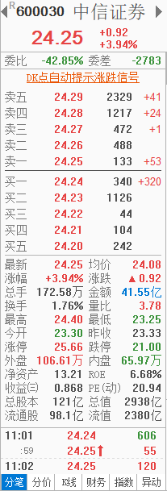
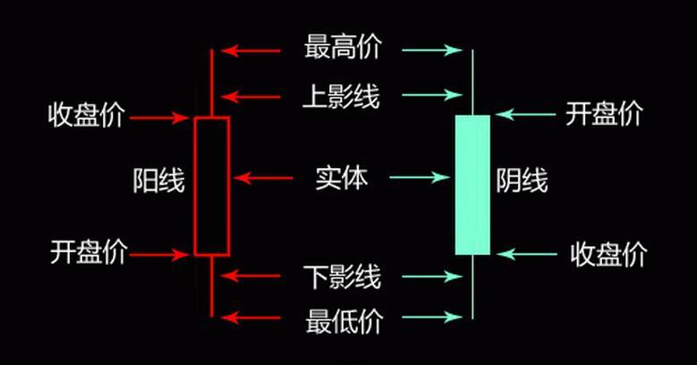
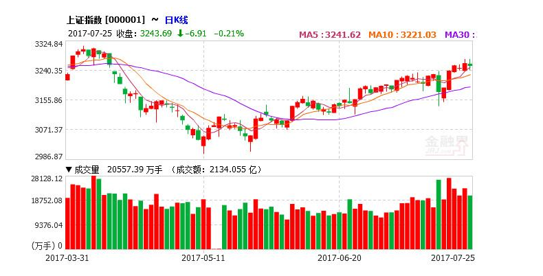

### 3. 讲解

#### 3.1 股票市场

中国股市，1989年开始作为试点， T+1交割，T+1交收：交易双方在交易次日完成与交易有关的证券、款项收付，即买方收到证券、卖方收到款项。我国上海、深圳证券交易所对A股均实行T+1交收。

股票市场是上市公司筹集资金的主要途径之一。随着商品经济的发展，公司的规模越来越大，需要大量的长期资本。而如果单靠公司自身的资本化积累，是很难满足生产发展的需求的，所以必须从外部筹集资金。公司筹集长期资本一般有三种方式：一是向银行借贷；二是发行公司债券；三是发行股票。前两种方式的利息较高，并且有时间限制，这不仅增加了公司的经营成本，而且使公司的资本难以稳定，因而有很大的局限性。而利用发行股票的方式来筹集资金，则无须还本付息，只需在利润中划拨一部分出来支付红利即可。把这三种筹资方式综合比较起来，发行股票的方式无疑是最符合经济原则的，对公司来说是最有利的。所以发行股票来筹集资本就成为发展大企业经济的一种重要形式，而股票交易在整个证券交易中因此而占有相当重要的地位。


#### 3.2 股票行情

股票行情指股票交易所内各只股票的涨幅变化及交易流通情况。每只股票的行情实质是由价格与时间组成。

股票价格，是指股票在证券市场上买卖时的价格。股票本身没有价值，仅是一种凭证。其有价格的原因是它能给其持有者带来股利收入，故买卖股票实际上是购买或出售一种领取股利收入的凭证。票面价值是参与公司利润分配的基础，股利水平是一定量的股份资本与实现的股利比率，利息率是货币资本的利息率水平。

股票的买卖价格，即股票行市的高低，直接取决于股息的数额与银行存款利率的高低。它直接受供求的影响，而供求又受股票市场内外诸多因素影响，从而使股票的行市背离其票面价值。例如公司的经营状况、信誉、发展前景、股利分配政策以及公司外部的经济周期变动、利率、货币供应量和国家的政治、经济与重大政策等是影响股价波动的潜在因素，而股票市场中发生的交易量、交易方式和交易者成份等等可以造成股价短期波动。另外，人为地操纵股票价格，也会引起股价的涨落。


#### 3.3 股票术语

   

+ 股票价格

  是指股票在证券市场上买卖时的价格，市场不断撮合交易， 股票价格也由此不断产生变化， 这是直接反映股票价值的重要信息。

+ 成交量(VOL)

  成交量是股票在某一个单位时间内（分钟、小时、天）的成交数量。市场活跃时， 供不应求， 成交量一般比较大； 市场冷清时， 供大于求， 成交量萎缩， 代表人气低下。

+ 外盘

  外盘就是股票的买家以卖家的卖出价而买入成交，当成交价在卖出价时，将成交数量加入外盘累计数量中，这是一种买盘比较积极的表现。

+ 内盘

  内盘是指卖家以买家的买入价而卖出成交， 当成交价在买入价时，将成交数量加入内盘累计数量中， 这是一种抛售比较明显的表现。

+ 集合竞价

  集合竞价是指对一段时间内接收的买卖申报一次性集中撮合的竞价方式。

  9：15——9：20这五分钟，交易主机可接收买卖申报，也可接收撤单申报，但不对买卖申报或撤销申报做处理。
  9：20——9：25、14:57——15:00，交易主机不接受参与竞价交易的撤销申报。

+ 开盘价

  是指某种证券在证券交易所每个交易日开市后的第一笔每股买卖成交价格。世界上大多数证券交易所都采用成交额最大原则来确定开盘价。
  
  如果开市后一段时间内（通常为半小时）某种证券没有买卖或没有成交，则取前一日的收盘价作为当日证券的开盘价。如果某证券连续数日未成交，则由证券交易所的场内中介经纪人根据客户对该证券买卖委托的价格走势提出指导价，促使成交后作为该证券的开盘价。在无形化交易市场中，如果某种证券连续数日未成交，以前一日的收盘价作为它的开盘价。

+ 收盘价

  指某种证券在证券交易所一天交易活动结束前最后一笔交易的成交价格。如当日没有成交，则采用上一交易日的收盘价作为当天的收盘价。收盘价是当日行情的标准，又是下一个交易日开盘价的依据，可据以预测未来证券市场行情；所以投资者对行情分析时，一般采用收盘价作为计算依据。

+ 涨跌幅限制

  是指在一个交易日内，除上市首日证券外，国内证券的交易价格相对上一交易日收市价格的涨跌幅度不得超过10%；超过涨跌限价的委托为无效委托。


#### 3.4 股票交易规则

+ 交易时间

  交易时间在工作日的上午和下午，上午是9:30-11:30，下午是13:00-15:00。我们管开始交易叫“开盘”，交易结束叫“收盘”。

+ 交易品种

  交易品种属于在深圳、上海证券交易所上市的股票（A股、B股）、债券（国债和企业债券）、封闭式基金、ETF基金和权证等。 A股股票是以人民币进行交易的股票，是投资者股票交易的主要品种。B股股票是以外币进行交易的股票。上海证券交易所的B股以美元进行交易，深圳证券交易所的B股以港币进行交易。

+ 交易制度

  实行 T+1 操作，当天买入的股票第二天才能卖出。不能透支及买空卖空。

+ 交易单位

  买入股票或基金，申报数量应当为100股(份)或其整数倍，A股、基金的申报价格最小变动单位为0.01元人民币。股票(基金)单笔申报最大数量应当低于100万股(份)。

#### 3.5 股票如何交易

“买入”和“卖出”，这个跟所有东西的买卖一样，股票的日常交易就是买与卖；

“多”和“空”，这两个词在金融市场上很常见，所谓“多”，就是指上涨、向好，所谓“空”，就是下跌，向差。

所以“看多”，就是指对之后的行情走势比较看好，比如说“看多某只股票”就是觉得这个股票之后会涨。 “看空”则相反。再就是“做多”，“做”的意思等同于“交易”了。“做多”就是认为未来会涨，所以买入。

那”做空“就是认为未来会跌，然后卖出了？卖出其实并不是做空，因为卖出了，其实就跟你没关系了。所谓“卖空“，是指认为未来某只股票会跌，所以先借到比如30万股该股票，然后以现价（比如10元/股）卖出，等到股票下跌后（比如跌到5元/股），再买回来还给别人，从而实现盈利。因为国内没有卖空的机制，所以大家可能并不熟悉， 在期货市场就可以实现做空。


### 第2章 股票K线知识

### 1. 目标

- 了解股票的K线相关知识

### 2. 分析

- 股票K线简介
- 股票K线的组成与画法
- K线的分类
- 成交量

### 3. 讲解

#### 3.1 简介

K线图（Candlestick Charts）又称蜡烛图、日本线、阴阳线、棒线等，常用说法是“K线”，起源于日本十八世纪德川幕府时代（1603～1867年）的米市交易，用来计算米价每天的涨跌。因其标画方法具有独到之处，人们把它引入股票市场价格走势的分析中，经过300多年的发展，已经广泛应用于股票、期货、外汇，期权等证券市场。

#### 3.2 K线组成与画法

K线是一条柱状的线条，由影线和实体组成。影线在实体上方的部分叫上影线,下方的部分叫下影线。实体分阳线和阴线。其中影线表明当天交易的最高和最低价，而实体表明当天的开盘价和收盘价。

K线由开盘价、收盘价、最高价、最低价四个价位组成.

开盘价低于收盘价称为阳线，反之叫阴线。

中间的矩形称为实体，实体以上细线叫上影线，实体以下细线叫下影线。




#### 3.3 K线分类

根据K线的计算周期可将其分为日K线, 周K线，月K线，年K线。周K线是指以一周的第一个交易日（比如周一）的开盘价，一周的最后一个交易日（比如周五）的收盘价，全周最高价和全周最低价来画的K线图。月K线则以一个月的第一个交易日的开盘价，最后一个交易日的收盘价和全月最高价与全 月最低价来画的K线图，同理可以推得年K线定义。周K线，月K线常用于研判中期行情。




#### 3.4 成交量

成交量是一种供需的表现，指一个时间单位内对某项交易成交的数量。 当供不应求时，人潮汹涌，都要买进，成交量自然放大；反之，供过于求，市场冷清无人，买气稀少，成交量势必萎缩。 而将人潮加以数值化，便是成交量。 广义的成交量包括成交股数、成交金额、换手率；狭义的也是最常用的是仅指成交股数。


### 第3章 FIX金融信息交换协议与行情源

### 1. 目标

- 了解业内FIX金融信息交换协议
- 了解FAST面向流的信息交换协议
- 了解STEP证券交易数据交换协议
- 了解Binary二进制格式协议
- 了解股票行情源与数据接口规范
- 了解聚合数据源行情接口规范

### 2. 分析

- FIX简介
- FIX协议结构
- FAST 面向流的信息交换协议
- STEP 证券交易数据交换协议
- Binary 二进制格式协议
- 行情源简介
- 新浪行情源
- 行情源对接选择
- 聚合数据源接口

### 3. 讲解

#### 3.1 简介

FIX 全称 Financial Information Exchange protocol 金融信息交换协议 
是适用于实时证券、金融电子交易的数据通信标准。它是把各类证券金融业务需求流程格式化,使之成为一个可用计 算机语言描述的功能流程,并在每个业务功能接口上统一交换格式。

2006年10月，FPL发布了FIX5.0。FIX5.0引入TI（the transport independence ）传输无关框架。TI将FIX会话层从应用层协议中分离出来。在TI框架下，应用层协议消息可以通过任意合适的传输技术进行传送，在这里，FIX会话层协议是FIX应用层消息的可选传输协议之一。两个协议层的版本标注将会有所不同，FIX X.Y为FIX应用层协议版本；FIXT X.Y 为FIX会话层协议版本编号。（会话层定义了数据通信相关的协议，应用层定义了金融活动相关的业务数据结构。


FIX5.0协议介绍参考

https://corp-web.b2bits.com/FAJ_doc/fast-manual/page2.html#sec2_3

https://www.fixtrading.org/standards/

读书笔记：

https://blog.csdn.net/songzhang/article/details/1788770

#### 3.2 FIX协议结构

FIX协议的格式存在着两种结构:"〈标记（Tag）〉=〈值（Value）〉"域结构和 FIXML 结构（基于XML传输）。

+ 信息格式：

  一条FIX协议信息的基本格式是：

  《标准头》+《信息正文域》+《标准尾》

  每条信息都是由一系列带有〈标记（Tag）〉=〈值（Value）〉的域组成的。在每个域之间通过`"< >"`分开。除了一些特殊规定外，信息中的域可按照任意顺序排列。所有域在都以"定界符"（#001；0x01H,文档中写为`<SOH>`）表示终止。 

+ 头部信息

  表明了信息类型、长度、目的地、序号、起始点和时间。

+ 尾部信息

  无论是命令类的，还是应用类的，以一个标准结尾终止。尾部被用来把信息分离，并包含有检验值。

+ 数据类型

  数据类型包括以下几种：整数、浮点数、布尔数、字符串、多元值串、货币、交易所字符串域、国际标准时时间戳、国际标准时时间、本地市场日期等。

+ 加密

  为保证信息安全，对传递的信息需要加密，加密方法的选择由传送中的有关双方协议而定。任何域都可被加密并被添加于"密码"的域内，不过， 公开的域须以非加密方式进行传送， 比如包的长度， 校验值等。

#### 3.3 FAST 面向流的信息交换协议

FAST 全称FIX Adapted For Streaming 面向流的信息交换协议。

为了解决FIX协议传输市场数据存在的冗余度高，带宽需求大的问题，芝加哥商品交易所（CME）在2003年向FPL（FIX Protocol Ltd）提交了一个解决方案，FPL在2004年成立了市场数据优化工作组(MDOWG),2005年MDOWG开始根据一些POC(Prove of Concept)的结果进行协议标准制定，并与2006年初完成了FAST V1.0，2006年12月完成了FAST V1.1。

FAST的优点是高压缩比，低资源消耗，算法简单高效，每秒百万级别的消息处理能力。利用FAST压缩后有效降低了带宽使用。

FAST的核心是一个压缩算法，将按照fix规范定义的数据经过压缩以后，可以在很大程度上降低发送、接收双方的带宽。参照FIX规范定义，FAST要将字段和其对应的值，进行压缩处理并传输。
发送接收双方的处理流程如下：


FAST协议参考：

https://www.jianshu.com/p/38e4cfc4d0c7

#### 3.4 STEP 证券交易数据交换协议

STEP全称 Security Trade Exchange Protocol 证券交易数据交换协议。

Fix协议是一种国际通用的交易协议，它详细地定义了每种交易的处理流程，为了适应国际化，交易所一般都会支持Fix协议，但是会做一些本地化，比如在中国的本地化Fix，就是step协议。它是我国根据FIX协议4.4版本的基础上制定出来的国家金融行业标准，已成为事实上的证券数据标准，语法简单定义灵活易扩展，数据相对冗余。

具体可以参看： 《轻量级STEP会话协议接口规范》

http://www.szse.cn/marketServices/technicalservice/interface/P020180328467247901955.pdf

#### 3.5 Binary二进制格式协议

Binary协议顾名思义就是二进制协议， 这是深交所自己定义的二进制格式协议。

通讯的协议是二进制的，里面详细定义了各种报文的字段，编解码规则等。在深交所行情的Binary协议中，所有的消息，都是有3部分组成：消息头，消息体和消息尾。消息头有8个字节，是两个整数 MsgType 和 BodyLen。MsgType 标识者这个消息的类型，BodyLen 则表示接下来的消息体有多少个字节，我们根据 BodyLen 将消息体读出来。剩下就是4个字节的 checksum 了。


#### 3.6 行情源介绍

正规行情源需要从交易所接入， 需要缴纳一定的授权费用。 各券商都可以申请从两所拉专线获取行情源数据，其次是第三方大智慧、通达信、同花顺等信息商。还有很多第三方及第四方提供免费行情源， 如数据超市、聚合数据、雅虎、新浪、Google、和讯、搜狐、ChinaStockWebService、东方财富客户端、证券之星、网易财经等。

交易所行情接入是要收取比较昂贵的费用， 一般几十万到上百万价格不等， 我们教学项目采用的是第三方聚合数据作为对接， 最主要是掌握行情源如何订阅、加工与呈现。

#### 3.7 新浪行情源

获取某支股票的实时数据， 访问地址格式： http://hq.sinajs.cn/list=sh601006

返回数据：

```
var hq_str_sh601006="大秦铁路,7.840,7.840,7.880,7.880,7.810,7.870,7.880,17766197,139547519.000,5500,7.870,48100,7.860,312323,7.850,323100,7.840,314700,7.830,574300,7.880,420700,7.890,433300,7.900,213500,7.910,162100,7.920,2019-07-17,15:00:00,00";
```

这个字符串由许多数据拼接在一起，不同含义的数据用逗号隔开了, 顺序从0开始， 含义如下：

```
0：“大秦铁路”，股票名字；
1：“9.170”，今日开盘价；
2：“9.190”，昨日收盘价；
3：“9.060”，当前价格；
4：“9.180”，今日最高价；
5：“9.050”，今日最低价；
6：“9.060”，竞买价，即“买一“报价；
7：“9.070”，竞卖价，即“卖一“报价；
8：“42148125”，成交的股票数，由于股票交易以一百股为基本单位，所以在使用时，通常把该值除以一百；
9：“384081266.460”，成交金额，单位为“元“，为了一目了然，通常以“万元“为成交金额的单位，所以通常把该值除上一万；
10：“624253”，“买一”申请624253股，即6243手；
11：“9.060”，“买一”报价；
12：“638540”，“买二”申报股数；
13：“9.050”，“买二”报价；
14：“210600”，“买三”申报股数；
15：“9.040”，“买三”报价；
16：“341700”，“买四”申报股数；
17：“9.030”，“买四”报价；
18：“2298300”，“买五”申报股数；
19：“9.020”，“买五”报价；
20：“227184”，“卖一”申报227184股，即2272手；
21：“9.070”，“卖一”报价；
(22, 23), (24, 25), (26,27), (28, 29)分别为“卖二”至“卖五”的申报股数及其价格；
30：“2019-07-17”，日期；
31：“15:00:00”，时间；

```

对于股票的K线图，日线图等的获取，可以通过如下的请求格式:

http://image.sinajs.cn/newchart/{K线类型}/n/${股票市场+股票名称}

例如：

查看日K线图： http://image.sinajs.cn/newchart/daily/n/sh601006.gif
分时线的查询： http://image.sinajs.cn/newchart/min/n/sh000001.gif
日K线查询： http://image.sinajs.cn/newchart/daily/n/sh000001.gif
周K线查询： http://image.sinajs.cn/newchart/weekly/n/sh000001.gif
月K线查询： http://image.sinajs.cn/newchart/monthly/n/sh000001.gif


#### 3.8 选择行情源

如果是商业项目， 一般会从交易所的行情源对接， 比如上交所或深交所， 如上面所讲， 它们通过SETP协议与Binary协议进行对接。课程项目采用聚合数据平台提供的免费接口进行对接， 每天上限1000次调用。

行情对接协议有多种， 但数据结构， 提供的属性基本一致， 都能够加工形成各种K线。


### 第4章 撮合交易机制

### 1. 目标

- 理解撮合交易处理机制。
- 掌握股票委托、撤单以及止盈止损相关概念。

### 2. 分析

- 撮合交易简介
- 股票委托介绍
- 集合竞价介绍
- 连续竞价介绍
- 撤单介绍
- 止盈止损介绍

### 3. 讲解

#### 3.1 简介

撮合交易是指卖方在交易市场委托销售定单/销售应单、买方在交易市场委托购买定单/购买应单，交易市场按照价格优先、时间优先原则确定双方成交价格并生成电子交易合同，并按交易定单指定的交割仓库进行实物交割的交易方式。

通常买和卖就只有一个价格， 但是股票市场中可以有多个买价和卖价， 买方价格由高到低排列， 卖方价格由低到高排列， 这就是我们通常看到多个挡位行情， 也就是盘口信息， 一般会显示五个挡位， 更高级的行情源， 可以显示十个或更多挡位。当一个挡位的数量不足以交易时， 由下一个挡位进行匹配成交， 就形成了深度成交。

在中国股票市场规定中， 交易分为两类， 集合竞价与连续竞价交易。 下面， 我们以实例， 详细讲解推演。

#### 3.2 股票委托

股票委托是指依据买卖双方各自提出的条件（股票代码， 价格和成交量等），代其买卖股票的交易活动。代理买卖的经纪人充当股票买卖双方的中介者， 比如证券商。 股票委托形式有两种：

+ 市价委托：即按市场价格买进或卖出股票。

+ 限价委托：即按委托人提出的价格条件买进或卖出股票。

  输入的委托价格不得高于该股票当日涨停价或低于当日的跌停价。
  
  
  
  假设买方选择限价委托方式进行申报， 委托价格为25.06， 申报手数为10手， 那么该笔申报的成交情况为暂时无成交， 若投资者不撤单， 则剩余委托仍在撮合成交系统内， 等待其他投资者主动卖出， 撮合成交， 成交价为25.06； 实际成交数量，根据交易系统撮合的数量确定。
  
  如果当日交易结束仍有部分委托未成交, 则系统自动撤单, 下一交易日需重新申报委托。


#### 3.3 集合竞价

沪深开放式集合竞价时间为9点15分至9点25分，14点57分至15点00分， 除此之外的交易时间为连续竞价交易时段。

假设某只股票在开盘前分别有5笔买入和6笔卖出委托， 根据价格优先原则， 按买入价格由高至低和卖出价格由低至高的顺序将其分别排列如下：

| 序号 | 委托买入价格 | 数量 | 序号 | 委托卖出价格 | 数量 |
| ---- | ------------ | ---- | ---- | ------------ | ---- |
| 1    | 3.80         | 2    | 1    | 3.52         | 5    |
| 2    | 3.76         | 6    | 2    | 3.57         | 1    |
| 3    | 3.65         | 4    | 3    | 3.60         | 2    |
| 4    | 3.60         | 7    | 4    | 3.65         | 6    |
| 5    | 3.54         | 6    | 5    | 3.70         | 6    |
|      |              |      | 6    | 3.75         | 3    |

按不高于申买价和不低于申卖价的原则，首先可成交第一笔，即3．80元买入委托和3．52元的卖出委托， 这对委托成交后其它的委托排序如下：

| 序号 | 委托买入价格 | 数量 | 序号 | 委托卖出价格 | 数量  |
| ---- | ------------ | ---- | ---- | ------------ | ----- |
| 1    |              |      | 1    | 3.52         | **3** |
| 2    | 3.76         | 6    | 2    | 3.57         | 1     |
| 3    | 3.65         | 4    | 3    | 3.60         | 2     |
| 4    | 3.60         | 7    | 4    | 3.65         | 6     |
| 5    | 3.54         | 6    | 5    | 3.70         | 6     |
|      |              |      | 6    | 3.75         | 3     |

序号1的买入委托2手全部成交， 序号1的卖出委托还剩余3手。

第二笔成交情况：序号2的买入委托价格为3．76元，数量为6手。 在卖出委托中，序号1—3的委托卖出价格符合条件, 且数量正好为6手，进行撮合成交， 其成交价格在3．60元—3．76元的范围内，成交数量为6手。 第二笔成交后剩下的委托情况为：

| 序号 | 委托买入价格 | 数量 | 序号 | 委托卖出价格 | 数量 |
| ---- | ------------ | ---- | ---- | ------------ | ---- |
| 3    | 3.65         | 4    | 4    | 3.65         | 6    |
| 4    | 3.60         | 7    | 5    | 3.70         | 6    |
| 5    | 3.54         | 6    | 6    | 3.75         | 3    |

第三笔成交情况：序号3的买入委托其价格要求不超过3．65元，而卖出委托序号4的委托价格符合要求，这样序号3的买入委托与序号4的卖出委托就正好配对成交，其价格为3．65元，因卖出委托数量大于买入委托，故序号4的卖出委托仅只成交了4手。第三笔成交后的委托情况如下：

| 序号 | 委托买入价格 | 数量 | 序号 | 委托卖出价格 | 数量  |
| ---- | ------------ | ---- | ---- | ------------ | ----- |
|      |              |      | 4    | 3.65         | **2** |
| 4    | 3.60         | 7    | 5    | 3.70         | 6     |
| 5    | 3.54         | 6    | 6    | 3.75         | 3     |

完成以上三笔委托后，因最高买入价为3．60元，而最低卖出价为3．65，买入价与卖出价之间再没有相交部分，所以这一次的集合竟价就已完成，最后一笔的成交价就为集合竟价的平均价格。剩下的其他委托将自动进入开盘后的连续竟价。


#### 3.4 连续竞价

连续竟价的成交方式与集合竟价有很大的区别，它是在买入的最高价与卖出的最低价的委托中一对一对地成交， 其成交价为申买与申卖的平均价。

仍以某只股票为例， 委托报价的排列情况如下：

| 序号 | 委托买入价格 | 数量 | 序号 | 委托卖出价格 | 数量 |
| ---- | ------------ | ---- | ---- | ------------ | ---- |
| 1    | 3.80         | 2    | 1    | 3.52         | 5    |
| 2    | 3.76         | 6    | 2    | 3.57         | 1    |
| 3    | 3.65         | 4    | 3    | 3.60         | 2    |
| 4    | 3.60         | 7    | 4    | 3.65         | 6    |
| 5    | 3.54         | 6    | 5    | 3.70         | 6    |
|      |              |      | 6    | 3.75         | 3    |

委托买入的最高价为序号1的3．80元，卖出最低价为序号1的3．52元，这一对优先成交，其价格为两者的平均价, 与成交数量无关, 计算公式为: (3．80＋3．52）/2，故产生的价格为3．66元。交易所发布的即时行情为：成交价3．66元，数量2手。剩余的委托报价排序情况如下：

| 序号 | 委托买入价格 | 数量 | 序号 | 委托卖出价格 | 数量  |
| ---- | ------------ | ---- | ---- | ------------ | ----- |
|      |              |      | 1    | 3.52         | **3** |
| 2    | 3.76         | 6    | 2    | 3.57         | 1     |
| 3    | 3.65         | 4    | 3    | 3.60         | 2     |
| 4    | 3.60         | 7    | 4    | 3.65         | 6     |
| 5    | 3.54         | 6    | 5    | 3.70         | 6     |
|      |              |      | 6    | 3.75         | 3     |

第二笔，序号1的卖出价为3．52元，序号2的买入价为3．76元，这一对可以成交，成交价格为两者的平均值，价格为3．64元，数量为3手。该次成交后的委托情况为： 

| 序号 | 委托买入价格 | 数量  | 序号 | 委托卖出价格 | 数量 |
| ---- | ------------ | ----- | ---- | ------------ | ---- |
| 2    | 3.76         | **3** | 2    | 3.57         | 1    |
| 3    | 3.65         | 4     | 3    | 3.60         | 2    |
| 4    | 3.60         | 7     | 4    | 3.65         | 6    |
| 5    | 3.54         | 6     | 5    | 3.70         | 6    |
|      |              |       | 6    | 3.75         | 3    |

第三笔，序号2的卖出委托与序号2的买入委托可以成交，成交均价为3．67元，成交量1手。成交后剩下的委托情况如下：

| 序号 | 委托买入价格 | 数量 | 序号 | 委托卖出价格 | 数量 |
| ---- | ------------ | ---- | ---- | ------------ | ---- |
| 2    | 3.76         | **2**    |      |              |      |
| 3    | 3.65         | 4    | 3    | 3.60         | 2    |
| 4    | 3.60         | 7    | 4    | 3.65         | 6    |
| 5    | 3.54         | 6    | 5    | 3.70         | 6    |
|      |              |      | 6    | 3.75         | 3    |

第四笔，序号2的买入委托3.76与序号3的卖出委托3.60成交2手， 序号2的买入委托与序号3的卖出委托消失；

第五笔， 序号4的卖出委托3.65与序号3的买入委托3.65撮合成交4手， 接下来没有匹配的价格无法进行撮合交易。

| 序号 | 委托买入价格 | 数量 | 序号 | 委托卖出价格 | 数量 |
| ---- | ------------ | ---- | ---- | ------------ | ---- |
| 4    | 3.60         | 7    | 4    | 3.65         | 2    |
| 5    | 3.54         | 6    | 5    | 3.70         | 6    |
|      |              |      | 6    | 3.75         | 3    |

以上就是撮合交易机制的处理流程。


#### 3.5 撤单

投资者通过股票委托， 进行买卖操作，按照投资者的要求撤回操作。

如果投资者在当天要动用被锁定的资金(在委托买入时，想改变买入价格或不想买入)或股票(在委托卖出时，想改变卖出价格或不想卖出)，就必须通过撤单撤消该委托。

国内A股撤单有效时间规定：

+ 9：15-9：20，可撤单;9：15前的撤单请求也从9：15开始受理。

+ 9：20-9：25，不接受撤单申报。

+ 9：30-11：30，可撤单。

+ 11：30-13：00，可申报撤单，但证交所尚不受理，处于“已报待撤”状态，13：00后开始受理，按时间顺序先受理买卖委托，如已成交，再受理撤单请求时，则不会撤单成功。

+ 13：00-15：00可撤单，两市最后3分钟14：57-15：00为集合竞价，不能撤单。

+ 15：00 收盘以后，没有成交的委托自动作废，无需撤单。但必须要等待清算结束后，资金才会解冻回到账户上来。


#### 3.6 止盈止损

+ 止盈：

  止盈（Stop-Profit/Stop Profit），也称停利、止赚 。 当股票到达一定的价格，而且出现利润，打算离场平仓了，在目标价位挂单卖出就是止盈。

  止盈的设置方式主要有两种:

  第一，设比例。假设10元买的股票，而后它上涨到12元，可以设定股票在回调10%位置时出仓。即，假如股票从12元回调到10.8元，就出来。如果没有回调到位，就一直拿着，然后，稳步修正止盈点(一定要严格遵守)，使自身利润接近最大化。
  第二，设价位。比如，10元买的股票，而后它上涨到12元，设定如果跌破11元就出仓，如果它没有跌到此价位而是继续上涨到了13元，那么，就设定如果跌破12元就出仓……这样逐级抬高标准，锁住自己的利润，也不至于因提前出仓后悔。

+ 止损俗称“割肉”，是指当某一投资出现的亏损达到预定数额时，及时斩仓出局，以避免形成更大的亏损。目的就在于投资失误时把损失限定在较小的范围内。

  止损方法与止盈类似， 主要存在两种， 根据比例和价位， 采用定额方式进行止损。


### 4. 总结

+ 撮合交易是一个交易系统的核心处理逻辑， 我们先要明白其处理机制， 通过案例推演， 掌握集合竞价与连续竞价的成交机制。
+ 理解股票委托， 撤单与止盈止损概念， 这些都是在交易中比较重要的业务环节， 帮助我们对后面的交易功能更好的实现。


