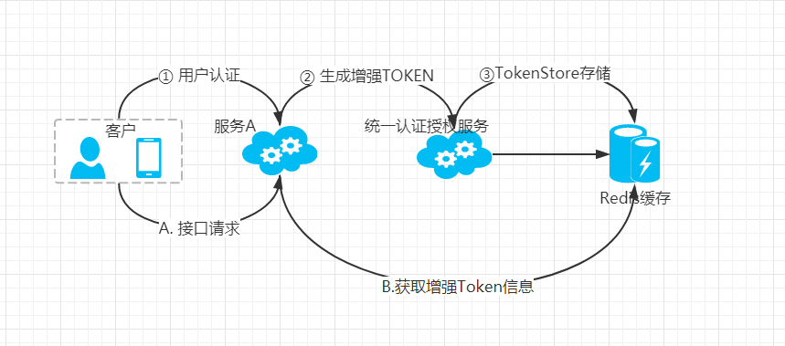

### 3. 实现

第二天的课程已经讲过Sentinel的使用与原理， 接下来我们在Spring Cloud 微服务的生产环境中配置和运用Sentinel。

#### 3.1 生产环境最优配置方案

**配置模式选择：**

|推送模式|说明|优点|缺点|
|--|--|--|--|
|[原始模式](https://github.com/alibaba/Sentinel/wiki/在生产环境中使用-Sentinel#原始模式)|API将规则推送至客户端并直接更新到内存中，扩展写数据源（[`WritableDataSource`](https://github.com/alibaba/Sentinel/wiki/动态规则扩展)）|简单，无任何依赖|不保证一致性；规则保存在内存中，重启即消失。严重不建议用于生产环境|
|[Pull模式](https://github.com/alibaba/Sentinel/wiki/在生产环境中使用-Sentinel#Pull模式)|扩展写数据源（[`WritableDataSource`](https://github.com/alibaba/Sentinel/wiki/动态规则扩展)），客户端主动向某个规则管理中心定期轮询拉取规则，这个规则中心可以是RDBMS、文件等|简单，无任何依赖；规则持久化|不保证一致性；实时性不保证，拉取过于频繁也可能会有性能问题。|
|**Push模式**|扩展读数据源（[`ReadableDataSource`](https://github.com/alibaba/Sentinel/wiki/动态规则扩展)），规则中心统一推送，客户端通过注册监听器的方式时刻监听变化，比如使用Nacos、Zookeeper等配置中心。这种方式有更好的实时性和一致性保证。**生产环境下一般采用push模式的数据源。**|规则持久化；一致性；快速|引入第三方依赖|


1. **原始模式**

   

2. **Pull拉取模式**

   

3. **Push推送模式**

   

**官方建议采用Push模式。**

#### 3.2 用户服务集成

1. **功能设计**
   
   我们把上一章完成的用户接口进行改造， 加入降级与限流处理。
   
   整个部署结构采用PUSH模式， 配置规则放置Nacos配置中心，统一发布与更新。
   
   在生产环境中， 如果在峰值时间段， 出现大量用户请求或者内部系统出现问题， 这个时候就有必要进行限流和降级处理， 防止穿透、雪崩导致整个服务瘫痪。


#### 3.3 熔断规则配置

启动Nacos服务， 在配置管理里面新建两项配置： 


sentinel-user-degrade为降级配置策略， 内容：

```json
[
  {
    "resource": "userLogin",
    "count": 0.2,
    "grade": 1,    
    "timeWindow": 4
  }
]
```

- resource:  为资源名称。
- count: 为百分比[0-1]， 这里代表20%
- grade:  为降级策略， 0： 代表响应时间， 1： 代表异常比例， 2： 代表异常数量， 这里采用的是异常比。
- timeWindow：为时间窗， 单位为秒。 


sentinel-user-flow为限流配置策略： 内容：

```json
[
   {
    "resource": "userLogin",
    "controlBehavior": 0,
    "count": 12,
    "grade": 1,
    "limitApp": "default",
    "strategy": 0
  }
]
```

- resource:  为资源名称。
- controlBehavior：流量整形的控制效果，目前支持快速失败和匀速排队两种模式，默认是0, 快速失败。
- count: 线程数量。
- grade：限流配置策略， 0：代表线程数量， 1：代表QPS并发数。
- limitApp： 限流针对的来源， 填写default即可。
- strategy： 基于调用关系的流量控制策略， 有三种
    - 0-STRATEGY_DIRECT，根据调用方进行限流， 结合limitApp使用。
    - 1-STRATEGY_RELATE， 根据关联流量限流， 当多个资源间具有资源争抢和关联关系的时候，比如同一个数据表的读与写请求， 如果写操作比较频繁， 那么读数据的请求就会被限流处理。
    - 2-STRATEGY_CHAIN,   根据调用链的入口限流， 比如两个请求Req1和Req2,  同时再配合设置FlowRule.refResource 指定Req1为入口请求， 那么Req1就会受到限流控制， Req2则可放行。

注意配置内容的JSON格式要符合要求， 如果填写错误， 配置不会生效。

### 4. 总结

+ 在生产环境中采用Push模式，优点支持规则持久化， 较强的一致性与可靠性， 能够快速处理， 实现最佳生产配置， 适用大型生产项目中使用， 掌握与理解熔断规则配置， 结合Sentinel监控台， 更好的发挥Sentinel组件作用。


#### 3.5 利用增强Token高效获取信息

1. 方案说明

   在微服务中， OATUH2的TOKEN处理方案有多种， 有通过统一网关加工处理， 其他服务不参与， 直接通过网关获取用户信息， 但网关职能变得就不再单一， 且其他服务安全性薄弱；有通过JWT TOKEN方式， 各服务直接从JWT中获取用户信息， 但附带信息有限， 且要加解密处理，占用计算成本， 传递JWT的长度比之前token增加数倍； 还有方案是， 各服务直接拿token远程调用认证服务， 获取用户信息，远程连接开销非常高， 且增加认证服务的压力。

   方案其实是可以灵活多样， 这里我们采用一种更高性能的方案：

   

   + 用户认证， 生成增强Token（增加用户ID，账号等主要信息）， 存储至Redis缓存中。

   + 在接下来的接口请求当中， 通过Token去Redis缓存里面直接获取增强Token信息， 从而获取用户ID等主要信息。

   + 这种方案相比以上方案， 能减少交互次数，不再需要请求统一认证服务，  减少加密解密等计算成本， 同时减少数据传递， 只要最基本的Token即可。但此方案的弊端， 必须认证服务和各个服务都能直接访问Redis缓存， 如果是跨项目， 跨区域, 需要暴露外网的情形下,  那么不推荐此方案,  毕竟还是要保障数据的安全性。

     


