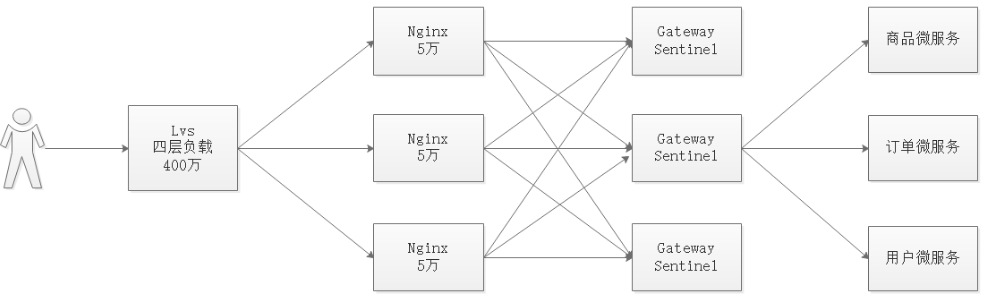
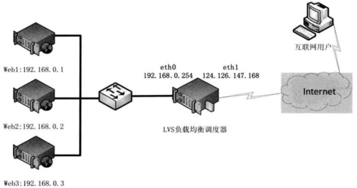
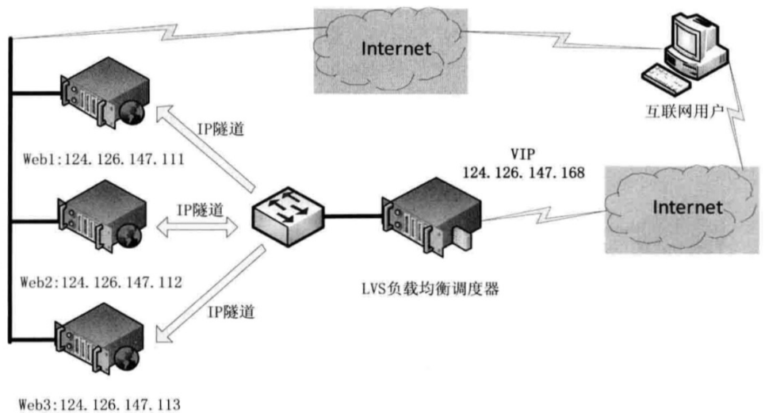
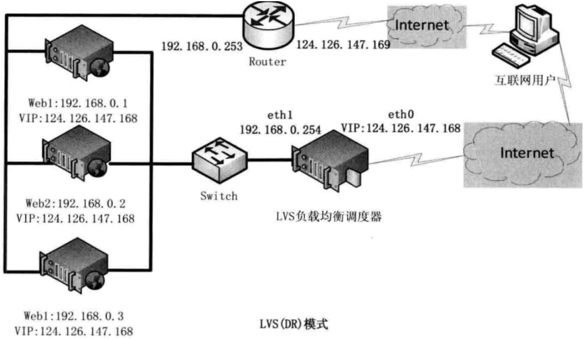

# 秒杀系统


## 秒杀设计

### 业务流程

​电商项目中，秒杀属于技术挑战最大的业务。后台可以发布秒杀商品后或者将现有商品列入秒杀商品，热点分析系统会对商品进行分析，对热点商品做特殊处理。商城会员可以在秒杀活动开始的时间内进行抢购，抢购后可以在线进行支付，支付完成的订单由平台工作人员发货，超时未支付订单会自动取消。

当前秒杀系统中一共涉及到管理员后台、搜索系统、秒杀系统、抢单流程系统、热点数据发现系统，如下图：


## 秒杀架构

B2B2C商城秒杀商品数据一般都是非常庞大，流量特别高，尤其是双十一等节日，所以设计秒杀系统，既要考虑系统抗压能力，也要考虑系统数据存储和处理能力。秒杀系统虽然流量特别高，但往往高流量抢购的商品为数不多，因此我们系统还需要对抢购热门的商品进行有效识别。

商品详情页的内容除了数量变更频率较高，其他数据基本很少发生变更，像这类变更频率低的数据，我们可以考虑采用模板静态化技术处理。

秒杀系统需要考虑抗压能力，编程语言的选择也有不少讲究。项目发布如果采用Tomcat，单台Tomcat抗压能力能调整到大约1000左右，占用资源较大。Nginx抗压能力轻飘的就能到5万，并且Nginx占用资源极小，运行稳定。如果单纯采用Java研发秒杀系统，用Tomcat发布项目，在抗压能力上显然有些不足，如果采用Lua脚本开发量大的功能，采用Nginx+Lua处理用户的请求，那么并发处理能力将大大提升。

下面是当前秒杀系统的架构图：


## 技术栈介绍


我们注册中心使用的是Nacos，数据库用的是MySQL，数据搜索Elasticsearch，采用了docker的安装方式。


项目的访问流程，流程图如下：


## 索引库数据管理: ​ 

秒杀商品数量庞大，我们要想实现快速检索，不建议直接使用关系型数据库查找。不建议使用Redis缓存所有数据，因为秒杀商品量大，会影响Redis的性能，并且Redis的条件检索能力偏弱。我们可以使用Elasticsearch，它在海量数据存储与检索上，能力卓越，市场使用面广。


3.1 批量导入

​ 我们需要将秒杀商品数据导入到ES索引库中，但秒杀商品数量庞大，所以我们应该分页查询并导入，流程如下：


1. 配置Elasticsearch地址信息
2. 编写Dao代码，继承`ElasticsearchRepository<T,ID>`
3. 在Service中分页调用查询秒杀商品集合
4. 分页导入秒杀商品集合数据到Elasticsearch中


3.2 增量导入

增量导入，也就是某个商品设置成秒杀商品的时候，或者发生变更的时候，能实现增量备份（只将修改的数据同步修改索引库），所以我们还需要实现单个商品导入索引库，我们可以在变更方法（增删改）中调用这边同步方法，但随着系统的增加，这种方法容易有漏网之鱼，我们可以采用canal实现数据库增量监听，然后调用seckill-search的单个操作方法。


3.3 商品搜索
​
根据秒杀页面的需求，多数是查询指定秒杀时段下的秒杀商品，同时还会有分页，当然，如果有复杂的查询，我们Elasticsearch也都满足。我们可以根据多数秒杀需求，实现按照秒杀时段分页查询数据。


## 商品详情页

秒杀活动中，热卖商品的详情页访问频率非常高，详情页的数据加载，我们可以采用直接从数据库查询加载，但这种方式会给数据库带来极大的压力，甚至崩溃，这种方式我们并不推荐。


​商品详情页主要有商品介绍、商品标题、商品图片、商品价格、商品数量等，大部分数据几乎不变，可能只有数量会变，因此我们可以考虑把商品详情页做成静态页，每次访问只需要加载库存数量，这样就可以大大降低数据库的压力。

​ 我们这里将采用freemarker来实现商品详情页的静态化


## Canal增量数据同步利器

canal主要用途是基于 MySQL 数据库增量日志解析，并能提供增量数据订阅和消费，应用场景十分丰富。

Canal应用场景

- 电商场景下商品、用户实时更新同步到至Elasticsearch、solr等搜索引擎；
- 价格、库存发生变更实时同步到redis；
- 数据库异地备份、数据同步；
- 代替使用轮询数据库方式来监控数据库变更，有效改善轮询耗费数据库资源。


当`tb_sku`秒杀商品发生变化时，我们应该同时变更索引库中的索引数据，比如秒杀商品增加，则需要同步增加秒杀商品的索引，如果有秒杀商品删除，则需要同步移除秒杀商品。


## 分布式任务调度: 索引+静态页动态更新


​ 索引和静态资源的更新功能已经完成，所有秒杀商品都只是参与一段时间活动，活动时间过了需要将秒杀商品从索引中移除，同时删除静态页。我们需要有这么一个功能，在秒杀商品活动结束的时候，将静态页删除、索引库数据删除。

​ 此时我们可以使用elastic-job定时执行该操作,我们看如下活动表，活动表中有一个活动开始时间和活动结束时间，我们可以在每次增加、修改的时候，动态创建一个定时任务，把活动结束时间作为任务执行时间。

实现步骤：

1.编写动态定时任务
2.修改/增加秒杀活动，添加动态定时任务，执行时间为秒杀活动结束时间


## 日志收集

日志在我们项目中是非常重要的，日志的作用也有差异，例如根据日志查找问题、根据日志做数据分析。在我们秒杀系统中，活跃的热点商品其实并不多，我们往往需要对热点商品进行额外处理。用户每次抢购商品的时候，都是从详情页发起的，因此统计热度商品，详情页的访问频次可以算一个方向，详情页访问的频次我们可以记录访问日志，然后统计某一段时间的访问量，根据访问量评判商品是否是热点商品。


​日志收集流程如上图，用户请求经过nginx，此时已经留下了用户对某个商品访问的足迹，我们可以在这里将用户访问的商品信息发送给我们kafka，采用大数据实时分析工具Apache Druid实时存储访问信息，再通过程序分析计算访问情况。


收集日志-Lua

Lua 是一种轻量小巧的脚本语言，用标准C语言编写并以源代码形式开放， 其设计目的是为了嵌入应用程序中，从而为应用程序提供灵活的扩展和定制功能。

​ OpenResty® 是一个基于 Nginx 与 Lua 的高性能 Web 平台，其内部集成了大量精良的 Lua 库、第三方模块以及大多数的依赖项。用于方便地搭建能够处理超高并发、扩展性极高的动态 Web 应用、Web 服务和动态网关。OpenResty 通过lua脚本扩展nginx功能，可提供负载均衡、请求路由、安全认证、服务鉴权、流量控制与日志监控等服务。

​ OpenResty® 通过汇聚各种设计精良的 Nginx 模块（主要由 OpenResty 团队自主开发），从而将 Nginx 有效地变成一个强大的通用 Web 应用平台。这样，Web 开发人员和系统工程师可以使用 Lua 脚本语言调动 Nginx 支持的各种 C 以及 Lua 模块，快速构造出足以胜任 10K 乃至 1000K 以上单机并发连接的高性能 Web 应用系统。

使用Lua实现日志收集，并向Kafka发送访问的详情页信息，​ 日志收集流程如下：


用户请求/web/items/1.html，进入到nginx第1个location中，在该location中向Kafka发送请求日志信息，并将请求中的/web去掉，跳转到另一个location中，并查找本地文件，这样既可以完成日志收集，也能完成文件的访问。


## Apache Druid日志实时分析

4.1 业务分析
​
秒杀业务中，通常会有很多用户同时蜂拥而上去抢购热卖商品，经常会出现抢购人数远大于商品库存。其实在秒杀过程中，热卖商品并不多，几乎只占1%，而99%的流量都源自热卖商品，很有可能因为这1%的热卖商品导致服务器宕机，因此针对热卖商品我们要做特殊处理。

​热卖商品我们这里称为热点商品，针对热点商品的处理，有这么几种思路，一是优化，二是限制，三是隔离。

​优化：优化热点数据最有效的办法就是缓存热点数据。

​限制：限制其实是一种削峰手段，我们可以把热点商品抢单采用队列来存储用户抢单信息，将热点抢单限制在一个队列里，防止热点商品抢单占用太多的资源服务，而使得其他服务无法获取抢单机会。

​隔离：隔离其实就是将热点商品和非热点商品进行数据源的隔离、操作流程的隔离，不要因为1%的热点数据影响到另外的99%数据。我们可以把热点商品数据存储到缓存中和非热点数据分开，抢单程序也可以和非热点抢单分开。


​热点数据又分为离线热点数据和实时热点数据，离线热点数据主要是分析过往热点商品信息，这个统计起来并无难度，可以直接从历史数据库中查询分析。但根据用户抢单实时数据进行分析是一个很困难的事，首先要存储大量的访问信息，同时还能高效的实时统计访问日志信息，从中获取热点商品信息。


Apache Druid

​Apache Druid 是一个分布式的、支持实时多维 OLAP 分析的数据处理系统。它既支持高速的数据实时摄入，也支持实时且灵活的多维数据分析查询。因此 Druid 最常用的场景是大数据背景下、灵活快速的多维 OLAP 分析。 另外，Druid 还有一个关键的特点：它支持根据时间戳对数据进行预聚合摄入和聚合分析，因此也有用户经常在有时序数据处理分析的场景中用到它。


|特性|OLTP|OLAP|
|----------|---------------------|-------------------------|
|用户|面向操作人员，支持日常操作|面向决策人员，支持管理需要|
|功能|日常操作处理|分析决策|
|DB设计|面向应用，事务驱动|面向主题，分析驱动|
|数据|当前的，最新的细节的|历史的，聚集的，多维的，集成的，统一的|
|存取|可更新，读/写数十条记录|不可更新，但周期性刷新，读上百万条记录|
|工作单位|简单的事务|复杂的查询|
|DB大小|100MB-GB|100GB-TB|


## 热点隔离

热点数据统计主要是为了找出热点数据，找出热点数据后，我们需要对热点数据采取各种措施，例如隔离、做缓存、优化等。

热点数据收集，我们可以以小时为单位，算出平均每小时访问量最高的商品信息，并对该商品信息进行隔离，下单方式也单独处理，流程如下图：


流程说明:

1. 实时读取Apache Druid的数据
2. 分析哪些数据访问频率高
3. 对访问频率高的数据进行隔离处理，可以把数据单独放到Redis缓存中
4. 用户每次下单的时候，可以先到Redis缓存中检测该商品是否是热点商品，如果不是热点商品，则直接走订单系统下单，如果是热点商品，则走Kafka排队，不直接下单


实时热点数据分析

​ 我们在热点数据分析系统中查询Druid，然后将热点数据存入到Redis缓存进行隔离。我们可以采用elastic-job每5秒钟查询一次被访问的商品信息，如果访问量超过1000，我们可以认为是热点数据，并且这里不能查历史访问量，应该查询近期一段时间，比如最近1天最近1小时最近一分钟等。热点数据查询出来后，我们需要将热点数据隔离，隔离的方式我们可以直接采用将数据单独存储到Redis的方式隔离。

热点数据隔离：

1. 编写定时任务->定时查询Druid
2. 配置Redis集群->热点商品存入到Redis实现隔离
3. 每次定时查询热点商品的时候，需要排除之前已经成为热点商品的数据


## 用户登录

用户抢单的时候，必须要先登录，我们先编写一个方法，用于实现用户登录，用户登录成功后，每次抢单的时候，还需要识别用户身份，我们这里采用JWT令牌保存用户身份信息，每次抢单识别JWT令牌即可。

Jwt令牌识别

识别Jwt令牌主要用于解析用户令牌，判断令牌是否真实有效。


 前面我们编写的Java代码可以解析识别用户令牌，但我们现在要的流程如上图，用户请求Nginx执行抢单的时候，需要识别用户登录状态，如果已登录，则允许用户抢单，未登录是不允许用户抢单的，识别用户是否登录，我们这里采用Lua脚本实现。


## 用户下单

商品分为热点商品抢单和非热点商品抢单，因此此系统中抢单模式并非一种。


​如上图，用户登录后经过nginx，进行抢单，此时会先判断商品是否是热点商品，如果是非热点商品，则直接调用订单系统进行下单操作，如果是热点商品，则向Kafka生产消息进行排队下单，订单系统会订阅排队下单信息，这样可以降低服务器所直接承受的抢单压力，这种操作也叫队列削峰。


### 非热点商品抢单

我们在订单系统中实现非热点商品抢单操作，非热点商品只用在订单系统中实现抢单即可，但抢单的时候要注意这么几个问题：

1. 先递减库存
2. 库存递减成功后，执行下单
3. 下单失败，需要实现分布式事务
4. 下单成功后，要记录用户抢单信息，在24小时内不允许再抢该商品
5. 抢单中，有可能存在抢购的商品正好变成了热点商品，此时应该走排队的方式抢单，否则商品数量会发生不精准问题

### 热点商品抢单

上面我们完成了非热点商品抢单，接着我们实现以下热点商品抢单。热点商品和非热点商品不一样，热点商品已经隔离出来，在Redis缓存中，并且热点商品抢单要实现高效率操作而且还能抗压，Nginx的并发能力远远超越tomcat，因此热点商品抢单我们可以使用Lua+Nginx。


用户进入抢单流程，通过Lua脚本判断令牌是否有效，如果有效，则进入抢单环节，抢单环节执行过程我们做一个分析：

1. 判断该商品用户是否在24小时内购买过
2. 如果购买了，直接提示用户24小时内无法购买
3. 如果用户没有购买过该商品，则判断该商品是否属于热点商品
4. 如果是非热点商品，则走非热点商品抢单流程
5. 如果是热点商品，则走热点商品抢单流程
6. 判断该商品用户是否已经排队，如果没有排队，则进入排队，如果已经排队，则提示用户正在排队
7. 下单过程交给订单系统，订单系统通过队列订阅读取用户下单信息，并进行下单


判断用户是否在24小时内抢购过该商品，我们可以将用户抢单信息存入到Redis缓存中，定时24小时过期即可，此时需要在Lua里面实现Redis集群操作

用户抢单的时候，如果是热点商品，这时候需要实现用户排队，用户排队我们需要向kafka发送抢单信息，因此需要使用Lua脚本操作kafka

​ 抢单这里分为2部分，首先需要向Kafka发送抢单信息实现排队，排队后，订单系统订阅抢单信息实现下单操作，所有的数据操作一律在Redis中完成，降低程序对服务器的压力。


排队抢单需要引入redis和kafka，我们的实现思路如下：

1. 校验用户令牌，如果不通过直接结束程序提示用户
2. 令牌校验通过，从Redis中获取用户在24小时内是抢购过该商品，如果抢购过直接结束程序并提示用户
3. 如果符合购买该商品条件，则校验该商品是否是热点商品，如果不是，直接请求后台下单
4. 如果是热点商品，并且库存>0，校验用户是否已经在排队，使用redis的incr自增判断排队次数可以去除重复排队
5. 如果没有排队，则向Kafka发送消息实现排队


## 分布式锁

在多线程执行的情况下，上面的抢单流程会发生超卖问题，比如只剩下1个商品，多线程同时判断是否有库存的时候，会同时判断有库存，最终导致1个商品多个订单的问题发生。

目前市面上分布式锁常见的实现方式有三种：

1. 基于数据库实现分布式锁； 
2. 基于缓存（Redis等）实现分布式锁； 
3. 基于Zookeeper实现分布式锁；

大部分网站使用的分布式锁是基于缓存的，有更好的性能，而缓存一般是以集群方式部署，保证了高可用性。而Redis分布式锁官方推荐使用redisson。


Redisson原理图如下：


1. redission获取锁释放锁的使用和JDK里面的lock很相似，底层的实现采用了类似lock的处理方式
2. redisson 依赖redis，因此使用redisson 锁需要服务端安装redis，而且redisson 支持单机和集群两种模式下的锁的实现
3. redisson 在多线程或者说是分布式环境下实现机制，其实是通过设置key的方式进行实现，也就是说多个线程为了抢占同一个锁，其实就是争抢设置key。


Redisson原理：

1)加锁：

```java
if (redis.call('exists', KEYS[1]) == 0) then 
        redis.call('hset', KEYS[1], ARGV[2], 1);
         redis.call('pexpire', KEYS[1], ARGV[1]); 
         return nil;
          end;
if (redis.call('hexists', KEYS[1], ARGV[2]) == 1) then
        redis.call('hincrby', KEYS[1], ARGV[2], 1);
        redis.call('pexpire', KEYS[1], ARGV[1]); 
        return nil;
        end;
return redis.call('pttl', KEYS[1]);

```

将业务封装在lua中发给redis，保障业务执行的原子性。

第1个if表示执行加锁，会先判断要加锁的key是否存在，不存在就加锁。

当第1个if执行，key存在的时候，会执行第2个if，第2个if会获取第1个if对应的key剩余的有效时间，然后会进入while循环，不停的尝试加锁。

2)释放锁：

```java
if (redis.call('exists', KEYS[1]) == 0) then
       redis.call('publish', KEYS[2], ARGV[1]);
        return 1; 
        end;
if (redis.call('hexists', KEYS[1], ARGV[3]) == 0) then 
     return nil;
     end;
local counter = redis.call('hincrby', KEYS[1], ARGV[3], -1); 
if (counter > 0) then
     redis.call('pexpire', KEYS[1], ARGV[2]); 
     return 0; 
else redis.call('del', KEYS[1]); 
     redis.call('publish', KEYS[2], ARGV[1]); 
     return 1;
     end;
return nil;

```

执行lock.unlock(),每次都对myLock数据结构中的那个加锁次数减1。如果发现加锁次数是0了，说明这个客户端已经不再持有锁了，此时就会用：“del myLock”命令，从redis里删除这个key,另外的客户端2就可以尝试完成加锁了。

3)缺点：

Redisson存在一个问题，就是如果你对某个redis master实例，写入了myLock这种锁key的value，此时会异步复制给对应的master slave实例。但是这个过程中一旦发生redis master宕机，主备切换，redis slave变为了redis master。接着就会导致，客户端2来尝试加锁的时候，在新的redis master上完成了加锁，而客户端1也以为自己成功加了锁。此时就会导致多个客户端对一个分布式锁完成了加锁。这时系统在业务上一定会出现问题，导致脏数据的产生。


## 分布式事务

非热点商品抢单的时候，我们这里采用Seata分布式事务控制库存减少，当库存递减成功的时候，执行创建订单，当库存减少失败的时候，不执行创建订单，但有可能存在这么一种现象，库存减少成功了，但创建订单失败了，此时需要回滚库存，这时需要跨应用管理事务，因此可以使用Seata实现。


## WebSocket

​目前用户抢单操作我们已经完成，无论是非热点商品还是热点商品抢单，抢单完成后，我们应该要通知用户抢单状态，非热点商品可以直接响应抢单结果，但热点商品目前还没有实现通知响应，通知用户抢单状态用户可以通过定时向后台发出请求查询实现，但这种短连接方式效率低，会和服务器进行多次通信，这块我们可以使用长连接websocket实现。


WebSocket 是 HTML5 开始提供的一种在单个 TCP 连接上进行全双向通讯的协议。


WebSocket 使得客户端和服务器之间的数据交换变得更加简单，允许服务端主动向客户端推送数据。在 WebSocket API 中，浏览器和服务器只需要完成一次握手，两者之间就直接可以创建持久性的连接，并进行双向数据传输。

现在，很多网站为了实现推送技术，所用的技术都是 Ajax 轮询。轮询是在特定的的时间间隔（如每1秒），由浏览器对服务器发出HTTP请求，然后由服务器返回最新的数据给客户端的浏览器。这种传统的模式带来很明显的缺点，即浏览器需要不断的向服务器发出请求，然而HTTP请求可能包含较长的头部，其中真正有效的数据可能只是很小的一部分，显然这样会浪费很多的带宽等资源。

HTML5 定义的 WebSocket 协议，能更好的节省服务器资源和带宽，并且能够更实时地进行通讯。

浏览器通过 JavaScript 向服务器发出建立 WebSocket 连接的请求，连接建立以后，客户端和服务器端就可以通过 TCP 连接直接交换数据。

当你获取 Web Socket 连接后，你可以通过 send() 方法来向服务器发送数据，并通过 onmessage 事件来接收服务器返回的数据。


## Netty高并发网络编程


Netty受到大公司青睐的原因：

1. 并发高: Netty是一款基于NIO（Nonblocking I/O，非阻塞IO）开发的网络通信框架，对比于BIO（Blocking I/O，阻塞IO），他的并发性能得到了很大提高，两张图让你了解BIO和NIO的区别：

    ​当一个连接建立之后，他有两个步骤要做，第一步是接收完客户端发过来的全部数据，第二步是服务端处理完请求业务之后返回response给客户端。NIO和BIO的区别主要是在第一步。
    ​在BIO中，等待客户端发数据这个过程是阻塞的，这样就造成了一个线程只能处理一个请求的情况，而机器能支持的最大线程数是有限的，这就是为什么BIO不能支持高并发的原因。
    ​而NIO中，当一个Socket建立好之后，Thread并不会阻塞去接受这个Socket，而是将这个请求交给Selector，Selector会不断的去遍历所有的Socket，一旦有一个Socket建立完成，他会通知Thread，然后Thread处理完数据再返回给客户端——这个过程是不阻塞的，这样就能让一个Thread处理更多的请求了。

2. 传输快

    Netty的传输快其实也是依赖了NIO的一个特性——*零拷贝*。我们知道，Java的内存有堆内存、栈内存和字符串常量池等等，其中堆内存是占用内存空间最大的一块，也是Java对象存放的地方，一般我们的数据如果需要从IO读取到堆内存，中间需要经过Socket缓冲区，也就是说一个数据会被拷贝两次才能到达他的的终点，如果数据量大，就会造成不必要的资源浪费。

    Netty针对这种情况，使用了NIO中的另一大特性——零拷贝，当他需要接收数据的时候，他会在堆内存之外开辟一块内存，数据就直接从IO读到了那块内存中去，在netty里面通过ByteBuf可以直接对这些数据进行直接操作，从而加快了传输速度。


3. 封装好

    Netty对NIO进行了封装，代码简洁，远远优于传统Socket编程，我们来理解一下Netty的一些重要概念：


    


    Channel：数据传输流，与channel相关的概念有以下四个，上一张图让你了解netty里面的Channel。

    1. Channel，表示一个连接，可以理解为每一个请求，就是一个Channel。
    2. ChannelHandler，核心处理业务就在这里，用于处理业务请求。
    3. ChannelHandlerContext，用于传输业务数据。
    4. ChannelPipeline，用于保存处理过程需要用到的ChannelHandler和ChannelHandlerContext。


    ByteBuf:ByteBuf是一个存储字节的容器，最大特点就是使用方便，它既有自己的读索引和写索引，方便你对整段字节缓存进行读写，也支持get/set，方便你对其中每一个字节进行读写，他的数据结构如上图所示。


Netty+WebSocket


## Sentinel限流

热点即经常访问的数据。很多时候我们希望统计某个热点数据中访问频次最高的 Top K 数据，并对其访问进行限制。


微服务网关Sentinel限流

在秒杀项目中，我们需要集成Sentinel进行限流操作，有些商品目前属于非热点商品，但也有可能存在部分商品会在中途突然增加抢购热度成为热点，成为热点有可能会导致瞬间的流量膨胀，这时候我们可以采用Sentinel做限流操作，以实现对后台微服务的保护。后台秒杀我们在微服务网关进行限流操作。

## nginx限流

首页的并发量是比较大的，即使 有了多级缓存，当用户不停的刷新页面的时候，也是没有必要的，另外如果有恶意的请求 大量达到，也会对系统造成影响。

而限流就是保护措施之一。

生活中限流对比

- 水坝泄洪，通过闸口限制洪水流量（控制流量速度）。
- 办理银行业务：所有人先领号，各窗口叫号处理。每个窗口处理速度根据客户具体业务而定，所有人排队等待叫号即可。若快下班时，告知客户明日再来(拒绝流量)
- 火车站排队买票安检，通过排队 的方式依次放入。（缓存带处理任务）


nginx提供两种限流的方式：

一是控制速率: 控制速率的方式之一就是采用漏桶算法。
二是控制并发连接数: 利用连接数限制 某一个用户的ip连接的数量来控制流量。


- limit_connperip20；#单个客户端ip与服务器的连接数
- limit_connperserver1oooo0；#限制与服务器的总连接数


## Lvs+Nginx集群配置

​ LVS（Linux Virtual Server）即Linux虚拟服务器，是由章文嵩博士主导的开源负载均衡项目，目前LVS已经被集成到Linux内核模块中。该项目在Linux内核中实现了基于IP的数据请求负载均衡调度方案，其体系结构如图1所示，终端互联网用户从外部访问公司的外部负载均衡服务器，终端用户的Web请求会发送给LVS调度器，调度器根据自己预设的算法决定将该请求发送给后端的某台Web服务器，比如，轮询算法可以将外部的请求平均分发给后端的所有服务器，终端用户访问LVS调度器虽然会被转发到后端真实的服务器，但如果真实服务器连接的是相同的存储，提供的服务也是相同的服务，最终用户不管是访问哪台真实服务器，得到的服务内容都是一样的，整个集群对用户而言都是透明的。





### Lvs工作解析模式介绍


1. NAT模式：即网络地址转换

    

    访问步骤：

    1.用户通过互联网DNS服务器解析到公司负载均衡设备上面的外网地址，相对于真实服务器而言，LVS外网IP又称VIP（Virtual IP Address），用户通过访问VIP，即可连接后端的真实服务器（Real Server），而这一切对用户而言都是透明的，用户以为自己访问的就是真实服务器，但他并不知道自己访问的VIP仅仅是一个调度器，也不清楚后端的真实服务器到底在哪里、有多少真实服务器。

    2.用户将请求发送至124.126.147.168，此时LVS将根据预设的算法选择后端的一台真实服务器（192.168.0.1~192.168.0.3），将数据请求包转发给真实服务器，并且在转发之前LVS会修改数据包中的目标地址以及目标端口，目标地址与目标端口将被修改为选出的真实服务器IP地址以及相应的端口。

    3.真实的服务器将响应数据包返回给LVS调度器，调度器在得到响应的数据包后会将源地址和源端口修改为VIP及调度器相应的端口，修改完成后，由调度器将响应数据包发送回终端用户，另外，由于LVS调度器有一个连接Hash表，该表中会记录连接请求及转发信息，当同一个连接的下一个数据包发送给调度器时，从该Hash表中可以直接找到之前的连接记录，并根据记录信息选出相同的真实服务器及端口信息。


2. TUN负载均衡模式（IP隧道）


    在LVS（NAT）模式的集群环境中，由于所有的数据请求及响应的数据包都需要经过LVS调度器转发，如果后端服务器的数量大于10台，则调度器就会成为整个集群环境的瓶颈。我们知道，数据请求包往往远小于响应数据包的大小。因为响应数据包中包含有客户需要的具体数据，所以LVS（TUN）的思路就是将请求与响应数据分离，让调度器仅处理数据请求，而让真实服务器响应数据包直接返回给客户端。VS/TUN工作模式拓扑结构如图3所示。其中，IP隧道（IP tunning）是一种数据包封装技术，它可以将原始数据包封装并添加新的包头（内容包括新的源地址及端口、目标地址及端口），从而实现将一个目标为调度器的VIP地址的数据包封装，通过隧道转发给后端的真实服务器（Real Server），通过将客户端发往调度器的原始数据包封装，并在其基础上添加新的数据包头（修改目标地址为调度器选择出来的真实服务器的IP地址及对应端口），LVS（TUN）模式要求真实服务器可以直接与外部网络连接，真实服务器在收到请求数据包后直接给客户端主机响应数据。


    


3. DR负载均衡模式（推荐：直接路由模式


    在LVS（TUN）模式下，由于需要在LVS调度器与真实服务器之间创建隧道连接，这同样会增加服务器的负担。与LVS（TUN）类似，DR模式也叫直接路由模式，其体系结构如图4所示，该模式中LVS依然仅承担数据的入站请求以及根据算法选出合理的真实服务器，最终由后端真实服务器负责将响应数据包发送返回给客户端。与隧道模式不同的是，直接路由模式（DR模式）要求调度器与后端服务器必须在同一个局域网内，VIP地址需要在调度器与后端所有的服务器间共享，因为最终的真实服务器给客户端回应数据包时需要设置源IP为VIP地址，目标IP为客户端IP，这样客户端访问的是调度器的VIP地址，回应的源地址也依然是该VIP地址（真实服务器上的VIP），客户端是感觉不到后端服务器存在的。由于多台计算机都设置了同样一个VIP地址，所以在直接路由模式中要求调度器的VIP地址是对外可见的，客户端需要将请求数据包发送到调度器主机，而所有的真实服务器的VIP地址必须配置在Non-ARP的网络设备上，也就是该网络设备并不会向外广播自己的MAC及对应的IP地址，真实服务器的VIP对外界是不可见的，但真实服务器却可以接受目标地址VIP的网络请求，并在回应数据包时将源地址设置为该VIP地址。调度器根据算法在选出真实服务器后，在不修改数据报文的情况下，将数据帧的MAC地址修改为选出的真实服务器的MAC地址，通过交换机将该数据帧发给真实服务器。整个过程中，真实服务器的VIP不需要对外界可见。


    


    负载均衡算法：

    | 算法 | 说明 |
    | ---- | ---- |
    | rr | 轮询算法，它将请求依次分配给不同的rs节点，也就是RS节点中均摊分配。这种算法简单，但只适合于RS节点处理性能差不多的情况 |
    | wrr | 加权轮训调度，它将依据不同RS的权值分配任务。权值较高的RS将优先获得任务，并且分配到的连接数将比权值低的RS更多。相同权值的RS得到相同数目的连接数 |
    | Wlc | 加权最小连接数调度，假设各台RS的权值依次为Wi，当前tcp连接数依次为Ti，选取Ti/Wi为最小的RS作为下一个分配的RS |
    | Dh | 目的地址哈希调度（destination hashing）以目的地址为关键字查找一个静态hash表来获得需要的RS |
    | SH | 源地址哈希调度（source hashing）以源地址为关键字查找一个静态hash表来获得需要的RS |
    | Lc | 最小连接数调度（least-connection），IPVS表存储了所有活动的连接。LB会将连接请求发送到当前连接最少的RS |
    | Lblc | 基于地址的最小连接数调度（locality-based least-connection）：将来自同一个目的地址的请求分配给同一台RS，此时这台服务器是尚未满负荷的。否则就将这个请求分配给连接数最小的RS，并以它作为下一次分配的首先考虑 |


