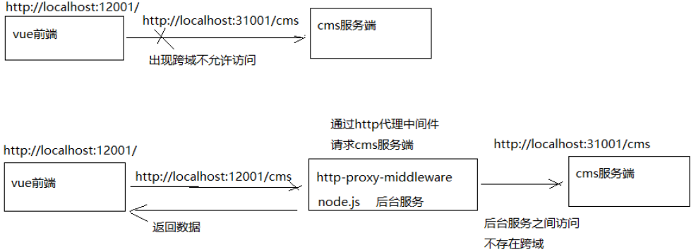
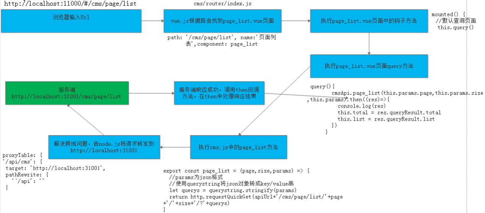
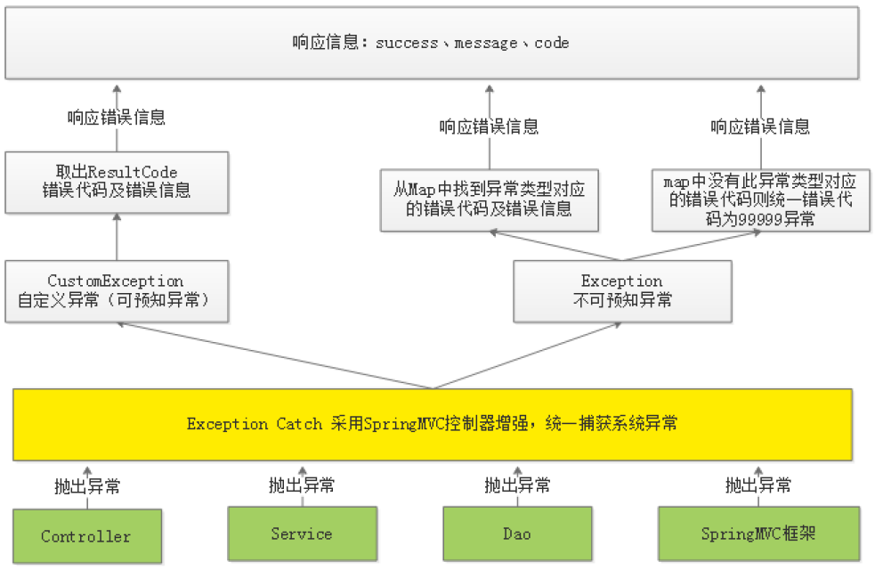
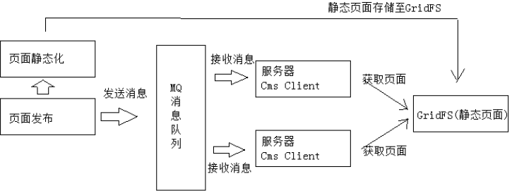
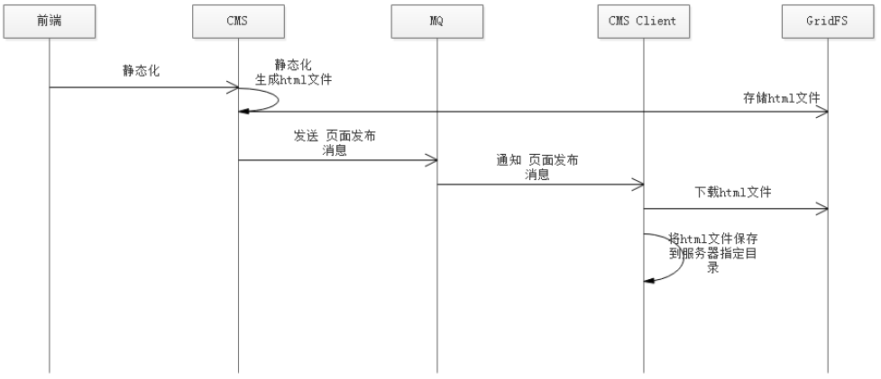
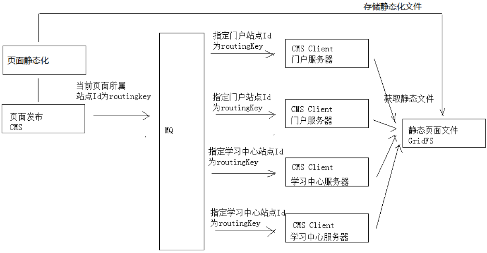

## CMS需求

CMS（Content Management System）即内容管理系统，不同的项目对CMS的定位不同，比如：一个在线教育网站，有些公司认为CMS系统是对所有的课程资源进行管理，而在早期网站刚开始盛行时很多公司的业务是网站制作，当时对CMS的定位是创建网站，即对网站的页面、图片等静态资源进行管理。本项目作为一个大型的在线教育平台，对CMS系统的定位是对各各网站（子站点）页面的管理，主要管理由于运营需要而经常变动的页面，从而实现根据运营需要快速进行页面开发、上线的需求。

### SSI服务端包含技术


将页面拆分成一个一个的小页面，通过cms去管理这些小页面，当要更改部分页面内容时只需要更改具体某个小页面即可。使用web服务(例如nginx)的SSI技术，将多个子页面合并渲染输出。

SSI(Server Side Include): 将内容发送到浏览器之前，可以使用"服务器端包含（SSI）“指令将文本、图形或应用程序信息包含到网页中。例如，可以使用SSI包含时间/日期戳、版权声明或供客户填写并返回的表单。对于在多个文件中重复出现的文本或图形，使用包含文件是一种简便的方法。将内容存入一个包含文件中即可，而不必将内容输入所有文件。通过一个非常简单的语句即可调用包含文件，此语句指示Web服务器将内容插入适当网页。而且，使用包含文件时，对内容的所有更改只需在一个地方就能完成。

ssi包含类似于jsp页面中的incluce指令，Ssi是在web服务端将include指定的页面包含在网页中，渲染html网页响应给客户端。nginx、apache等多数web容器都支持SSi指令。ssi指令如下：

1. 拆分首页

    - index.html：首页主体内容
    - include/header.html：头部区域
    - include/index_banner.html：轮播图
    - include/index_category.html：左侧列表导航
    - include/footer.html：页尾

2. 首页内容输入

    ```html
    <!--#include virtual="include/header.html"-->
    <!--#include virtual="include/index_banner.html"-->
    <!--#include virtual="include/index_category.html"-->
    <!--#include virtual="include/footer.html"-->
    ```
3. 在nginx虚拟主机中开通SSI

    ```
    server{
    listen       80;     
    server_name  www.xuecheng.com;     
    ssi on;     
    ssi_silent_errors on;     
    }
    ```


### CMS页面管理需求

1. 创建站点: 一个网站有很多子站点，比如：学成在线有主门户、学习中心、问答系统等子站点。具体的哪个页面是归属于具体的站点，所以要管理页面，先要管理页面所属的站点。
2. 创建模板：比如电商网站的商品详情页面，每个页面的内容布局、板式是相同的，不同的只是内容，这个页面的布局、板式就是页面模板，模板+数据就组成一个完整的页面，最终要创建一个页面文件需要先定义此页面的模板，最终拿到页面的数据再结合模板就拼装成一个完整的页面。
3. 创建页面: 创建页面是指填写页面的基本信息，如：页面的名称、页面的url地址等。
4. 页面预览: 页面预览是页面发布前的一项工作，页面预览使用静态化技术根据页面模板和数据生成页面内容，并通过浏览器预览页面。页面发布前进行页面预览的目是为了保证页面发布后的正确性。
5. 页面发布: 使用计算机技术将页面发送到页面所在站点的服务器，页面发布成功就可以通过浏览器来访问了。


本项目要实现什么样的功能？

- 页面管理: 管理员在后台添加、修改、删除页面信息
- 页面预览: 管理员通过页面预览功能预览页面发布后的效果。
- 页面发布: 管理员通过页面发布功能将页面发布到远程门户服务器。


### MongoDB入门

CMS采用MongoDB数据库存储CMS页面信息，CMS选用Mongodb的原因如下：

- Mongodb是非关系型数据库，存储Json格式数据 ,数据格式`灵活`。
- 相比课程管理等核心数据CMS数据`不重要`，且`没有事务管理要求`。

###  模型类介绍

- CmsSite：站点模型
- CmsTemplate：页面模板
- CmsPage：页面信息

    ```java
    public class CmsPage {
        private String siteId;//站点ID
        private String pageId;//页面ID
        private String pageName;//页面名称
        private String pageAliase;//别名
        private String pageWebPath;//访问地址
        private String pageParameter;//参数
        private String pagePhysicalPath;//物理路径
        private String pageType;//类型（静态/动态）
        private String pageTemplate;//页面模版
        private String pageHtml;//页面静态化内容
        private String pageStatus;//状态
        private Date pageCreateTime;//创建时间
        private String templateId;//模版id
        private String templateFileId;//模版文件Id
        private String htmlFileId;//静态文件Id
        private String dataUrl;//数据Url
    }
    ```

### 单页面应用介绍

单页Web应用（singlepage web application，SPA），就是只有一张Web页面的应用。单页应用程序(SPA)是加载单个HTML页面并在用户与应用程序交互时动态更新该页面的Web应用程序。浏览器一开始会加载必需的HTML、CSS和JavaScript，所有的操作都在这张页面上完成，都由JavaScript来控制。因此，对单页应用来说模块化的开发和设计显得相当重要。

单页面应用的优缺点：

- 优点：
    - 1、用户操作体验好，用户不用刷新页面，整个交互过程都是通过Ajax来操作。
    - 2、适合前后端分离开发，服务端提供http接口，前端请求http接口获取数据，使用JS进行客户端渲染。

- 缺点：
    - 1、首页加载慢: 单页面应用会将js、css打包成一个文件，在加载页面显示的时候加载打包文件，如果打包文件较大或者网速慢则用户体验不好。
    - 2、SEO不友好: SEO（Search Engine Optimization）为搜索引擎优化。它是一种利用搜索引擎的搜索规则来提高网站在搜索引擎排名的方法。目前各家搜索引擎对JS支持不好，所以使用单页面应用将大大减少搜索引擎对网站的收录。

- 总结：

    本项目的门户、课程介绍不采用单页面应用架构去开发，对于需要用户登录的管理系统采用单页面开发。


### 跨域访问

跨域问题: 浏览器的同源策略不允许跨域访问，所谓同源策略是指协议、域名、端口相同。

`No 'Access-Control-Allow-Origin' header is present on the requested resource. Origin 'http://localhost:11000' is therefore not allowed access.`

采用proxyTable解决。vue-cli提供的解决vue开发环境下跨域问题的方法，proxyTable的底层使用了http-proxy-middleware（https://github.com/chimurai/http-proxy-middleware），它是http代理中间件，它依赖node.js，基本原理是用服务端代理解决浏览器跨域：




### 前后端请求响应流程小结



1. 在浏览器输入前端url
2. 前端框架vue.js根据url解析路由，根据路由找到page_list.vue页面
3. 首先执行page_list.vue中的钩子方法
4. 在钩子方法中调用query方法。
5. 在query方法中调用cms.js中的page_list方法
6. cms.js中的page_list方法通过axios请求服务端接口
7. 采用proxyTable解决跨域问题，node.js将请求转发到服务端(http://localhost:31001/cms/page/list)
8. 服务端处理，将查询结果响应给前端
9. 成功响应调用then方法，在then方法中处理响应结果，将查询结果赋值给数据模型中的total和list变量。
10. vue.js通过双向数据绑定将list数据渲染输出。


## CMS页面管理开发

以下开发均分为:
1. 前端开发
2. 服务端开发: Dao, Service, Controller


### 自定义条件查询

在页面输入查询条件，查询符合条件的页面信息。查询条件如下：

- 站点Id：精确匹配
- 模板Id：精确匹配
- 页面别名：模糊匹配

### 新增页面
### 修改页面


修改页面用户操作流程：
- 用户进入修改页面，在页面上显示了修改页面的信息
- 用户修改页面的内容，点击“提交”，提示“修改成功”或“修改失败”

### 修改页面
修改页面用户操作流程：
- 用户进入修改页面，在页面上显示了修改页面的信息
- 用户修改页面的内容，点击“提交”，提示“修改成功”或“修改失败”

### 删除页面

用户操作流程：
- 用户进入用户列表，点击“删除”
- 执行删除操作，提示“删除成功”或“删除失败”

### 异常处理

#### 异常处理的问题分析

```java
//添加页面
public CmsPageResult add(CmsPage cmsPage){
//校验页面是否存在，根据页面名称、站点Id、页面webpath查询         
CmsPage cmsPage1 =
cmsPageRepository.findByPageNameAndSiteIdAndPageWebPath(cmsPage.getPageName(), 
cmsPage.getSiteId(), cmsPage.getPageWebPath());
         if(cmsPage1==null){
            cmsPage.setPageId(null);//添加页面主键由spring data 自动生成
            cmsPageRepository.save(cmsPage);
            //返回结果
            CmsPageResult cmsPageResult = new CmsPageResult(CommonCode.SUCCESS,cmsPage);
            return cmsPageResult;
        }
        return new CmsPageResult(CommonCode.FAIL,null);
    }
```

问题：

- 上边的代码只要操作不成功仅向用户返回“错误代码：11111，失败信息：操作失败”，无法区别具体的错误信息。
- service方法在执行过程出现异常在哪捕获？在service中需要都加try/catch，如果在controller也需要添加try/catch，代码冗余严重且不易维护。

解决方案：
- 在Service方法中的编码顺序是先校验判断，有问题则抛出具体的异常信息，最后执行具体的业务操作，返回成功信息。
- 在统一异常处理类中去捕获异常，无需controller捕获异常，向用户返回统一规范的响应信息。


代码模板如下：

```java
 
cmsPageRepository.findByPageNameAndSiteIdAndPageWebPath(cmsPage.getPageName(), 
cmsPage.getSiteId(), cmsPage.getPageWebPath());
         if(cmsPage1==null){
            cmsPage.setPageId(null);//添加页面主键由spring data 自动生成
            cmsPageRepository.save(cmsPage);
            //返回结果
            CmsPageResult cmsPageResult = new CmsPageResult(CommonCode.SUCCESS,cmsPage);
            return cmsPageResult;
        }
        return new CmsPageResult(CommonCode.FAIL,null);
    }
 
//添加页面
public CmsPageResult add(CmsPage cmsPage){
    //校验cmsPage是否为空
    if(cmsPage == null){
        //抛出异常，非法请求
        //...
    }
    //根据页面名称查询（页面名称已在mongodb创建了唯一索引）
    CmsPage cmsPage1 = 
cmsPageRepository.findByPageNameAndSiteIdAndPageWebPath(cmsPage.getPageName(), 
cmsPage.getSiteId(), cmsPage.getPageWebPath());
    //校验页面是否存在，已存在则抛出异常
    if(cmsPage1 !=null){
        //抛出异常，已存在相同的页面名称
        //...
    }
    cmsPage.setPageId(null);//添加页面主键由spring data 自动生成
    CmsPage save = cmsPageRepository.save(cmsPage);
    //返回结果
    CmsPageResult cmsPageResult = new CmsPageResult(CommonCode.SUCCESS,save);
    return cmsPageResult;
}
```


#### 异常处理流程

系统对异常的处理使用统一的异常处理流程：

1. 自定义异常类型。
2. 自定义错误代码及错误信息。
3. 对于可预知的异常由程序员在代码中主动抛出，由SpringMVC统一捕获。

    可预知异常是程序员在代码中手动抛出本系统定义的特定异常类型，由于是程序员抛出的异常，通常异常信息比较齐全，程序员在抛出时会指定错误代码及错误信息，获取异常信息也比较方便。
4. 对于不可预知的异常（运行时异常）由SpringMVC统一捕获Exception类型的异常。

    不可预知异常通常是由于系统出现bug、或一些不要抗拒的错误（比如网络中断、服务器宕机等），异常类型为RuntimeException类型（运行时异常）。
5. 可预知的异常及不可预知的运行时异常最终会采用统一的信息格式（错误代码+错误信息）来表示，最终也会随请求响应给客户端。




1. 在controller、service、dao中程序员抛出自定义异常；springMVC框架抛出框架异常类型
2. 统一由异常捕获类捕获异常，并进行处理
3. 捕获到自定义异常则直接取出错误代码及错误信息，响应给用户。
4. 捕获到非自定义异常类型首先从Map中找该异常类型是否对应具体的错误代码，如果有则取出错误代码和错误
信息并响应给用户，如果从Map中找不到异常类型所对应的错误代码则统一为99999错误代码并响应给用户。
5. 将错误代码及错误信息以Json格式响应给用户。


## 页面静态化 页面预览 

### 页面静态化需求


本项目cms系统的功能就是根据运营需要，对门户等子系统的部分页面进行管理，从而实现快速根据用户需求修改页面内容并上线的需求。

在开发中修改页面内容是需要人工编写html及JS文件，CMS系统是通过程序自动化的对页面内容进行修改，通过页面静态化技术生成html页面。

一个页面等于模板加数据，在添加页面的时候我们选择了页面的模板。页面静态化就是将页面模板和数据通过技术手段将二者合二为一，生成一个html网页文件。


### 页面静态化流程


模板+数据模型=输出，页面静态化需要准备数据模型和模板


CMS管理了各种页面，CMS对页面进行静态化时需要数据模型，但是CMS并不知道每个页面的数据模型的具体内容，它只管执行静态化程序便可对页面进行静态化，所以CMS静态化程序需要通过一种通用的方法来获取数据模型。

在编辑页面信息时指定一个DataUrl，此DataUrl便是获取数据模型的Url，它基于Http方式，CMS对页面进行静态化时会从页面信息中读取DataUrl，通过Http远程调用的方法请求DataUrl获取数据模型。举例说明：
- 此页面是轮播图页面，它的DataUrl由开发轮播图管理的程序员提供。
- 此页面是精品课程推荐页面，它的DataUrl由精品课程推荐的程序员提供。
- 此页面是课程详情页面，它的DataUrl由课程管理的程序员提供。


页面静态化流程如下图：
1. 静态化程序首先读取页面获取DataUrl。
2. 静态化程序远程请求DataUrl得到数据模型。
3. 获取页面模板。
4. 执行页面静态化。


### 数据模型

CMS中有轮播图管理、精品课程推荐的功能，以轮播图管理为例说明：轮播图管理是通过可视化的操作界面由管理员指定轮播图图片地址，最后将轮播图图片地址保存在cms_config集合中，下边是轮播图数据模型：


```json
{
"_id": ObjectId("5a791725dd573c3574ee333f"),
"_class": "com.xuecheng.framework.domain.cms.CmsConfig",
"name": "轮播图",
"model": [
        {
        "key": "banner1",
        "name": "轮播图1地址",
        "value": "http://www.xuecheng.com/img/widget-bannerB.jpg"
        },
        {
        "key": "banner2",
        "name": "轮播图2地址",
        "value": "http://www.xuecheng.com/img/widget-bannerA.jpg"
        }
    ]
}

```

### 模板管理

1、要增加新模板首先需要制作模板，模板的内容就是Freemarker ftl模板内容。
2、通过模板管理模块功能新增模板、修改模板、删除模板。
3、模板信息存储在MongoDB数据库，其中模板信息存储在cms_template集合中，模板文件存储在GridFS文件系
统中。


### GridFS

GridFS是MongoDB提供的用于持久化存储文件的模块，


 它的工作原理是：
- 在GridFS存储文件是将文件分块存储，文件会按照256KB的大小分割成多个块进行存储. 当您通过 GridFS 查询文件时，驱动程序将根据需要重新组合数据块。
- GridFS使用两个集合（collection）存储文件，一个集合是chunks, 用于存储文件的二进制数据；一个集合是files，用于存储文件的元数据信息（文件名称、块大小、上传时间等信息）。


## 页面预览


1. 用户进入cms前端，点击“页面预览”在浏览器请求cms页面预览链接。
2. cms根据页面id查询DataUrl并远程请求DataUrl获取数据模型。
3. cms根据页面id查询页面模板内容
4. cms执行页面静态化。
5. cms将静态化内容响应给浏览器。
6. 在浏览器展示页面内容，实现页面预览的功能。


## 消息队列 GridFS

业务流程如下：
1. 管理员进入管理界面点击“页面发布”，前端请求cms页面发布接口。
2. cms页面发布接口执行页面静态化，并将静态化页面(html文件)存储至GridFS中。
3. 静态化成功后，向消息队列发送页面发布的消息。
    - 页面发布的最终目标是将页面发布到服务器。
    - 通过消息队列将页面发布的消息发送给各各服务器。
3. 消息队列负责将消息发送给各各服务器上部署的Cms Client(Cms客户端)。
    - 在服务器上部署Cms Client(Cms客户端)，客户端接收消息队列的通知。
4. 每个接收到页面发布消息的Cms Client从GridFS获取Html页面文件，并将Html文件存储在本地服务器。
    - CmsClient根据页面发布消息的内容请求GridFS获取页面文件，存储在本地服务器。







技术方案说明：

1. 平台包括多个站点，页面归属不同的站点。
2. 发布一个页面应将该页面发布到所属站点的服务器上。
3. 每个站点服务部署cms client程序，并与交换机绑定，绑定时指定站点Id为routingKey。
    指定站点id为routingKey就可以实现cms client只能接收到所属站点的页面发布消息。
4. 页面发布程序向MQ发布消息时指定页面所属站点Id为routingKey，将该页面发布到它所在服务器上的cmsclient。





路由模式分析如下：

发布一个页面，需发布到该页面所属的每个站点服务器，其它站点服务器不发布。
比如：发布一个门户的页面，需要发布到每个门户服务器上，而用户中心服务器则不需要发布。
所以本项目采用routing模式，用站点id作为routingKey，这样就可以匹配页面只发布到所属的站点服务器上。


