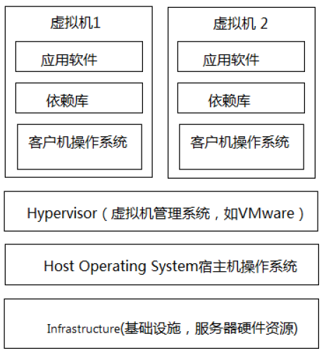
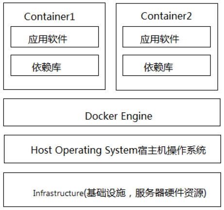
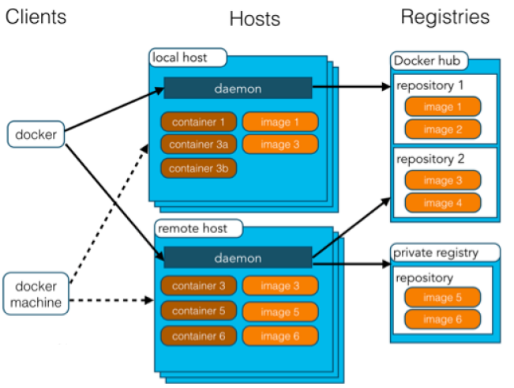

# devops

## DevOps

DevOps是Development和Operations两个词的缩写. DevOps是一种方法或理念，它涵盖开发、测试、运维的整个过程。

## Git/GitLab

Git是一个版本控制系统，GitLab是一个远程的Git仓库，GitLab与GitHub及国内的码云类似，用户在GitLab上注册账号，上传项目到GitLab，通过GitLab对项目进行版本控制。通常企业使用GitLab在局域网搭建自己的Git代码管理仓库，不过随着云计算的发展，很多企业也开始使用提供Git仓库管理公共服务的平台，比如：码云、GitHub等。

## Docker

互联网的发展使软件业发生了巨大的变化，其中一个显著的变化是软件的规模越来越大，基于微服务架构的软件在
生产部署时遇到了这样的挑战：
1、微服务的开发语言、操作系统、依赖库等环境配置不同，如何快速安装、迁移、配置软件？
2、一个软件由若干微服务组成，如何快速批量部署微服务？
3、如何有效的利于计算机资源？
针对前两个问题的思考：
传统的软件部署流程是：安装操作系统-->安装依赖软件/库-->安装软件（微服务）-->配置软件-->最终软件上线运
行，面对大量的微服务及微服务集群，使用此方案不仅效率低下，而且还可能会出现环境兼容问题，显然此方案不
适合用在微服务部署。
设想：如果有一项技术可以快速的将软件及所需要的各种环境配置打包、批量复制将会解决以上问题。
针对第三个问题的思考：
在一台计算机只安装一个微服务对计算机资源极大的浪费，如果安装多个微服务就可以有效的利于计算机资源，但
是对于批量软件的安装部署还是会面临1、2问题。
设想：在一台计算机安装多个微服务，使用一种技术将微服务打包、复制部署，并且微服务之间隔离互不影响。

服务器虚拟化主要有两种技术：

1、Hypervisor也叫VMM（virtual machine monitor）即虚拟机监视器
Hypervisor是一种将操作系统与硬件抽象分离的方法，实现在宿主机（host machine）上能同时运行多个客户机
（guest machine），每个客户机就是一个虚拟机，这些虚拟机高效地分享宿主机的硬件资源。

如下图：

在服务器（宿主机）上安装操作系统，并安装hypervisor虚拟机管理软件，如VMware、VirtualBox等，由
hypervisor管理多个虚拟机，每个虚拟机上需要安装客户操作系统、依赖库、应用软件。

2、Containers容器化技术

容器技术中docker引擎取代了hypervisor，docker引擎是运行在住宿操作系统上的一个进程，该进程管理了多个docker容器，每个docker容器集成了应用软件、依赖库，容器之间相互隔离。

3、技术对比：
资源占用：
  虚拟机由于是独立的操作系统，占用资源比docker多。
启动速度:
  虚拟机包括操作系统，启动虚拟机相当于启动一个操作系统，容器则不一样，容器中只包括操作系统的内核，启动
一个容器实例相当于启动一个进程，容器的启动速度比虚拟机快。
体积：
  容器包括操作系统内核、软件及依赖库，虚拟机不仅包括软件和依赖库还将完整的操作系统打包进去，虚拟机的体
积比容器大的多。

1、Docker daemon（Docker守护进程）： Docker守护进程是部署在操作系统上，负责支撑Docker Container的运行以及本地Image的管理。
2、Docker client： 用户不直接操作Docker daemon，用户通过Docker client访问Docker，Docker client提供pull、run等操作命令。
3、Docker Image： Docker 镜像就是一个只读的模板。 例如：一个镜像可以包含一个完整的 ubuntu 操作系统环境，里面仅安装了 Tomcat或用户需要的其它应用程序。 镜像可以用来创建 Docker 容器。 Docker 提供了一个很简单的机制来创建镜像或者更新现有的镜像，用户甚至可以直接从其他人那里下载一个已经做好的镜像来直接使用。
4、Docker Container： Docker 利用容器来运行应用。容器是从镜像创建的运行实例。它可以被启动、开始、停止、删除。每个容器都是相互隔离的、保证安全的平台。打个比方，镜像相当于类，容器相当于对象。
5、Docker Registry： Docker 仓库分为公开仓库（Public）和私有仓库（Private）两种形式 最大的公开仓库是Docker Hub，存放了数量庞大的镜像供用户下载。 用户也可以在本地网络内创建一个私有仓库。 当用户创建了自己的镜像之后就可以使用 push 命令将它上传到公有或者私有仓库，这样下次在另外一台机器上使用这个镜像时候，只需要从仓库上 pull 下来就可以了。

## 持续集成

传统的软件开发流程如下：
1、项目经理分配模块给开发人员
2、每个模块的开发人员并行开发，并进行单元测试
3、开发完毕，将代码集成部署到测试服务器，测试人员进行测试。
4、测试人员发现bug，提交bug、开发人员修改bug
5、bug修改完毕再次集成、测试。
问题描述：
1、模块之间依赖关系复杂，在集成时发现大量bug
2、测试人员等待测试时间过长
3、软件交付无法保障
解决上述问题的思考：
1、能否把集成测试时间提前？
2、能否使用自动化工具代替人工集成部署的过程？

持续集成（Continuous integration）简称CI，持续集成的思想是每天要多次将代码合并到主干，并进行集成、测试，这样就可以提早发现错误，进行修正。持久集成也属于DevOps

GitLab CI/CD 是 GitLab 内置的持续集成和持续部署（CI/CD）工具，它可以帮助开发团队自动化代码测试、构建和部署。本指南将介绍如何使用 GitLab CI/CD 搭建完整的自动化部署流程，包括 .gitlab-ci.yml 配置文件的编写、Stages、Jobs、Artifacts 以及 Runner 的使用。

