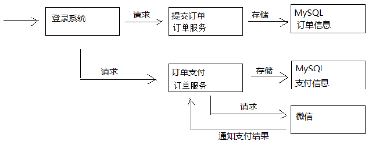
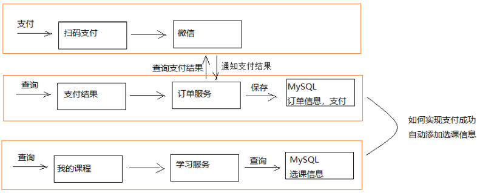
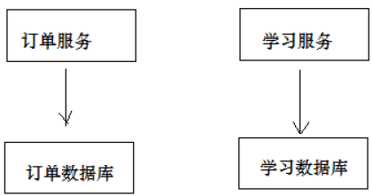
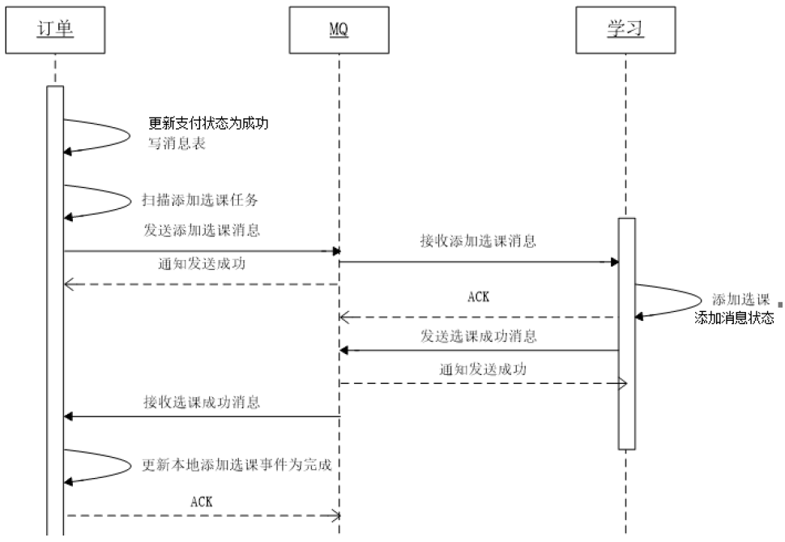

# 分布式事务

## 订单与选课需求分析

学成在线的课程分为免费和收费两种。对于收费课程，用户需提交订单并完成支付方可在线学习。

提交订单及支付流程如下：

1、用户提交订单需要先登录系统
2、提交订单，订单信息保存到订单数据库
3、订单支付，调用微信支付接口完成支付
4、完成支付，微信支付系统通知学成在线支付结果
5、学成在线接收到支付结果通知，更新支付结果

提交订单流程：
1、用户进入课程详情页面
2、点击“立即购买”，打开订单确认信息
3、点击“确认无误，提交订单”

    订单提交成功，向订单数据库的xc_orders订单表保存一条记录，向xc_orders_detail订单明细表保存一条或多条记录，向订单支付表插入一条记录。

4、订单提交成功自动进入订单支付页面
5、点击“微信支付”打开二维码
6、用手机扫码支付，支付完成，点击“完成支付”
    支付完成，收到微信支付系统的支付完成通知或请求微信查询支付已完成，更新学成在线订单支付表中的支付状态字段。

## 自动选课需求

支付成功即完成订单，订单完成之后系统需自动添加选课。下图是微信支付、学成在线订单服务、学成在线学习服务交互图：

1、用户支付完成，微信支付系统会主动通知学成在线支付结果，学成在线也可主动请求微信支付查询订单的支付结果。
    最终得到支付结果后将订单支付结果保存到订单数据库中。
2、订单支付完成系统自动向选课表添加学生选课记录。
3、选课记录添加完成学习即可在线开始学习。

## 分布式事务

根据上边的自动选课的需求，分析如下：

用户支付完成会将支付状态及订单状态保存在订单数据库中，由订单服务去维护订单数据库。而学生选课信息在学习中心数据库，由学习服务去维护学习中心数据库的信息。下图是系统结构图：

如何实现两个分布式服务（订单服务、学习服务）共同完成一件事即订单支付成功自动添加学生选课的需求，这里的关键是如何保证两个分布式服务的事务的一致性。

## 分布式事务

[理论参考](../%E5%BE%AE%E6%9C%8D%E5%8A%A1/3_0%E5%88%86%E5%B8%83%E5%BC%8F%E4%BA%8B%E5%8A%A1.md)

## 解决方案

1. 支付成功后，订单服务在本地

    - 向本地数据库`更新订单状态`
    - 消息表写入`添加选课消息`

2. `定时任务`扫描`消息表`，取出`添加选课消息`并发向`MQ`
3. 学习服务接收到添加选课的消息，查询本地数据库的历史消息表是否存在`该消息`
    - 存在则说明已经添加选课
    - 否则向本地数据库添加选课，并向历史消息表添加选课消息。✨这里选课表和历史消息表在同一个数据库，通过本地事务保证。
4. 学习服务向MQ发送“完成添加选课任务的消息”
5. 订单服务接收到完成选课的消息后, 为保证后期对账
    - 将消息表的消息先添加到历史消息表
    - 再删除消息，表示此消息已经完成

## 乐观锁取任务

考虑订单服务将来会集群部署，为了避免任务在1分钟内重复执行，这里使用乐观锁，实现思路如下：

1) 每次取任务时判断当前版本及任务id是否匹配，如果匹配则执行任务，如果不匹配则取消执行。
2) 如果当前版本和任务Id可以匹配到任务则更新当前版本加1.
