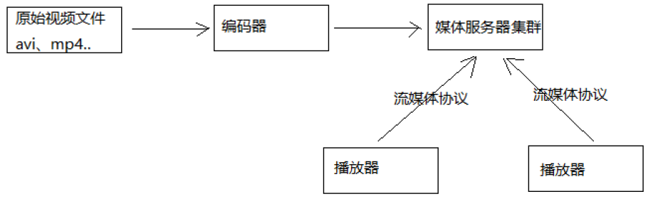
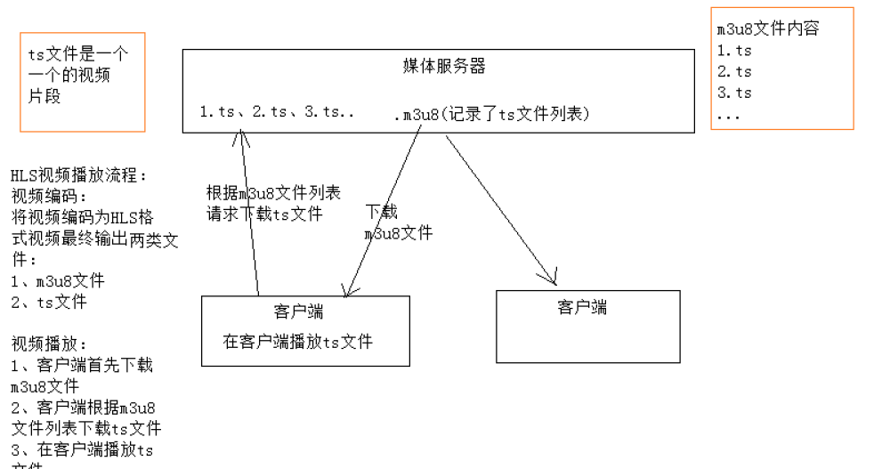
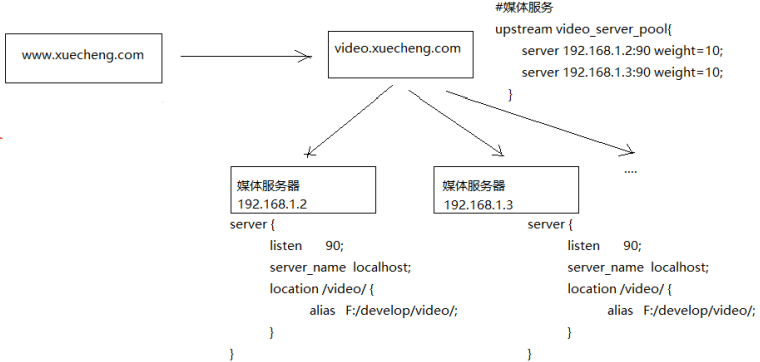
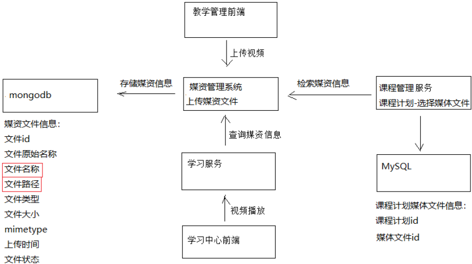
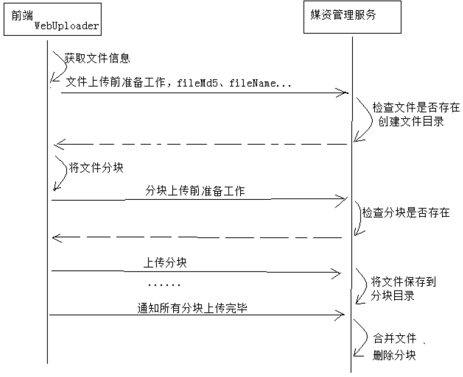

# 在线学习

## 需求

学成在线作为在线教育网站，提供多种学习形式，包括：录播、直播、图文、社群等，学生登录进入学习中心即可
在线学习，本章节将开发录播课程的在线学习功能，需求如下：
1、学生可以在windows浏览器上在线观看视频。
2、播放器具有快进、快退、暂停等基本功能。
3、学生可以方便切换章节进行学习。

什么是录播课程？录播课程就是提供录制好课程视频，供用户在线点播，反复学习。
课程视频如何管理？媒资管理系统专门来管理课程视频，用户视频文件上传到媒资系统，并对视频进行编码处理。

### 视频点播解决方案

概括理解：流媒体就是将视频文件分成许多小块儿，将这些小块儿作为数据包通过网络发送出去，实现一边传输视频 数据 包一边观看视频。

在网络上传输音、视频信息有两个方式：下载和流式传输

- 下载：就是把音、视频文件完全下载到本机后开始播放，它的特点是必须等到视频文件下载完成方可播放，播放等待时间较长，无法去播放还未下载的部分视频。

- 流式传输：就是客户端通过链接视频服务器实时传输音、视频信息，实现“边下载边播放”。流式传输包括如下两种方式：

    - 顺序流式传输

        即顺序下载音、视频文件，可以实现边下载边播放，不过，用户只能观看已下载的视频内容，无法快进到未下载的视频部分，顺序流式传输可以使用Http服务器来实现，比如Nginx、Apache等。

    - 实时流式传输

        实时流式传输可以解决顺序流式传输无法快进的问题，它与Http流式传输不同，它必须使用流媒体服务器并且使用流媒体协议来传输视频，它比Http流式传输复杂。常见的实时流式传输协议有RTSP、RTMP、RSVP等。

### 流媒体系统的概要结构

1. 将原始的视频文件通过编码器转换为适合网络传输的流格式，编码后的视频直接输送给媒体服务器。原始的视频文件通常是事先录制好的视频，比如通过摄像机、摄像头等录像、录音设备采集到的音视频文件，体积较大，要想在网络上传输需要经过压缩处理，即通过编码器进行编码 。
2. 媒体服务获取到编码好的视频文件，对外提供流媒体数据传输接口，接口协议包括 ：HTTP、RTSP、RTMP等 。
3. 播放器通过流媒体协议与媒体服务器通信，获取视频数据，播放视频。

### 点播方案

本项目包括点播和直播两种方式，我们先调研点播的方案，如下：
1、 播放器通过 http协议从http服务器上下载视频文件进行播放
问题：必须等到视频下载完才可以播放，不支持快进到某个时间点进行播放
2、 播放器通过rtmp协议连接媒体服务器以实时流方式播放视频
使用rtmp协议需要架设媒体服务器，造价高，对于直播多采用此方案。
3、 播放器使用HLS协议连接http服务器（Nginx、Apache等）实现近实时流方式播放视频HLS协议规定：基于Http协议，视频封装格式为ts，视频的编码格式为H264,音频编码格式为MP3、AAC或者AC-3。

### HLS

HLS的工作方式是：将视频拆分成若干ts格式的小文件，通过m3u8格式的索引文件对这些ts小文件建立索引。一般10秒一个ts文件，播放器连接m3u8文件播放，当快进时通过m3u8即可找到对应的索引文件，并去下载对应的ts文件，从而实现快进、快退以近实时 的方式播放视频。

## 视频编码

### 视频编码格式

首先我们要分清文件格式和编码格式：

文件格式：是指.mp4、.avi、.rmvb等 这些不同扩展名的视频文件的文件格式 ，视频文件的内容主要包括视频和音频，其文件格式是按照一 定的编码格式去编码，并且按照该文件所规定的封装格式将视频、音频、字幕等信息封装在一起，播放器会根据它们的封装格式去提取出编码，然后由播放器解码，最终播放音视频。

音视频编码格式：通过音视频的压缩技术，将视频格式转换成另一种视频格式，通过视频编码实现流媒体的传输。比如：一个.avi的视频文件原来的编码是a，通过编码后编码格式变为b，音频原来为c，通过编码后变为d。

音视频编码格式各类繁多，主要有几下几类：

MPEG系列 （由ISO[国际标准组织机构]下属的MPEG[运动图象专家组]开发 ）视频编码方面主要是Mpeg1（vcd用的就是它）、Mpeg2（DVD使用）、Mpeg4（的DVDRIP使用的都是它的变种，如：divx，xvid等）、Mpeg4AVC（正热门）；音频编码方面主要是MPEG Audio Layer 1/2、MPEG Audio Layer 3（大名鼎鼎的mp3）、MPEG-2 AAC 、MPEG-4 AAC等等。注意：DVD音频没有采用Mpeg的。

H.26X系列 （由ITU[国际电传视讯联盟]主导，侧重网络传输，注意：只是视频编码） 包括H.261、H.262、H.263、H.263+、H.263++、H.264（就是MPEG4 AVC-合作的结晶）

目前最常用的编码标准是视频H.264，音频AAC。

### FFmpeg

FFmpeg是一套可以用来记录、转换数字音频、视频，并能将其转化为流的开源计算机程序

生成m3u8/ts文件:

1. 第一步：先将avi视频转成mp4

    `ffmpeg.exe ‐i  lucene.avi ‐c:v libx264 ‐s 1280x720 ‐pix_fmt yuv420p ‐b:a 63k ‐b:v 753k ‐r 18 .\lucene.mp4`

    - -c:v 视频编码为x264 ，x264编码是H264的一种开源编码格式。
    - -s 设置分辨率
    - -pix_fmt yuv420p：设置像素采样方式，主流的采样方式有三种，YUV4:4:4，YUV4:2:2，YUV4:2:0，它的作用是根据采样方式来从码流中还原每个像素点的YUV（亮度信息与色彩信息）值。
    - -b 设置码率，-b:a和-b:v分别表示音频的码率和视频的码率，-b表示音频加视频的总码率。码率对一个视频质量有很大的作用，后边会介绍。
    - -r：帧率，表示每秒更新图像画面的次数，通常大于24肉眼就没有连贯与停顿的感觉了。

2. 第二步：将mp4生成m3u8

    `ffmpeg ‐i  lucene.mp4   ‐hls_time 10 ‐hls_list_size 0  ‐hls_segment_filename ./hls/lucene_%05d.ts ./hls/lucene.m3u8`

    - -hls_time 设置每片的长度，单位为秒
    - -hls_list_size n: 保存的分片的数量，设置为0表示保存所有分片
    - -hls_segment_filename ：段文件的名称，%05d表示5位数字

    生成的效果是：将lucene.mp4视频文件每10秒生成一个ts文件，最后生成一个m3u8文件，m3u8文件是ts的索引文件。

### 码率的设置

码率又叫比特率即每秒传输的bit数，单位为bps(Bit Per Second)，码率越大传送数据的速度越快。
码率的计算公式是：文件大小（转成bit）/ 时长（秒）/1024 = kbps 即每秒传输千位数
例如一个1M的视频，它的时长是10s，它的码率等于

`1*1024*1024*8/10/1024 = 819Kbps`

##  播放器

Video.js是一款基于HTML5世界的网络视频播放器。

## 搭建媒体服务器

正常使用video.js播放视频是通过一个网页，用户通过浏览器打开网页去播放视频，网页和视频都从web服务器请求，通常视频的url地址使用单独的域名。

HLS协议基于Http协议，本项目使用Nginx作为视频服务器。下图是Nginx媒体服务器的配置流程图：

1、用户打开www.xuecheng.com上边的video.html网页, 在此网页中引入视频链接，视频地址指向video.xuecheng.com
2、video.xuecheng.com进行负载均衡处理，将视频请求转发到媒体服务器

## 媒资管理

每个教学机构都可以在媒资系统管理自己的教学资源，包括：视频、教案等文件。

目前媒资管理的主要管理对象是课程录播视频，包括：媒资文件的查询、视频上传、视频删除、视频处理等。

- 媒资查询：教学机构查询自己所拥有的媒体文件。
- 视频上传：将用户线下录制的教学视频上传到媒资系统。
- 视频处理：视频上传成功，系统自动对视频进行编码处理。
- 视频删除 ：如果该视频已不再使用，可以从媒资系统删除。

## 上传文件
### 断点续传解决方案

断点续传指的是在下载或上传时，将下载或上传任务（一个文件或一个压缩包）人为的划分为几个部分，每一个部分采用一个线程进行上传或下载，如果碰到网络故障，可以从已经上传或下载的部分开始继续上传下载未完成的部分，而没有必要从头开始上传下载，断点续传可以提高节省操作时间，提高用户体验性。

上传流程如下：
1、上传前先把文件分成块
2、一块一块的上传，上传中断后重新上传，已上传的分块则不用再上传
3、各分块上传完成最后合并文件

前端使用WebUploader上传流程如下：

媒资服务端编写

服务端需要实现如下功能：
1、上传前检查上传环境
检查文件是否上传，已上传则直接返回。
检查文件上传路径是否存在，不存在则创建。
2、分块检查
检查分块文件是否上传，已上传则返回true。
未上传则检查上传路径是否存在，不存在则创建。
3、分块上传
将分块文件上传到指定的路径。
4、合并分块
将所有分块文件合并为一个文件。
在数据库记录文件信息。

