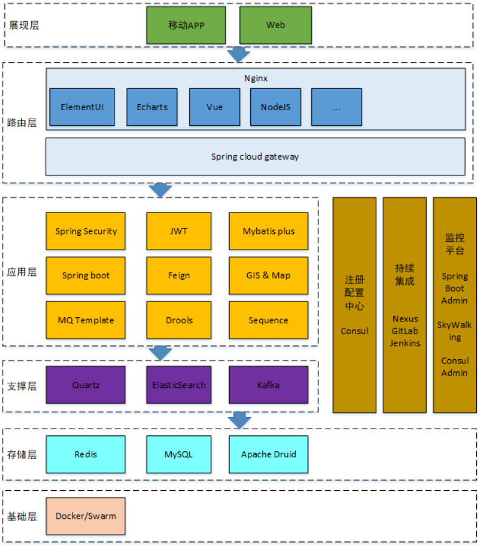
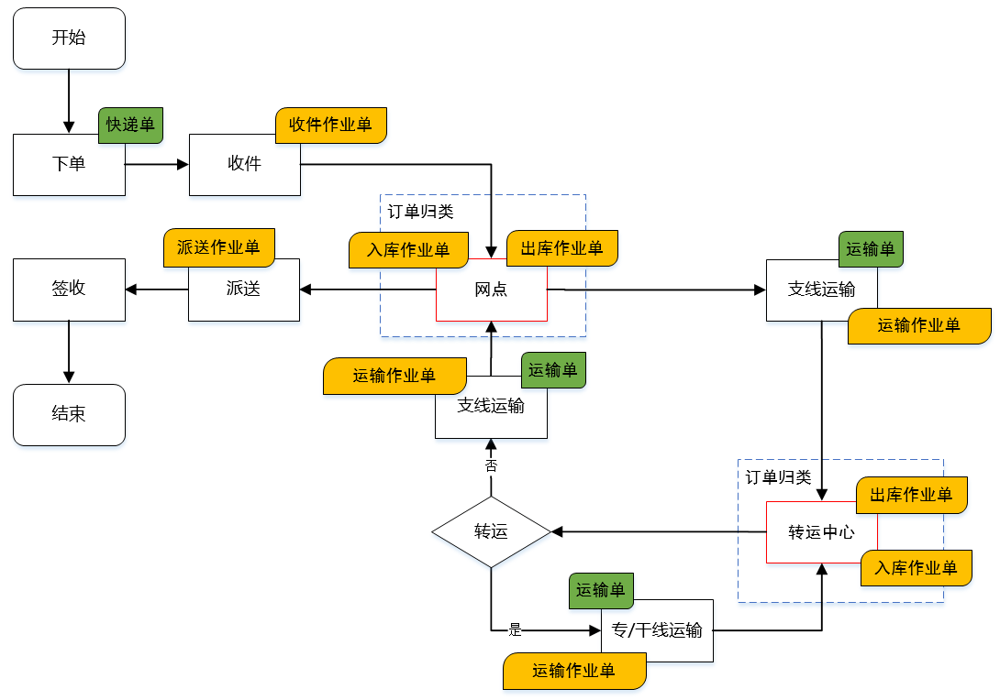
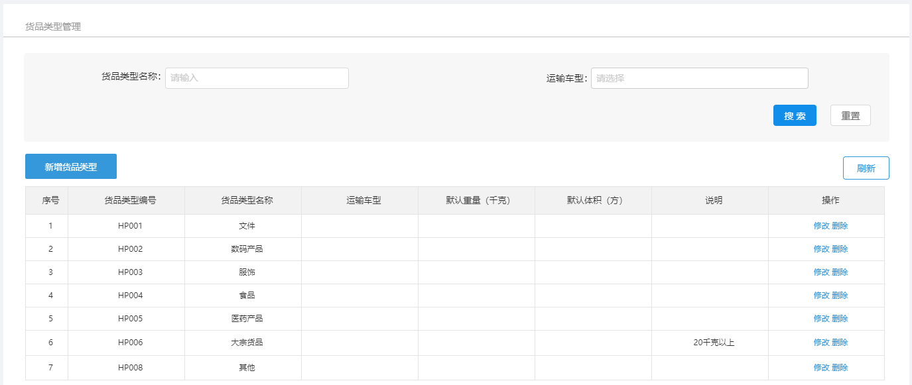
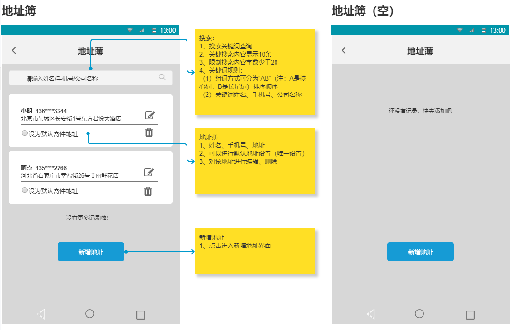
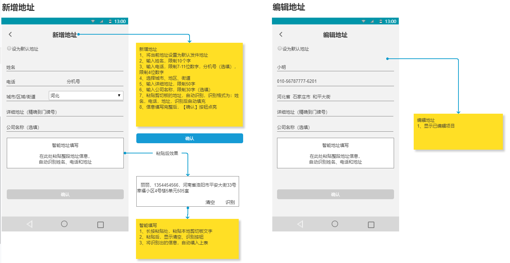
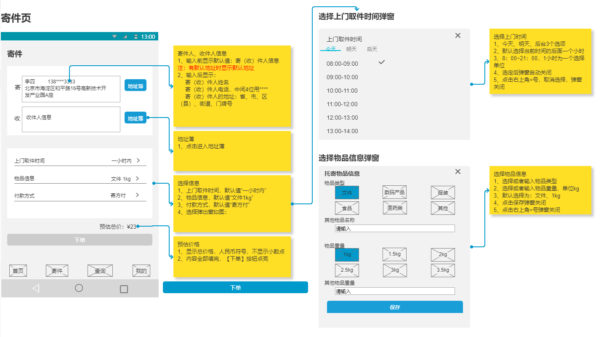
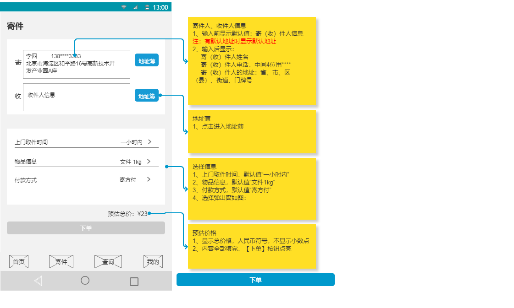
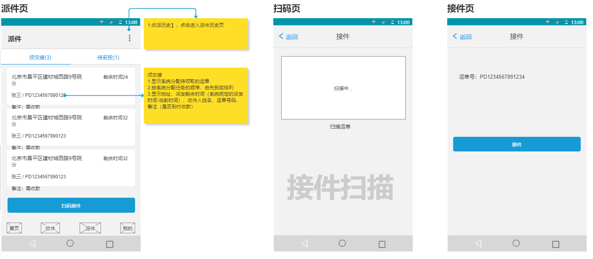

# 物流项目

TMS全称为：Transportation Management System，即运输管理系统，是对运输作业从运力资源准备到最终货物抵达目的地的全流程管理。TMS系统适用于运输公司、各企业下面的运输队等，它主要包括订单管理、配载作业、调度分配、行车管理、GPS车辆定位系统、车辆管理、线路管理、车次管理、人员管理、数据报表、基本信息维护等模块。

本项目从用户层面可以分为四个端：TMS后台系统管理端、客户端App、快递员端App、司机端App。

- TMS后台系统管理端：公司内部管理员用户使用，可以进行基础数据维护、订单管理、运单管理等
- 客户端App：App名称为品达速运，外部客户使用，可以寄件、查询物流信息等
- 快递员端App：App名称为品达快递员，公司内部的快递员使用，可以接收取派件任务等
- 司机端App：App名称为品达司机宝，公司内部的司机使用，可以接收运输任务、上报位置信息等

## 物流行业介绍

物流运输市场目前上最普遍的有四种行业类别：快递、快运、专线、三方。这四种行业支撑着全国商品货物的流通。

- 快递：物流行业外的人对物流的直接反应就是快递，快递只是物流行业的一种形态，得益于电商的发展把快递行业推到大众视野之中。快递的接收群体大多为个人，也称C端。快运、专线、三方的发货和接收群体主要为B端,主要为企业与企业之间的合作，也有少量个人。
- 快运：快运承运的多是小批量货物，一般为几立方货物或几十公斤货物，如德邦快递、远成快运，运输对象为单个沙发，桌椅等，配送网络为自建和加盟两种方式。
- 专线：专线衔接的货物多数为大宗商品，货物往往依照吨来结算，送货主要送到仓库，工厂，门店。整个配送网络都是社会化网络，由不同的专线进行配合，货物运输需要经过多次中转、集拼。
- 三方：三方不直接从事货物运输，主要通过与工厂签订运输合同，将货物交给专线或者联系车队、司机将货物送到指定地点，属于轻资产运作模式。

## 微服务架构

## 系统架构

## 技术架构

## 需求文档与原型图

需求文档目录如下，原型图略。

1. 市场调研
    - 市场调研
    - 业务调研
    - 竞品调研
2. 系统简介
    - 系统用户-品达集团
    - 系统构成
    - 系统角色
    - 版本规划
    - 行业术语
3. 系统流程图
    - 总系统流程图
    - 子流程图
4. 系统功能清单
5. TMS系统功能说明
    - 组织管理
        - 1.1 组织机构管理
        - 1.2 机构作业管理
        - 1.3 角色管理
    - 订单管理
        - 2.1 订单管理
        - 2.2 订单详情
    - 运单管理
        - 3.1 运单管理
    - 网点管理
        - 4.1 快递员作业管理
        - 4.2 快递员作业范围管理
        - 4.3 快递员详情
        - 4.4 货品类型管理
        - 4.5 客户管理
        - 4.6 地址管理
    - 工作台
        - 5.1 工作台
        - 5.2 个人中心
    - 转运中心管理
        - 6.1 车型管理
        - 6.2 车队管理
        - 6.3 车辆管理
        - 6.4 司机管理
        - 6.5 线路类型管理
        - 6.6 线路管理
    - 调度规则
    - 运输任务管理
    - 司机作业管理
    - 机构数据看板

## 整体业务流程

## 货物类型管理

货物类型是TMS的基础数据，表示物流货物的类别，例如：服饰、食品、数码产品等类型，可以进行增删改查的操作。

产品原型如下：

## 地址簿管理

地址簿是TMS的C端用户来负责维护的基础数据，用户可以在寄件时从地址簿中选择寄件人和收件人。

## 用户信息管理

此处的用户是指TMS的C端用户，用户在进行验证码登录时会自动完成注册。

## 订单中心服务开发

订单中心微服务提供TMS中订单的维护功能。

### 货物信息

货物信息是指用户所寄物品相关信息，包括货物名称、货物单位、货物重量、所属订单id、所属运单id、货物数量等。

产品原型如下：

### 订单

订单是指客户下达运输业务的单个委托单证。用户可以通过手机端品达速运App在寄件页输入相关信息，点击“下单”按钮即可提交订单。

产品原型如下：

## 作业中心服务开发

### 快递员取件、派件任务管理

用户通过手机App寄件，产生订单(pd_order),根据订单计算，产生快递员取件任务(pd_task_pickup_dispatch)。 货物到达收件人网点后，计算产生快递员派件任务(pd_task_pickup_dispatch)。

任务类型：1为取件任务，2为派件任务

任务状态：1为待执行（对应 待上门和须交接）、2为进行中（该状态暂不使用，属于保留状态）、3为待确认（对应 待妥投和须交件）、4为已完成、5为已取消

签收状态：1为已签收，2为拒收

任务分配状态：1为未分配，2为已分配，3为待人工分配

产品原型如下：

### 运单管理

运单是指承运人与托运人之间关于货物运输事宜的“一次性’’书面契约。是货物运输及运输代理的合同凭证，也是运输经营者接受货物并在运输期间负责保管和据以交付的凭据。整个运输过程中，运单是进行各项运输作业和处理有关事项(如货运事故或运费计收等)的基本依据。

运单状态：1.新建 2.已装车 3.到达 4.到达终端网点 5.已签收 6.拒收

调度状态：1.待调度 2.未匹配线路 3.已调度

### 运输任务管理

根据订单和运单计算，产生运输任务(pd_task_transport)。一个运单可能关联多个运输任务。

任务状态：1为待执行（对应 未发车）、2为进行中（对应在途）、3为待确认（保留状态）、4为已完成（对应 已交付）、5为已取消。

任务分配状态：1未分配、2已分配、3待人工分配。

产品原型如下：

### 司机作业单管理

调度过程中会根据运输任务计算产生司机作业单，司机根据作业单进行运输作业。

作业状态：1为待执行（对应 待提货）、2为进行中（对应在途）、3为改派（对应 已交付）、4为已完成（对应 已交付）、5为已作废。

产品原型如下：

## 智能调度服务

智能调度服务，主要功能就是针对物流公司的网点和转运中心的订单进行处理，最终生成司机的运输作业，司机根据运输作业进行货物的运输操作。

具体处理流程如下

流程为：开始 → 订单分类 → 路线规划 → 创建运输任务 → 规划车次车辆 → 创建司机运输作业 → 结束

注意：智能调度是针对某一个网点或者转运中心的，即每个网点或转运中心都需要根据当前自己机构的订单进行智能调度处理。

- 订单分类：就是根据订单的收件人地址所属网点将订单进行分类，收件网点相同的订单分为一类
- 路线规划：根据当前网点和目的地网点查询符合条件的线路(包括直达线路和中转线路)，确定订单分类和线路的对应关系
- 创建运输任务：根据前面路线规划的结果，创建运输任务，同时更新订单状态并且让运输任务关联运单
- 规划车次车辆：根据前面路线规划的结果，查询符合条件的车次、车辆、司机
- 创建司机运输作业：根据前面路线规划和车次车辆规划的结果，创建司机的运输作业，同时更新运输任务信息

