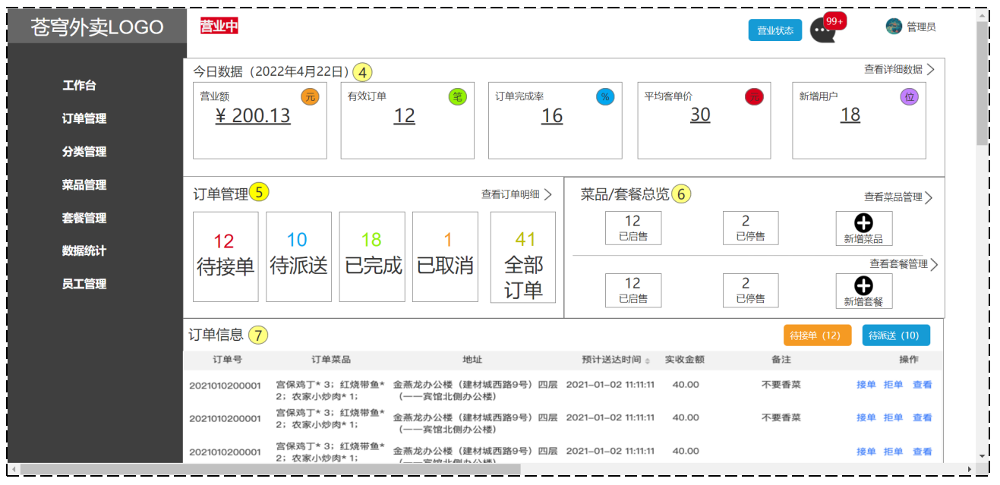
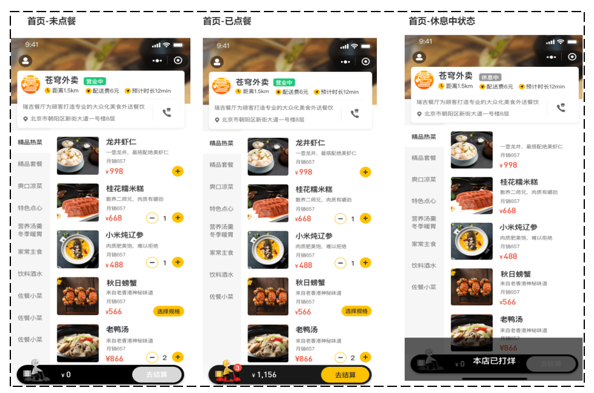

# 苍穹外卖

## 项目介绍

本项目（苍穹外卖）是专门为餐饮企业（餐厅、饭店）定制的一款软件产品，包括 系统管理后台 和 小程序端应用 两部分。

1. 系统管理后台主要提供给餐饮企业内部员工使用，可以对餐厅的分类、菜品、套餐、订单、员工等进行管理维护，对餐厅的各类数据进行统计，同时也可进行来单语音播报功能。
2. 小程序端主要提供给消费者使用，可以在线浏览菜品、添加购物车、下单、支付、催单等。

接下来，通过功能架构图来展示**管理端**和**用户端**的具体业务功能模块。

1. 管理端： 餐饮企业内部员工使用。 主要功能有: 

    | 模块      | 描述                                                         |
    | --------- | ------------------------------------------------------------ |
    | 登录/退出 | 内部员工必须登录后,才可以访问系统管理后台                    |
    | 员工管理  | 管理员可以在系统后台对员工信息进行管理，包含查询、新增、编辑、禁用等功能 |
    | 分类管理  | 主要对当前餐厅经营的 菜品分类 或 套餐分类 进行管理维护， 包含查询、新增、修改、删除等功能 |
    | 菜品管理  | 主要维护各个分类下的菜品信息，包含查询、新增、修改、删除、启售、停售等功能 |
    | 套餐管理  | 主要维护当前餐厅中的套餐信息，包含查询、新增、修改、删除、启售、停售等功能 |
    | 订单管理  | 主要维护用户在移动端下的订单信息，包含查询、取消、派送、完成，以及订单报表下载等功能 |
    | 数据统计  | 主要完成对餐厅的各类数据统计，如营业额、用户数量、订单等     |

2. 用户端： 移动端应用主要提供给消费者使用。主要功能有:

    | 模块        | 描述                                                         |
    | ----------- | ------------------------------------------------------------ |
    | 登录/退出   | 用户需要通过微信授权后登录使用小程序进行点餐                 |
    | 点餐-菜单   | 在点餐界面需要展示出菜品分类/套餐分类, 并根据当前选择的分类加载其中的菜品信息, 供用户查询选择 |
    | 点餐-购物车 | 用户选中的菜品就会加入用户的购物车, 主要包含 查询购物车、加入购物车、删除购物车、清空购物车等功能 |
    | 订单支付    | 用户选完菜品/套餐后, 可以对购物车菜品进行结算支付, 这时就需要进行订单的支付 |
    | 个人信息    | 在个人中心页面中会展示当前用户的基本信息, 用户可以管理收货地址, 也可以查询历史订单数据 |

## 产品原型

产品原型，用于展示项目的业务功能，一般由产品经理进行设计。

✨产品原型主要用于展示项目的功能，并不是最终的页面效果。

1. 管理端原型图
    
2. 用户端原型图
    

## 技术架构

关于本项目的技术选型, 我们将会从 用户层、网关层、应用层、数据层 这几个方面进行介绍，主要用于展示项目中使用到的技术框架和中间件等。

1. 用户层

    本项目中在构建系统管理后台的前端页面，我们会用到H5、Vue.js、ElementUI、apache echarts(展示图表)等技术。而在构建移动端应用时，我们会使用到微信小程序。

2. 网关层

    Nginx是一个服务器，主要用来作为Http服务器，部署静态资源，访问性能高。在Nginx中还有两个比较重要的作用： 反向代理和负载均衡， 在进行项目部署时，要实现Tomcat的负载均衡，就可以通过Nginx来实现。

3. 应用层

    1. SpringBoot： 快速构建Spring项目, 采用 "约定优于配置" 的思想, 简化Spring项目的配置开发。
    2. SpringMVC：SpringMVC是spring框架的一个模块，springmvc和spring无需通过中间整合层进行整合，可以无缝集成。
    3. Spring Task:  由Spring提供的定时任务框架。
    4. httpclient:  主要实现了对http请求的发送。
    5. Spring Cache:  由Spring提供的数据缓存框架
    6. JWT:  用于对应用程序上的用户进行身份验证的标记。
    7. 阿里云OSS:  对象存储服务，在项目中主要存储文件，如图片等。
    8. Swagger： 可以自动的帮助开发人员生成接口文档，并对接口进行测试。
    9. POI:  封装了对Excel表格的常用操作。
    10. WebSocket: 一种通信网络协议，使客户端和服务器之间的数据交换更加简单，用于项目的来单、催单功能实现。

4. 数据层

    1. MySQL： 关系型数据库, 本项目的核心业务数据都会采用MySQL进行存储。
    2. Redis： 基于key-value格式存储的内存数据库, 访问速度快, 经常使用它做缓存。
    3. Mybatis： 本项目持久层将会使用Mybatis开发。
    4. pagehelper:  分页插件。
    5. spring data redis:  简化java代码操作Redis的API。

5. 工具

    1. git: 版本控制工具, 在团队协作中, 使用该工具对项目中的代码进行管理。
    2. maven: 项目构建工具。
    3. junit：单元测试工具，开发人员功能实现完毕后，需要通过junit对功能进行单元测试。
    4. postman:  接口测工具，模拟用户发起的各类HTTP请求，获取对应的响应结果。
