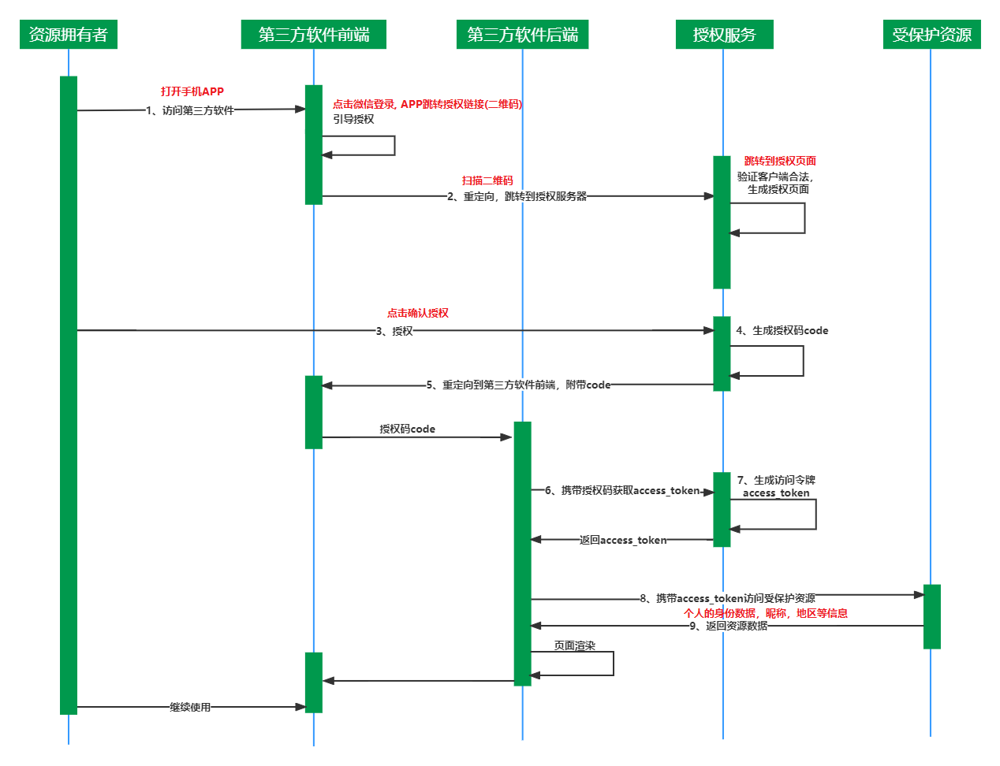
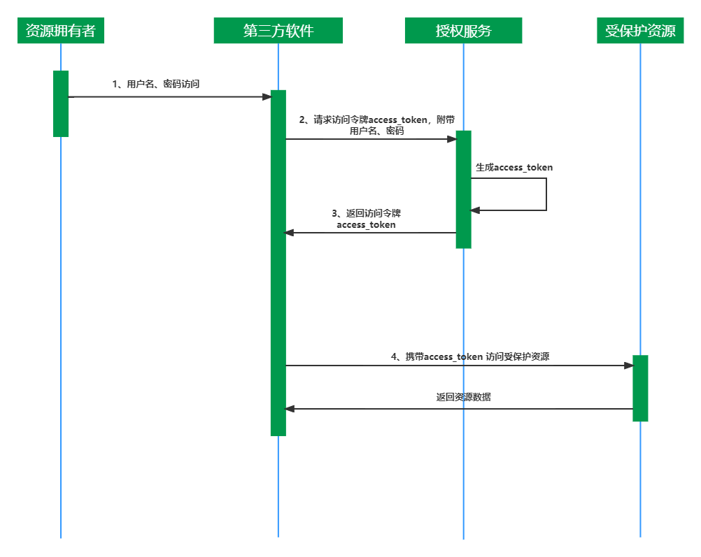
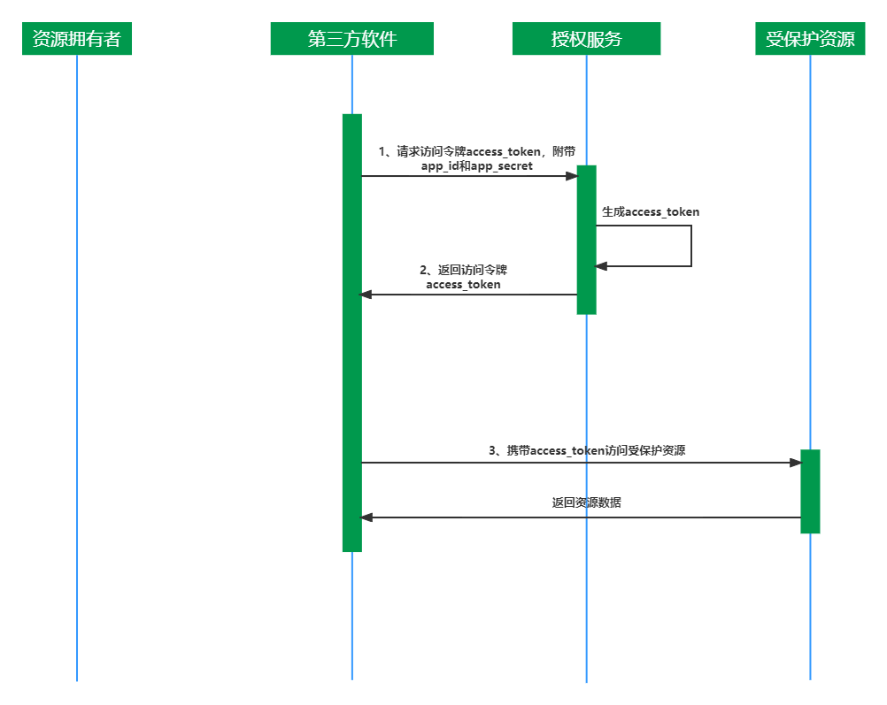
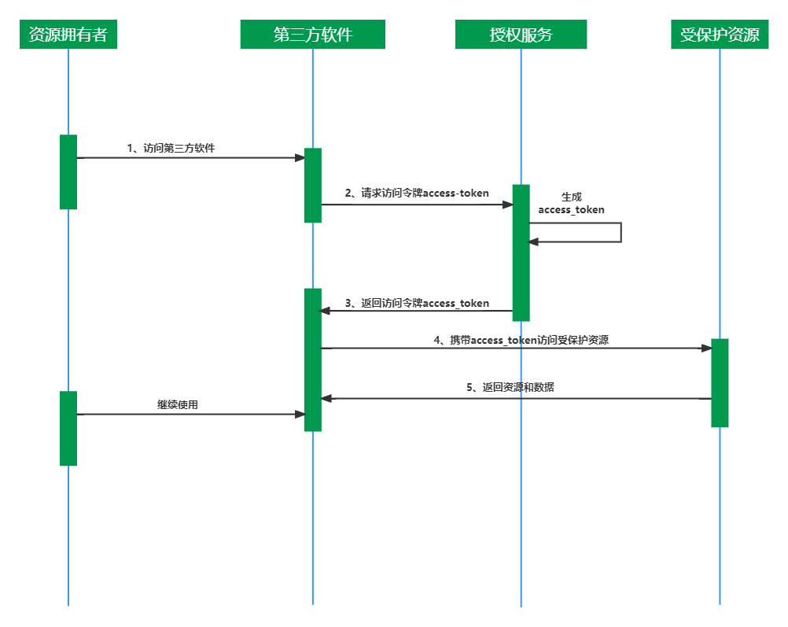

# Oauth

Oauth2.0具有多种授权许可机制协议：授权码许可机制、客户端凭据机制、资源拥有者凭据机制（密码模式）和隐式许可机制。

## 五种角色

OAuth 2.0 的体系里面有 5 种角色:

- 资源所有者(resource owner): 具备访问该资源的实体，如果是某个人，被称为end-user。
- 用户代理(user-agent): 作为资源所有者与客户端沟通的前端工具， 比如APP， 浏览器等。
- 客户端(client): 第三方应用的后端。
- 授权服务器(authorization server): 能够给客户端颁发令牌，这个就是我们上面所讲的统一认证授权服务器。
- 资源服务器(resources server): 受保护的资源服务器， 具备提供资源能力， 如订单服务， 商品服务等。

## 4种授权类型

OAuth2 分为四种授权类型， 分别为：

- 授权码模式(Authorization Code)：授权码模式， 先通过认证获取授权码,  然后申请获取token，进行资源访问。
- 简化/隐式模式(Implicit)：用于简单应用，比如问卷调查等，用户认证通过之后， 认证服务器直接向应用服务返回token，这种模式比授权码模式少了授权码code获取环节， 简化交互， 但存在token过期与暴露问题(因为不能获取refresh_token)。
- 密码模式(Resource Owner Password Credentials)：资源所有者和客户端之间具有高度信任时（例如，客户端是设备的操作系统的一部分，或者是一个高度特权应用程序， 比如APP， 自研终端等），因为client可能存储用户密码。
- 客户端模式(Client Credentials)：该模式直接根据client端的id和密钥即可获取token， 不需要用户参与， 适合内部的API应用服务使用。

## 授权码许可机制

授权码许可机制的参与者：资源拥有者、客户端、授权服务、受保护资源

- 为什么需要生成授权码以及根据授权码获取access_token步骤

    假设从时序图中抹除授权码的流程，那么从第三步，用户点击确定授权，此时资源拥有者与授权服务器就建立起关联，此时，资源拥有者则与第三方软件前端断开关联，界面则会停留在授权界面。然后授权服务器直接把access_token送给第三方软件后端，后端在携带access_token去访问受保护资源。虽然说资源数据已经拿到了，但是如何通知用户呢？因此，得需要建立起用户与第三方软件前端的关联，所以授权服务器生成授权码后重定向到第三方软件前端则是重新建立起用户与第三方软件前端的关联。

    既然如此，那么为什么授权服务器不直接重定向传回access_token,首先并不能保证重定向采用的形式是否是https，而且并不是所有的客户端都支持https，所以重定向传回access_token就会增加access_token失窃的风险。虽然access_token需要与client_id,client_secret一起才能够通过授权服务器校验访问到保护资源，但是在安全层面来说，这都是不适合的。在此层面上看，授权码的作用在于access_token不经过用户浏览器, 保护了access_token。

- 授权码code可以暴露

    - 授权码Authentication code只能用一次，而且会很快超时失效, 使得被截获后难以运用。
    - 授权码需要和client id/client secret共同完成认证，才能够获得access_token。就算授权码如果失窃，单凭授权码是无法得到access_token的。

- access_token不能暴露在浏览器那么该存放在哪

    重定向传回access_token会使安全保密性要求极高的访问令牌暴露在浏览器，增加访问令牌失窃风险。通过授权码以及客户端id和secret共同校验后获取的access_token，可以把access_token存放在localStorage中，localStorage虽然是永久存储，但是access_token会有一个有效期，有效期到了之后，即便access_token一直都存在但是有效期过后就无法访问到受保护资源。

## 资源拥有者凭据机制（密码模式）

客户端凭据机制的参与者：资源拥有者、客户端、授权服务、受保护资源

资源拥有者凭据，顾名思义就是资源拥有者的凭据（账号，密码）。在这场景里面就不存在第三方软件这概念，相当于就是访问系统中的一个子系统，他们之间互相信任。举个例子来说就是，腾讯有许多的游戏，你只需要用qq账号密码就可以登录游戏玩，不需要进行腾讯授权。因为该游戏是腾讯旗下的，他们相互信任的，所以不存在第三方的说法。

## 客户端凭据机制

客户端凭据机制的参与者：客户端、授权服务、受保护资源

相当于就是第三方软件访问不需要资源拥有者授权的资源和数据，换句话说在这里客户端也可以看作是资源拥有者。举个例子来说就是第三方软件访问一些公共的服务，譬如说一些地图信息，logo图标等。

这种场景下的授权，便是客户端凭据许可，第三方软件可以直接使用注册时的 client_id 和 client_secret 来换回访问令牌 token 的值。

## 隐式许可机制

隐式许可机制的场景适用于没有后端服务的应用，举个例子来说的话就是在浏览器中执行，譬如说JavaScript应用。

在这种情况下，第三方软件对于浏览器就没有任何保密的数据可以隐藏了，也不再需要应用密钥 app_secret 的值了，也不用再通过授权码 code 来换取访问令牌 access_token 的值了。因此，隐式许可授权流程的安全性会降低很多。

这种场景下的授权，第三方软件可以直接使用注册时的 client_id来换回访问令牌 token 的值。

## 参考

- https://www.cnblogs.com/Chary/p/17940925
- https://cloud.tencent.com/developer/article/2403282
- https://juejin.cn/post/6949929792502235149